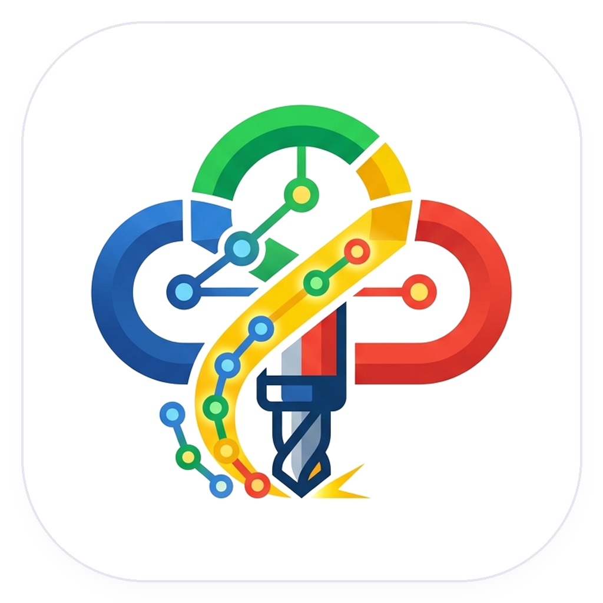
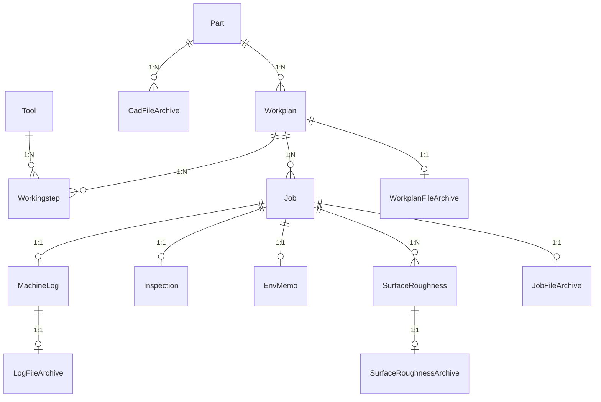

<p align="center">
  
</p>

<h1 align="center">공작기계지능화실험실 통합 제조 데이터베이스 시스템 (ManufacturingDB)</h1>

<p align="center">
  <a href="https://www.python.org/"></a>
  <a href="https://www.mysql.com/"></a>
  <a href="https://www.sqlalchemy.org/"></a>
  <a href="https://streamlit.io/"></a>
  <a href="https://www.iso.org/"></a>
  <a href="https://github.com/OrcusExtreme/ManufacturingDB"></a>
</p>

공작기계지능화실험실(Machine Tool Intelligence Lab)의 **통합 스마트 제조 데이터베이스 및 실시간 분석 플랫폼**입니다.  
공작기계(CNC)에서 생성되는 다양한 이기종 데이터(XML 메타데이터, NC 프로그램, 고주파 NI TDMS 센서(실측 12.8kHz · 스핀들 전류/진동/음향), 1Hz CNC 상태 로그, 표면 조도 측정 CSV, 3D CAD 도면)를 **Watchdog 기반으로 자동 감시·수집·파싱**하여 **ISO 14649(STEP-NC) 표준 기반 RDBMS**에 정규화 적재하고, 연구원 및 관리자에게 고성능 웹 대시보드를 제공합니다.

---

## 🌟 주요 특징 (Key Highlights)

### 1. ISO 14649(STEP-NC) 표준 기반 데이터 모델링
- **정적 공정 계획(Static Planning)**과 **동적 가공 실행(Dynamic Execution)**의 분리
- `Part(부품)` ➔ `Workplan(NC 가공계획)` ➔ `Workingstep(단위공정/공구호출)` ↔ `Tool(공구 마스터)`의 객체 지향 공정 계층 구조 구축
- 단일 Workplan 하에서 반복 수행되는 실험 가공(`Job`)의 1:N 이력 관리

### 2. 하이브리드 4계층 스토리지 & 재난 복구(DR) 체계
- **MySQL RDBMS**: B-Tree 인덱스 기반의 초고속 조건 필터링, 정렬, 다차원 조인 및 통계 쿼리
- **Apache Parquet**: 수백만 행 고주파 센서 시계열(12.8kHz)과 마이크로미터($\mu m$) 단면 조도 곡선을 Snappy 컬럼형 압축 포맷으로 초고속 렌더링
- **File Vault**: SHA 해시 기반의 불변 원본 파일 안전 보관 디렉터리 (프로젝트 외부 경로 지정 지원으로 프로젝트 삭제 시에도 백업 영구 보존)
- **LONGBLOB 백업 미러링**: MySQL 덤프 파일 단독으로도 `recovery_engine.py`를 통해 모든 원본 파일과 디렉터리 트리를 100% 원복 가능
- **스토리지 초기화 시 보관소 영구 보호**: DB 및 런타임 데이터 초기화 시에도 보관소(`archive_vault`)는 절대 삭제되지 않도록 이중 격리 보호

### 3. 무중단 실시간 자동 파이프라인 (Automated Pipeline)
- `machining_raw_data/` 모니터링 디렉터리에 폴더째 파일 투입 시 자동 감지(Watchdog)
- 파일 전송 완료(Lock 해제) 감지 후 자료 종류별 파서 자동 구동 (`xml`, `tdms`, `nc`, `log`, `csv`, `step`/`stl`)
- **Job 폴더 자동 정리**: 파일이 Job 폴더에 섞여 들어와도 확장자를 보고
  `XML/` · `Log/` · `TDMS/` · `NC/` 하위 폴더로 옮긴 뒤 처리 (규칙은 `backend/job_layout.py` 단일 출처)
- 비동기 백그라운드 데몬(`tdms_visualizer.py`)을 통한 시간 도메인 & FFT 주파수 스펙트럼 Parquet 자동 생성
- **단일 패스 TDMS 읽기**: 여유 메모리를 보고 파일 전체를 한 번에 훑어 채널별 재스캔을 제거
  (464MB 실측 54.9초 → 10.1초). 메모리가 부족하면 지연 로딩으로 자동 전환

### 4. 제조 DB Controller (C++ 네이티브 GUI)
`system_controller.exe` 하나로 Streamlit UI · Watchdog 수집기 · TDMS 변환기를 개별 제어하고,
세 프로세스의 로그를 한 창에서 실시간으로 봅니다. 파서 6종과 파이프라인 일시정지를 **재시작 없이** 토글할 수
있으며(`backend/pipeline_config.json` 공유), Job Object 로 묶어 제어기가 비정상 종료해도 자식 프로세스가
남지 않습니다. 파이썬 코드를 품지 않고 디스크의 `.py` 를 그대로 실행하므로 **파이썬을 고쳐도 재빌드가 필요 없습니다.**

### 5. 단일 통합 Streamlit 웹 대시보드 (Port 8501)
Job 검색부터 ISO 14649 트리뷰, 센서/조도 분석(Plotly Envelope & FFT), 메타데이터·환경·품질 수정, 데이터 삽입,
DB 테이블 조회/편집, 재난 복구(ZIP)까지 하나의 화면 흐름에서 처리합니다. 별도의 관리자/사용자 계정 구분 없이
모든 기능에 접근할 수 있으며, Job 삭제나 DB 테이블 직접 편집처럼 파괴적인 작업에는 확인 절차(삭제 확인
다이얼로그, Root 계정 재인증)가 남아 있습니다.

---

## 🏗️ 시스템 아키텍처 (System Architecture)

```text
[제조 DB Controller (system_controller.exe)]
       │  세 프로세스를 켜고 끄고, 로그를 모아 보여주고, 파서를 토글한다
       │  ├─ pipeline_config.json ─▶ 파서 6종 On/Off · 파이프라인 일시정지
       │  └─ Job Object 로 묶어 비정상 종료 시 자식까지 회수
       ▼
[Raw Data / Network Drive]
       │ (File Drop: XML, NC, TDMS, LOG, CAD, CSV)
       ▼
[Watchdog Observer (data_insert_recognization.py)]
       │ (Queue & Stability Check: 파일 접근 권한 및 무변동 검사)
       │ (Job 폴더에 섞여 들어온 파일은 job_layout 규칙에 따라 하위 폴더로 자동 정리)
       ▼
[Parsing Engine (parsers/)]
  ├─ xml_parser.py       : 메타데이터 추출, Part/Workplan/Job 구조 매핑, 공구 런타임 상태 추출 (공구 마스터는 읽기 전용)
  ├─ tdms_parser.py      : 초고속 메타데이터(nptdms) 추출 및 가공 시작 시간 보완
  ├─ log_parser.py       : CNC 1Hz 로그 통계(Max/Avg Load, RPM, Feed) 요약 및 알람 수집
  ├─ roughness_parser.py : 조도 측정 결과(Ra, Rq, Rz) 자동 계산 및 2D 단면 Parquet 변환
  ├─ cad_parser.py       : 3D 모델(STEP, STL) 파트 매핑 및 원본 아카이빙
  └─ nc_parser.py        : NC 프로그램 코드 추출, 공구별 절삭조건(Feed Rate / Spindle Speed) 파싱 및 MD5 해시 식별자 생성
       │
       ▼
[MySQL Database (SQLAlchemy ORM)]  ◄═══►  [Vault System (vault_manager.py)]
       │
       ▼
[Streamlit Frontend UI]
  └─ 통합 대시보드 (Port 8501) : Job 검색·분석, 메타데이터/환경/품질 수정, 데이터 삽입, DB 조회/편집, 복구 ZIP 생성
```

---

## 📊 데이터베이스 스키마 구조 (ER Diagram)



| 도메인 | 테이블명 | 주요 역할 |
| :--- | :--- | :--- |
| **마스터 & 계획** | `part`, `workplan`, `tool`, `workingstep`, `cad_file_archive` | 가공 대상 부품(숫자 PK + `part_name`), NC 공정 계획(숫자 PK + 부품·프로그램·NC해시 유일 제약), 공구 제원, 단위 공정 순서 및 절삭 가공조건(Feed/Spindle), 3D 도면 관리 |
| **가공 실행 & 품질** | `job`, `machine_log`, `surface_roughness`, `inspection`, `env_memo` | 가공 이력(시간,거리,에러), CNC 1Hz 부하 요약, 다지점 표면조도, 공차/합부(PASS/FAIL), 온습도/메모 |
| **아카이브 & 백업** | `workplan_file_archive`, `job_file_archive`, `surface_roughness_archive`, `log_file_archive` | 원본 파일 Vault 저장 경로 및 LONGBLOB 이중화 백업 데이터 |

---

## 📁 디렉터리 구조 (Directory Structure)

루트에는 **실행 파일과 최소한의 설정만** 둡니다. 코드·데이터·도구·문서는 모두 폴더로 분리되어 있습니다.

```text
ManufacturingDB/
├── system_controller.exe             # ★ 실행은 이것 하나 (제조 DB Controller)
├── README.md
├── .env                              # DB 접속 정보 (dotenv 가 cwd 기준으로 읽어 루트 고정)
├── .streamlit/config.toml            # Streamlit 설정 (streamlit 이 $CWD 에서만 읽어 루트 고정)
├── pyrefly.toml                      # 타입 체커 설정
│
├── assets/                           # 브랜드 자산 (컨트롤러·대시보드가 공유)
│   ├── logo_card.png                 #   컨트롤러 헤더 · 사이드바 카드
│   ├── logo.png / logo.jpg           #   홈 헤더 · 일반 용도
│   └── logo.ico / favicon.ico        #   앱 아이콘 · 브라우저 탭
│
├── controller/                       # 제조 DB Controller C++ 소스
│   ├── system_controller.cpp         #   Win32 오너드로우 UI + 프로세스 감독
│   ├── theme.h                       #   Google Cloud 콘솔풍 팔레트 및 그리기 도우미
│   ├── app_config.h                  #   설정 JSON 읽기/쓰기 + 파이썬 인터프리터 탐색
│   └── system_controller.rc          #   실행 파일 아이콘 및 버전 정보
│
├── backend/                          # 수집 파이프라인
│   ├── data_insert_recognization.py  #   Watchdog 파일 감시 및 큐 분배기
│   ├── job_layout.py                 #   Job 폴더 하위 분류(XML/Log/TDMS/NC) 규칙 단일 출처
│   ├── vault_manager.py              #   경로 기준(PROJECT_ROOT·DATA_ROOT 등) 및 Vault 아카이빙
│   ├── job_manager.py                #   Job 생성 및 중복 확인 유틸리티
│   ├── recovery_engine.py            #   Vault/DB 기반 복원 및 재난 복구 ZIP 생성
│   ├── tdms_visualizer.py            #   백그라운드 TDMS Parquet/FFT 변환 데몬
│   ├── tdms_alignment.py             #   NC 대조 실가공 구간 판별 + CNC/DAQ 시간축 정렬 (단독 CLI)
│   ├── tool_inserter.py              #   공구 마스터 Excel 전체 교체 + 원본 보관
│   ├── pipeline_control.py           #   파서 토글/일시정지 상태 (컨트롤러와 JSON 공유)
│   ├── pipeline_config.json          #   ↑ 그 상태 파일
│   ├── integrity.py                  #   SHA-256 원본 복원 검증 단일 로직 (3-상태)
│   ├── integrity_monitor.py          #   검증 백그라운드 감시자 (30분 주기)
│   ├── clean_dummy_data.py           #   고아 Workplan·중복 Workingstep 자동 정리
│   ├── reset_database_and_storage.py #   DB + 프로젝트 data/ 초기화 (보관소는 보존)
│   ├── migrate_keys_v3.py            #   키 정규화 마이그레이션 (숫자 PK 전환)
│   ├── migrate_job_folder_layout.py  #   Job 폴더를 자료 종류별 하위 폴더로 이전
│   ├── migrate_vault_location.py     #   원본 보관소 위치 이전 도구 (미리보기 / --apply)
│   ├── normalize_name_casing.py      #   보관소 폴더 대소문자 표기를 DB 기준으로 통일
│   ├── backfill_workingstep_conditions.py  # 기존 Workplan 절삭조건 소급 갱신
│   ├── DB/
│   │   ├── database.py               #   SQLAlchemy 커넥션 풀링 및 세션 팩토리
│   │   ├── models.py                 #   14개 테이블 ORM 정의
│   │   └── schema_patch.py           #   기동 시 누락 컬럼만 채우는 경량 보정
│   ├── parsers/                      #   자료 종류별 파싱 엔진
│   │   ├── xml_parser.py  nc_parser.py  tdms_parser.py
│   │   └── log_parser.py  roughness_parser.py  cad_parser.py
│   └── tests/
│       ├── test_nc_parser.py                  # pytest
│       ├── test_controller_integration.py     # pytest
│       ├── test_tdms_alignment.py             # 단독 실행 (합성 TDMS 31개 검사)
│       └── verify_e2e_cutting_conditions.py   # 단독 실행 (실 DB 연동 검증)
│
├── frontend/                         # Streamlit 통합 대시보드 (Port 8501)
│   ├── dashboard.py                  #   단일 엔트리포인트: 사이드바 내비게이션
│   ├── cad_viewer_component.py       #   3D CAD(STEP/STL) 뷰어 (Z-up, 축 gizmo)
│   ├── erd_component.py              #   인터랙티브 ERD 다이어그램
│   └── components/
│       ├── common.py                 #   경로 설정 · 캐싱 쿼리
│       ├── home_view.py              #   홈 화면 및 Quick Access 카드
│       ├── filters.py                #   5단계 캐스케이딩 Job 검색 필터
│       ├── job_workspace.py          #   Job 검색·분석·수정 통합 화면
│       ├── master_tree.py            #   계층형 마스터 데이터 (ISO 14649 트리)
│       ├── tool_master.py            #   공구 마스터 엑셀 업로드 및 조회
│       ├── data_upload.py            #   가공 데이터 수동 업로드
│       ├── db_explorer.py            #   DB 테이블 조회·필터·편집·CSV
│       ├── download_center.py        #   프로젝트 ▸ Part ▸ Job 드릴다운 다운로드
│       ├── native_picker.py          #   파일 선택창 형식 필터 이름 지정
│       └── recovery.py               #   시스템 백업/복구
│
├── data/                             # 런타임 데이터 (코드와 분리 · 전부 gitignore)
│   ├── machining_raw_data/           #   장비 데이터 유입 감시 폴더
│   │   └── {Project}/{Part}/
│   │       ├── CAD_Files/            #     3D 도면 (Part 단위)
│   │       └── {JobID}/              #     가공차수 1건
│   │           ├── XML/  Log/  TDMS/  NC/
│   │           ├── Surface_Roughness/
│   │           ├── etc/
│   │           └── processed_parquet/
│   ├── processed_data/               #   변환된 시계열·FFT Parquet
│   └── failed_data/                  #   파싱 실패 격리 (DLQ)
│
│   ※ 원본 백업 보관소(archive_vault)는 프로젝트 밖에 둡니다.
│     .env 의 ORCUS_DB_DATA_DIR 로 DB 설치 폴더를 가리키면
│     프로젝트 폴더가 사라져도 백업은 남습니다.
│
├── tools/                            # 개발·운영 도구
│   ├── run_system.py                 #   CLI 일괄 실행 (컨트롤러 대안)
│   ├── compile_controller.bat        #   컨트롤러 빌드 (g++ + windres)
│   ├── run_controller.bat            #   컨트롤러 실행 (없으면 자동 빌드)
│   ├── run_windows.bat               #   venv 생성 + 의존성 설치 + CLI 실행
│   └── requirements.txt              #   런타임 의존 패키지
│
└── docs/
    └── gemini.md                     # 전체 시스템 상세 명세서
```


---

## 🚀 빠른 시작 (Quick Start)

### 1. 사전 요구사항 (Prerequisites)
- **Python**: 3.10 이상
- **MySQL**: 8.0 이상 (인스턴스 구동 필요)
- **OS**: Windows 10/11 — 제조 DB Controller 가 Win32 API 를 직접 사용합니다.
  다른 OS 에서는 CLI 실행(`python tools/run_system.py`)을 쓰세요
- **g++ (MinGW-w64 / w64devkit)**: 컨트롤러를 **수정해 다시 빌드할 때만** 필요합니다

### 2. 저장소 복제 (Clone Repository)
```bash
git clone https://github.com/OrcusExtreme/ManufacturingDB.git
cd ManufacturingDB
```

### 3. 환경 변수 설정 (`.env`)
프로젝트 루트 디렉터리에 `.env` 파일을 생성하고 데이터베이스 정보를 입력합니다.
```env
DB_HOST=localhost
DB_PORT=3306
DB_USER=root
DB_PASSWORD=your_password
DB_NAME=orcus
PYTHONPATH=backend

# 원본 백업 보관소(archive_vault)를 프로젝트 밖에 둡니다.
# 그 아래 archive_vault/ 폴더가 자동으로 만들어집니다.
ORCUS_DB_DATA_DIR=C:\ProgramData\MySQL\MySQL Server 8.0\Data\orcus
```

#### 백업 보관소를 프로젝트 밖에 두는 이유

보관소가 프로젝트 안에 있으면 **프로젝트 폴더를 지우는 순간 원본 백업도 함께 사라집니다.**
백업의 존재 이유가 "원본이 없어져도 복원할 수 있다"는 것이므로, 보관소는 프로젝트와
수명이 다른 곳(예: DB 가 설치된 폴더)에 두어야 합니다.

| 우선순위 | 환경변수 | 의미 |
| :--- | :--- | :--- |
| 1 | `ORCUS_VAULT_ROOT` | 보관소 절대경로를 직접 지정 |
| 2 | `ORCUS_DB_DATA_DIR` | DB 설치 폴더. 그 아래 `archive_vault/` 를 만들어 사용 |
| 3 | (설정 없음) | 예전 위치 `data/archive_vault` 를 그대로 사용 |

DB 에는 보관소 루트 기준의 **상대경로만** 저장되므로, 위 값을 바꾸고 폴더만 옮기면
기존 레코드를 손대지 않아도 복원 기능이 그대로 동작합니다. 이미 쌓인 보관소를 옮길 때는
아래 도구를 사용하세요.

```bash
python backend\migrate_vault_location.py            # 무엇이 옮겨질지 미리보기
python backend\migrate_vault_location.py --apply    # 실제 이동 (복사 → 검증 → 원본 삭제)
```

#### 폴더 이름 대소문자 표기

Windows 파일시스템과 MySQL 기본 콜레이션은 **둘 다 대소문자를 구분하지 않습니다.** 그래서
같은 부품을 `DB_Test` 로도 `DB_TEST` 로도 넣을 수 있고 DB 조회는 어느 쪽으로도 같은 행을
찾습니다(중복 Part 는 생기지 않습니다). 파서는 **먼저 등록된 표기**를 기준으로 경로를 만들어
보관소 폴더가 갈라지지 않게 합니다. 이미 갈라진 폴더가 있다면 아래 도구로 정리하세요.

```bash
python backend\normalize_name_casing.py             # 무엇이 바뀔지 미리보기
python backend\normalize_name_casing.py --apply     # DB 표기 기준으로 폴더 이름 통일
```

> Windows 에서는 대소문자가 달라도 파일이 열려 당장은 문제가 없지만, 보관소를 리눅스/NAS 로
> 옮기거나 다른 PC 에서 복원하면 대소문자를 구분하는 파일시스템에서 경로가 어긋납니다.
> DB 가 참조하지 않는 고아 폴더는 **삭제하지 않고 보고만** 합니다.

**보관소는 초기화 버튼으로 지워지지 않습니다.** 컨트롤러의 `DB · 스토리지 초기화` 는
DB 테이블과 프로젝트 폴더의 `data/` 만 비우고 보관소는 손대지 않습니다. 삭제 대상 목록에서
제외하는 것에 더해, 실제 삭제 직전에 보관소 안쪽 경로인지 한 번 더 확인해 막습니다.

| 구분 | 대상 |
| :--- | :--- |
| 초기화 | DB 테이블 전체 · `data/machining_raw_data` · `data/processed_data` · `data/failed_data` |
| 보존 | 원본 백업 보관소 `archive_vault` |

> **주의** 보관소를 MySQL 스키마 폴더(`...\Data\orcus`) 안에 두면, 나중에
> `DROP DATABASE orcus` 를 실행할 때 MySQL 이 폴더를 지우지 못해 오류가 납니다.
> 이 프로젝트의 초기화 도구는 `DROP TABLE` 만 사용하므로 평소에는 문제가 없지만,
> 스키마를 통째로 재생성할 계획이라면 `ORCUS_VAULT_ROOT` 로 스키마 폴더 바깥
> (예: `C:\ProgramData\Orcus\archive_vault`)을 가리키는 편이 안전합니다.

### 4. 시스템 실행 (Run System)

#### 방법 1: 제조 DB Controller (권장 - 실시간 로그 모니터 & 모듈/파서 토글 지원)
C++ Win32 네이티브 컨트롤러로 Streamlit UI, Watchdog 파일 감시, TDMS 변환기를 개별 제어하고,
실시간 로그 스트리밍과 파서별 On/Off 토글을 수행합니다. Google Cloud 콘솔풍의 밝은 화면을
오너드로우로 직접 그렸고, 강조색은 대시보드와 같은 `#1A73E8` 입니다.
```bash
system_controller.exe          # 실행 파일 직접 실행
tools\run_controller.bat       # 없으면 자동 빌드 후 실행
```

**동작 방식** — 컨트롤러는 파이썬 코드를 품고 있지 않고 디스크의 `.py` 를 그대로 실행하는 감독자입니다.
따라서 `backend/`, `frontend/` 를 수정하면 **컨트롤러를 다시 빌드하지 않아도** 다음 실행부터 반영됩니다.

**파이썬 인터프리터 탐색 순서** (`controller/app_config.h`)
1. `runtime\python.exe` — 프로젝트에 동봉한 임베디드 런타임 (파이썬 미설치 PC 대응)
2. `py -3` → 실제 `sys.executable` 경로를 조회해 사용
3. PATH 의 `python` → 마찬가지로 실제 경로를 조회해 사용

> PATH 의 `python.exe` / `py.exe` 는 Microsoft Store 파이썬에서 0바이트 **앱 실행 별칭**인 경우가 많고,
> 표준 출력을 파이프로 받는 실행에서는 `ERROR_CANT_ACCESS_FILE(1920)` 로 실패합니다.
> 그래서 별칭을 한 번 실행해 실제 exe 경로를 받아낸 뒤, 이후에는 그 절대 경로만 씁니다.

**컨트롤러 빌드** (수정했을 때만 필요, MinGW-w64 / w64devkit 의 g++ 사용)
```bash
tools\compile_controller.bat
```

#### 방법 2: CLI 터미널 일괄 실행
`tools/run_system.py`를 실행하면 필수 패키지 설치 확인, DB 스키마 자동 초기화, 파이프라인 및 통합 대시보드가 서브프로세스로 동시 기동됩니다.
```bash
python tools/run_system.py
```

### 5. 서비스 접속
- **통합 대시보드**: [http://localhost:8501](http://localhost:8501)
- **컨트롤러 모니터**: `system_controller.exe` 창에서 Watchdog 및 대시보드 실시간 로그 확인 가능

---

## 📈 대시보드 주요 기능 안내 (UI Features)

로그인·역할 구분 없이 하나의 화면에서 모든 기능에 접근합니다. Job 삭제, DB 테이블 직접 편집처럼 되돌릴 수
없는 작업에는 확인 다이얼로그 또는 Root 계정 재인증이 남아 있습니다.

1. **홈**: 로고 헤더와 Quick Access 카드 8개. 자주 쓰는 화면으로 한 번에 이동합니다
2. **Job 워크스페이스**: 연구 프로젝트명·Part명·가공차수·실험일자·장비 기반 5단계 캐스케이딩 필터로 Job을
   검색한 뒤, 하나의 화면에서 탭으로 전환하며 처리합니다. 가공시간·조도 Ra·평균 RPM 범위로도 좁힐 수 있습니다.
   - `분석 보기`: Job 정보/품질/조도통계/CNC로그/환경 카드 + CNC·DAQ·FFT 탭 차트, CNC 로그 추이,
     마이크로미터 표면조도 단면 곡선. TDMS 카드 상단에 가공 구간 판별 근거를 한 줄로 표시합니다
   - `메타데이터 · 환경 · 품질 수정`(편집 모드): Job 메타데이터, 온습도/작업자/칩형태 환경메모,
     치수공차/형상/PASS·FAIL 품질점검 통합 편집
   - 하단 `영구 삭제`: 원자적 연쇄 삭제(`CASCADE`) 확인 모달 지원
   - 원본 파일 다운로드는 `데이터 다운로드` 메뉴로 일원화되어 있습니다
3. **계층형 마스터 데이터**: ISO 14649 공정 트리(Part ➔ Workplan ➔ Workingstep ➔ Tool) 조회.
   Workingstep 표에 NC에서 파싱한 `주축회전수 (RPM)`·`이송속도 (mm/min)`가 함께 나오며,
   단위는 열 이름에만 표기하고 칸에는 숫자만 둡니다. Part별 3D CAD 모델 뷰어(Z-up, 축 gizmo) 제공
4. **공구 마스터**: 엑셀(`.xlsx`) 업로드로 공구 마스터 전체 교체(기존 데이터 삭제 후 엑셀 내용만 등록,
   `T1`~`T99` 형식 코드만 적재, 가공 이력의 공구 연결은 공구 코드 기준으로 자동 재연결) 및 전체 공구 목록 조회.
   유효 공구가 0건이면 교체를 취소해 잘못된 파일로 마스터가 비워지는 사고를 막습니다.
   업로드한 원본은 보관소의 `tool_master/tool_info.xlsx`로 보관되며 화면에서 바로 내려받을 수 있습니다
5. **데이터 삽입**: CAD 도면(`.stl`/`.stp`/`.step`), XML, NC, TDMS, Log, 조도 CSV 웹 수동 업로드.
   업로드한 파일은 처음부터 자료 종류별 하위 폴더에 저장됩니다
6. **DB 테이블**: 인터랙티브 ERD에서 테이블을 선택해 실시간 조회·검색, 속성별 정렬(오름/내림차순)과 속성 ▸
   비교 조건 ▸ 값 드롭다운 필터링, CSV 내보내기 지원. 표를 직접 편집한 뒤 저장하면 Root 인증을 거쳐 반영
7. **데이터 다운로드**: 프로젝트 ▸ Part ▸ Job 순으로 좁혀가며 선택 범위를 ZIP으로 내려받습니다.
   - **부품까지 선택**하면 `CAD 파일` 버튼이 나타납니다. 도면은 가공차수가 아니라 부품에 딸린 자료라
     따로 받으며, 원본 폴더 ▸ Vault ▸ DB BLOB 순으로 조달합니다
   - **Job까지 선택**하면 그 Job에 **실제로 존재하는 데이터 유형만** 버튼으로 나타나고(파일 개수 표시),
     유형별로 즉시 받거나 개별 파일 단위로 받을 수 있습니다
   - 원본 폴더가 삭제된 Job은 Vault/DB 아카이브에서 자동 조달되며, 로컬 디스크로 원본 복원도 가능합니다
8. **시스템 백업/복구**: Vault/DB에서 원본 파일들을 역추적하여 폴더 구조 그대로 압축(ZIP) 다운로드.
   단일 Job 복원과 **같은 코드**를 쓰므로 XML·NC·TDMS·로그·조도·etc·CAD·Parquet이 모두 포함됩니다

사이드바는 로고와 `DB 관계도(ERD) 보기` 버튼(전체 테이블 관계도 팝업) 아래에 데이터 입출력 메뉴
(`데이터 삽입`, `데이터 다운로드`)를 두고, 구분선 아래에 나머지 조회·관리 메뉴를 배치합니다.

### 🔒 원본 복원 검증은 백그라운드에서만 수행됩니다

XML/NC/CAD 원본이 저장 시점과 바이트 단위로 동일한지에 대한 SHA-256 검증은 화면에서 제거되었고,
데이터 수집 파이프라인이 기동 직후와 이후 30분 주기로 자동 수행합니다(`backend/integrity_monitor.py`).
판정은 `일치 / 불일치 / 검증 불가(기준 해시 미기록)` 3-상태를 그대로 유지하며, 실행 로그에 다음과 같이 남습니다.

```text
[원본 복원 검증] 일치 4건 / 불일치 0건 / 검증 불가 0건 / 원본 미보존 1건
```

불일치가 감지되면 해당 대상의 기준 해시와 재계산 해시가 `[경고]` 라인으로 함께 출력됩니다. 해시 재계산
로직은 여전히 `backend/integrity.py` 한 곳만 사용합니다.

---

## 🚀 릴리즈 노트 (Release Notes)

각 버전의 핵심만 적습니다. 세부 동작과 판단 근거는 [`docs/gemini.md`](docs/gemini.md)를 참고하세요.

### [V3.0.4] - 2026-09-15
- **TDMS 변환 성능 5.4배 개선** (464MB 파일 실측 54.9초 → 10.1초, 폴더 투입부터 UI 전체 노출까지 148초 → 43.2초):
  - 채널별 지연 로딩이 채널 수만큼 파일을 다시 스캔하던 문제를 단일 패스 읽기(`TdmsFile.read`)로 교체.
    CNC 34채널을 읽는 데만 45초(전체의 79%)가 소모되던 병목 제거
  - 손상 파일 꼬리를 잘라내는 `_TruncatedFile` 래퍼가 파일 하나당 400만 회 호출되던 문제를
    읽기 위치 직접 추적 + `BufferedReader`(1MB) 도입으로 수백 회 수준까지 축소
  - 여유 메모리를 보고 단일 패스와 지연 로딩을 자동 선택 (`open_tdms(eager=None)`)하여
    대용량 파일에서도 안전하게 동작
- **부품·프로젝트 표기 통일**: Windows·MySQL 모두 대소문자를 구분하지 않아 같은 부품이
  `DB_Test` / `DB_TEST` 등 서로 다른 Vault 폴더로 갈라지던 문제 해결
  - 파서가 들어온 이름 대신 **DB에 등록된 표기**로 경로를 생성하도록 수정 (`canonical_names`)
  - 기존 보관소 폴더 표기를 일괄 정리하는 `backend/normalize_name_casing.py` 신설
    (미리보기 기본, `--apply` 적용, 고아 폴더는 삭제하지 않고 보고만)
- **Watchdog 삭제 감지 안정화**:
  - 탐색기가 폴더 복사 중 생성·삭제하는 `desktop.ini`, `Thumbs.db`, 오피스 임시 파일 등을
    수집·삭제 양쪽에서 동일 기준으로 무시 (`job_layout.is_ignored_file`)
  - 삭제 이벤트마다 스레드를 새로 띄우던 구조를 큐 + 단일 워커로 교체.
    파일 14개 폴더 삭제 시 15개 스레드가 동시에 DB 세션을 잡아 커넥션 풀이 고갈되던
    (`QueuePool limit ... timed out`) 문제 해소, 자동 복원 트리거 15회 → 1회
- **Streamlit 1.61 지원**: 폐기 예정 경고를 발생시키던 `use_container_width`를
  `width="stretch"`로 전면 교체 (11곳)

### [V3.0.3] - 2026-09-15
- **문서화 및 가이드 최신화**:
  - `tools/`, `controller/`, `docs/`, `assets/` 디렉터리 분리에 따른 README 실행·빌드 가이드 및 스크립트 경로 전면 갱신
  - V3.0.2 원본 백업 보관소 외부 분리(`ORCUS_VAULT_ROOT` / `ORCUS_DB_DATA_DIR`) 가이드 및 `migrate_vault_location.py` 사용법 정리
  - 스토리지 초기화 시 보관소 영구 보존 정책 및 이중 보호 체계 문서 반영

### [V3.0.2] - 2026-09-15
- **원본 백업 보관소(Vault) 외부 분리 및 영구 보호**:
  - 프로젝트 폴더 삭제나 재설치 시에도 원본 백업이 함께 유실되지 않도록 보관소 경로를 프로젝트 외부(예: MySQL 데이터 디렉터리 등)로 지정 지원 (`ORCUS_VAULT_ROOT` / `ORCUS_DB_DATA_DIR` 환경변수)
  - `backend/migrate_vault_location.py` 마이그레이션 도구 신설 (기본 드라이런 미리보기 및 `--apply` 옵션을 통한 안전한 원본 복사·검증·삭제)
  - DB 및 캐시 초기화(`reset_database_and_storage.py`) 시 원본 백업 보관소(`archive_vault`)를 영구 보존하는 이중 보호 장치(`is_inside_vault`) 적용
  - C++ 컨트롤러 다이얼로그에서 실제 보관소 위치 표시 및 초기화 대상(DB, raw_data, processed_data, failed_data)과 보존 대상(보관소) 분리 안내

### [V3.0.1] - 2026-09-15
- **프로젝트 디렉터리 구조 개편 및 정돈**:
  - 루트의 중복 로고 및 배치 스크립트를 정리하고 `assets/`, `docs/`, `tools/`, `controller/`(구 `src/`) 하위로 기능별 분리
  - 빌드 및 실행 도구(`tools/`), 마크다운 상세 문서(`docs/`) 경로 표준화 및 README 내 안내 경로 갱신

### [V3.0.0] - 2026-09-14
- **전용 브랜드 로고 도입**: 엔드밀 공구·클라우드 회로 루프·스파크를 형상화한 심볼을
  JPG / 멀티해상도 ICO / 투명 PNG / 카드형 PNG 4종으로 제작해 `assets/` 한 곳에 보관.
  컨트롤러 헤더·앱 아이콘, 대시보드 사이드바·파비콘이 모두 같은 파일을 씁니다
- **대시보드 홈 화면 신설**: 브랜드 헤더 + Quick Access 카드 8개 그리드
- **프로젝트 구조 정리**: 루트에 흩어져 있던 로고 중복본을 제거하고
  `assets/` · `docs/` · `tools/` · `controller/`(구 `src/`)로 분리.
  루트에는 `system_controller.exe`와 README, 설정 파일만 남습니다

### [V2.3.5] - 2026-09-14
- **Workingstep 절삭조건 자동 파싱**: NC 코드에서 공구별 `Feed Rate`/`Spindle Speed`를 추출해
  `workingstep`에 반영. 컴팩트 표기(`S3800M3`, `G1Z-2F710`)와 공백 분리형을 모두 지원
- **Job 폴더 구조 개편**: 원본을 `XML/`·`Log/`·`TDMS/`·`NC/` 하위 폴더로 분리.
  규칙은 `backend/job_layout.py` 단일 출처이며, Job 루트에 떨어진 파일은 자동으로 옮겨 처리
- **제조 DB Controller 신설**: C++ Win32 네이티브 GUI로 모듈 제어·실시간 로그·파서 토글 제공.
  Google Cloud 콘솔풍 라이트 테마, 브랜드 로고, 파이썬 인터프리터 자동 탐색(동봉 런타임 지원)
- **전체 복구 ZIP 누락 수정**: 전체 복구가 단일 Job 복원과 다른 코드를 써서 TDMS·Parquet·etc·CAD가
  빠져 있던 문제를 공용 함수로 통합해 해결. 복원이 멱등해져 반복 실행해도 파일이 중복되지 않음
- **데이터 정합성 보강**: Workingstep 중복 생성(세션 flush 누락), CNC 로그가 아닌 `.log`가 통계를
  0으로 덮어쓰던 문제, 해시 미확보로 생기던 고아 Workplan, 사용자 입력의 SQL 직접 보간 수정
- **정리**: 중복·미사용 모듈(`reset_db.py`, `restore_utility.py`) 삭제, 경로 기준을
  `vault_manager.PROJECT_ROOT` 단일 출처로 통합

### [V2.3.4] - 2026-09-11
- NC 코드와 `CNC-CurrentBlock`을 대조해 **실가공 구간만 자동 판별** (`backend/tdms_alignment.py` 신규)
- CNC(27Hz)와 DAQ(12.8kHz)를 **공통 경과시간 축**으로 통일하고, 상호상관으로 시계 지연 실측·보정
- 손상된 TDMS(비정상 종료로 꼬리가 깨진 파일)도 유효 지점까지만 읽어 처리
- 표면조도 평가곡선 인식을 파일명 → **내용 기반**으로 변경해 이름이 달라도 적재
- 3D 형상 뷰어를 CAD 표준 **Z-up**으로 정렬하고 축 gizmo 추가

### [V2.3.3] - 2026-09-10
- 공구 마스터의 단일 출처를 **엑셀로 고정**. `xml_parser`는 공구 행을 만들 수 없도록 차단
- 업로드 방식을 업서트 → **전체 교체**로 변경하고, 유효 공구 0건이면 취소해 사고 방지
- 공구 코드 형식 검증(`^T\d{1,2}$`), `tool_id` 연속 재부여, 원본 엑셀 보관

### [V2.3.2] - 2026-09-09
- **DB 키 정규화**: 사람이 읽는 이름을 PK로 쓰던 구조를 숫자 대리키로 전환.
  `part_name` 분리, `UNIQUE(part_code, program_code, nc_hash)` 제약으로 중복 차단 규칙 이관
- 데이터 보존 마이그레이션 도구 신설 (`backend/migrate_keys_v3.py`, `--check` / `--run`)

### [V2.3.1] - 2026-09-08
- 관리자/사용자 대시보드를 **단일 대시보드**로 통합 (Port 8501)
- 백그라운드 무결성 검증 도입, 다운로드 센터 신설

### [V2.0.x ~ V2.2.0] - 2026-08-31 ~ 09-07
- ISO 14649 기반 스키마 확립, Watchdog 수집 파이프라인, Vault + LONGBLOB 이중화
- TDMS Parquet 변환, 표면조도 파서, 3D CAD 뷰어, 재난 복구 ZIP

---


## 👥 기여 및 문의 (Contact)
- **개발 및 관리**: 공작기계지능화실험실 (Machine Tool Intelligence Lab)
- **GitHub**: [@OrcusExtreme](https://github.com/OrcusExtreme)
- **Issues**: 버그 리포트 및 기능 제안은 [GitHub Issues](https://github.com/OrcusExtreme/ManufacturingDB/issues)를 이용해 주세요.
