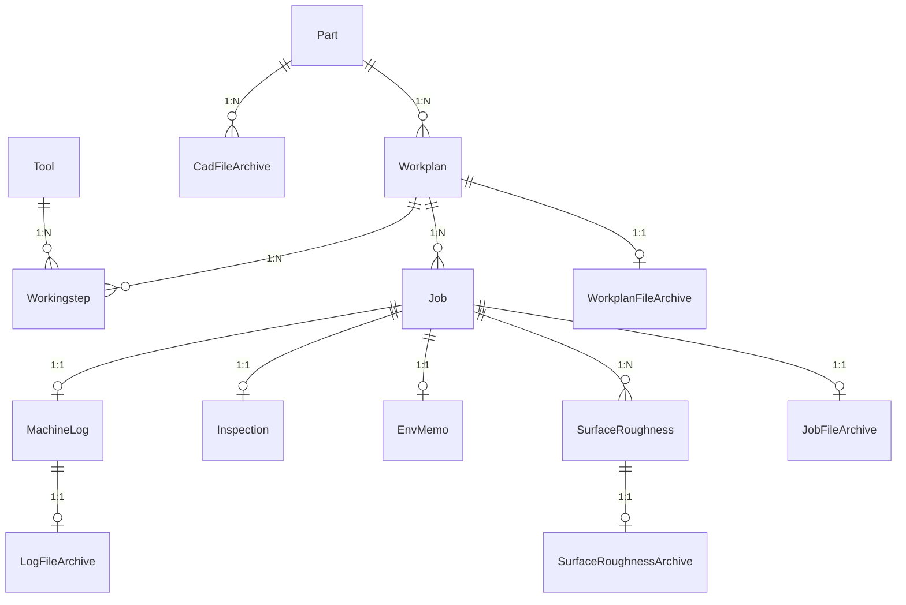

# 공작기계지능화실험실 통합 제조 데이터베이스 시스템 (ManufacturingDB)

[](https://www.python.org/)
[](https://www.mysql.com/)
[](https://www.sqlalchemy.org/)
[](https://streamlit.io/)
[-green.svg)](https://www.iso.org/)
[](https://github.com/OrcusExtreme/ManufacturingDB)

공작기계지능화실험실(Machine Tool Intelligence Lab)의 **통합 스마트 제조 데이터베이스 및 실시간 분석 플랫폼**입니다.  
공작기계(CNC)에서 생성되는 다양한 이기종 데이터(XML 메타데이터, NC 프로그램, 100kHz+ 고주파 NI TDMS 진동 센서, 1Hz CNC 상태 로그, 표면 조도 측정 CSV, 3D CAD 도면)를 **Watchdog 기반으로 자동 감시·수집·파싱**하여 **ISO 14649(STEP-NC) 표준 기반 RDBMS**에 정규화 적재하고, 연구원 및 관리자에게 고성능 웹 대시보드를 제공합니다.

---

## 🌟 주요 특징 (Key Highlights)

### 1. ISO 14649(STEP-NC) 표준 기반 데이터 모델링
- **정적 공정 계획(Static Planning)**과 **동적 가공 실행(Dynamic Execution)**의 분리
- `Part(부품)` ➔ `Workplan(NC 가공계획)` ➔ `Workingstep(단위공정/공구호출)` ↔ `Tool(공구 마스터)`의 객체 지향 공정 계층 구조 구축
- 단일 Workplan 하에서 반복 수행되는 실험 가공(`Job`)의 1:N 이력 관리

### 2. 하이브리드 4계층 스토리지 & 재난 복구(DR) 체계
- **MySQL RDBMS**: B-Tree 인덱스 기반의 초고속 조건 필터링, 정렬, 다차원 조인 및 통계 쿼리
- **Apache Parquet**: 100kHz+ 초고주파 센서 시계열 및 마이크로미터($\mu m$) 단면 조도 곡선을 Snappy 컬럼형 압축 포맷으로 초고속 렌더링
- **File Vault**: SHA 해시 기반의 불변 원본 파일 안전 보관 디렉터리
- **LONGBLOB 백업 미러링**: MySQL 덤프 파일 단독으로도 `recovery_engine.py`를 통해 모든 원본 파일과 디렉터리 트리를 100% 원복 가능

### 3. 무중단 실시간 자동 파이프라인 (Automated Pipeline)
- `machining_raw_data/` 모니터링 디렉터리에 폴더째 파일 투입 시 자동 감지(Watchdog)
- 파일 전송 완료(Lock 해제) 감지 후 확장자별 병렬 파서 자동 구동 (`xml`, `tdms`, `nc`, `log`, `csv`, `step`/`stl`)
- 비동기 백그라운드 데몬(`tdms_visualizer.py`)을 통한 시간 도메인 & FFT 주파수 스펙트럼 Parquet 자동 생성

### 4. 단일 통합 Streamlit 웹 대시보드 (Port 8501)
Job 검색부터 ISO 14649 트리뷰, 센서/조도 분석(Plotly Envelope & FFT), 메타데이터·환경·품질 수정, 데이터 삽입,
DB 테이블 조회/편집, 재난 복구(ZIP)까지 하나의 화면 흐름에서 처리합니다. 별도의 관리자/사용자 계정 구분 없이
모든 기능에 접근할 수 있으며, Job 삭제나 DB 테이블 직접 편집처럼 파괴적인 작업에는 확인 절차(삭제 확인
다이얼로그, Root 계정 재인증)가 남아 있습니다.

---

## 🏗️ 시스템 아키텍처 (System Architecture)

```text
[Raw Data / Network Drive]
       │ (File Drop: XML, NC, TDMS, LOG, CAD, CSV)
       ▼
[Watchdog Observer (data_insert_recognization.py)]
       │ (Queue & Stability Check: 파일 접근 권한 및 무변동 검사)
       ▼
[Parsing Engine (parsers/)]
  ├─ xml_parser.py       : 메타데이터 추출, Part/Workplan/Job 구조 매핑, 공구 런타임 상태 추출 (공구 마스터는 읽기 전용)
  ├─ tdms_parser.py      : 초고속 메타데이터(nptdms) 추출 및 가공 시작 시간 보완
  ├─ log_parser.py       : CNC 1Hz 로그 통계(Max/Avg Load, RPM, Feed) 요약 및 알람 수집
  ├─ roughness_parser.py : 조도 측정 결과(Ra, Rq, Rz) 자동 계산 및 2D 단면 Parquet 변환
  ├─ cad_parser.py       : 3D 모델(STEP, STL) 파트 매핑 및 원본 아카이빙
  └─ nc_parser.py        : NC 프로그램 코드 추출, 공구별 절삭조건(Feed Rate / Spindle Speed) 파싱 및 MD5 해시 식별자 생성
       │
       ▼
[MySQL Database (SQLAlchemy ORM)]  ◄═══►  [Vault System (vault_manager.py)]
       │
       ▼
[Streamlit Frontend UI]
  └─ 통합 대시보드 (Port 8501) : Job 검색·분석, 메타데이터/환경/품질 수정, 데이터 삽입, DB 조회/편집, 복구 ZIP 생성
```

---

## 📊 데이터베이스 스키마 구조 (ER Diagram)



| 도메인 | 테이블명 | 주요 역할 |
| :--- | :--- | :--- |
| **마스터 & 계획** | `part`, `workplan`, `tool`, `workingstep`, `cad_file_archive` | 가공 대상 부품(숫자 PK + `part_name`), NC 공정 계획(숫자 PK + 부품·프로그램·NC해시 유일 제약), 공구 제원, 단위 공정 순서 및 절삭 가공조건(Feed/Spindle), 3D 도면 관리 |
| **가공 실행 & 품질** | `job`, `machine_log`, `surface_roughness`, `inspection`, `env_memo` | 가공 이력(시간,거리,에러), CNC 1Hz 부하 요약, 다지점 표면조도, 공차/합부(PASS/FAIL), 온습도/메모 |
| **아카이브 & 백업** | `workplan_file_archive`, `job_file_archive`, `surface_roughness_archive`, `log_file_archive` | 원본 파일 Vault 저장 경로 및 LONGBLOB 이중화 백업 데이터 |

---

## 📁 디렉터리 구조 (Directory Structure)

```text
ManufacturingDB/
├── .env                              # 데이터베이스 및 시스템 환경변수 설정
├── requirements.txt                  # 런타임 종속 파이썬 패키지 목록
├── run_system.py                     # 전체 서비스 원클릭 통합 기동 관리자
├── gemini.md                         # 전체 시스템 복원 및 상세 기술 명세서
├── machining_raw_data/               # 외부 장비 데이터 유입 모니터링 폴더
│   └── {ProjectName}/{PartName}/
│       ├── CAD_Files/                # 3D 도면 (Part 단위, 가공차수와 무관)
│       └── {JobID}/                  # 가공차수 1건
│           ├── XML/                  # 장비 메타데이터
│           ├── Log/                  # CNC 1Hz 상태 로그 (.log/.csv)
│           ├── TDMS/                 # 고주파 센서 원본
│           ├── NC/                   # NC 프로그램
│           ├── Surface_Roughness/    # 조도 측정 결과
│           ├── etc/                  # 참고용 기타 파일
│           └── processed_parquet/    # 변환 산출물 (시스템 생성)
├── archive_vault/                    # SHA 해시 기반 원본 파일 안전 보관소
├── processed_data/                   # 변환된 시계열 및 FFT Parquet 저장소
├── failed_data/                      # 파싱 실패 격리 보관소 (DLQ)
├── backend/                          # 백엔드 파이프라인 모듈
│   ├── data_insert_recognization.py  # Watchdog 파일 감시 및 큐 분배기
│   ├── job_manager.py                # Job 생성 및 중복 확인 유틸리티
│   ├── recovery_engine.py            # Vault/DB 기반 재난 복구 ZIP 생성기
│   ├── tool_inserter.py              # 공구 마스터 Excel 파서 (전체 교체 + 원본 보관, UI에서도 실행 가능)
│   ├── tdms_visualizer.py            # 백그라운드 TDMS Parquet/FFT 변환 데몬
│   ├── tdms_alignment.py             # NC 코드 대조 실가공 구간 판별 + CNC/DAQ 시간축 정렬 (단독 CLI 제공)
│   ├── vault_manager.py              # 파일 SHA 해시 기반 Vault 아카이빙
│   ├── integrity.py                  # SHA-256 원본 복원 검증 단일 로직 (3-상태 결과)
│   ├── integrity_monitor.py          # 원본 복원 검증 백그라운드 감시자 (주기 실행 + 로그 경고)
│   ├── job_layout.py                 # Job 폴더 하위 분류(XML/Log/TDMS/NC) 규칙 단일 출처
│   ├── migrate_keys_v3.py            # 키 정규화 마이그레이션 (숫자 PK 전환, 데이터 보존)
│   ├── migrate_job_folder_layout.py  # 기존 Job 폴더를 자료 종류별 하위 폴더로 이전
│   ├── backfill_workingstep_conditions.py # 기존 Workplan 대상 NC 절삭조건(Feed/Spindle) 소급 갱신
│   ├── reset_database_and_storage.py # DB(orcus) 및 스토리지(raw/vault/processed/failed) 완전 초기화
│   ├── DB/                           
│   │   ├── database.py               # SQLAlchemy 커넥션 풀링 및 세션 팩토리
│   │   ├── models.py                 # 14개 테이블 DDL 및 ORM 정의
│   │   └── schema_patch.py           # 기동 시 누락 컬럼만 채우는 경량 스키마 보정
│   ├── tests/
│   │   ├── test_tdms_alignment.py    # 합성 TDMS 기반 구간 판별/시간축 정렬 회귀 테스트
│   │   ├── test_nc_parser.py         # NC 절삭조건(Feed Rate/Spindle Speed/Tool) 파싱 단위 테스트
│   │   └── verify_e2e_cutting_conditions.py # 실가공 NC(O0911.nc) 기반 E2E 파싱 및 DB 연동 검증
│   └── parsers/                      # 확장자별 전용 파싱 엔진
│       ├── xml_parser.py             # XML 메타데이터 및 공구 상태 파서
│       ├── tdms_parser.py            # NI TDMS 고속 헤더 파서
│       ├── log_parser.py             # CNC 컨트롤러 1Hz 상태 로그 파서
│       ├── roughness_parser.py       # 표면조도(Ra/Rq/Rz) 및 평가곡선 파서
│       ├── cad_parser.py             # STEP/STL 도면 파서
│       └── nc_parser.py              # NC 프로그램 G코드 파서
└── frontend/                         # Streamlit 통합 대시보드 (Port 8501)
    ├── dashboard.py                   # 단일 엔트리포인트: 페이지 설정, 사이드바 내비게이션
    ├── cad_viewer_component.py        # 3D CAD(STEP/STL) 뷰어 컴포넌트
    ├── erd_component.py               # 인터랙티브 ERD 다이어그램 컴포넌트
    └── components/                    # 화면별 모듈화된 렌더링 컴포넌트
        ├── common.py                  # 공통 유틸(경로 설정, 캐싱 쿼리, ZIP 생성 등)
        ├── filters.py                 # 5단계 캐스케이딩 Job 검색 필터
        ├── job_workspace.py           # Job 검색·분석·수정·다운로드 통합 화면
        ├── master_tree.py             # 계층형 마스터 데이터(ISO 14649 트리) 조회
        ├── tool_master.py             # 공구 마스터 엑셀(.xlsx) 전체 교체, 보관 원본 조회 및 목록 조회
        ├── data_upload.py             # 가공 데이터 수동 업로드
        ├── db_explorer.py             # DB 테이블 ERD/조회/정렬·조건 필터/편집/CSV 내보내기
        ├── download_center.py         # 프로젝트 ▸ Part ▸ Job ▸ 세부 데이터 다운로드 내비게이션
        ├── native_picker.py           # 파일 선택창의 형식 필터 이름 지정(File System Access API)
        └── recovery.py                # 시스템 백업/복구 (전체 복구 ZIP 생성)
```

---

## 🚀 빠른 시작 (Quick Start)

### 1. 사전 요구사항 (Prerequisites)
- **Python**: 3.10 이상
- **MySQL**: 8.0 이상 (인스턴스 구동 필요)

### 2. 저장소 복제 (Clone Repository)
```bash
git clone https://github.com/OrcusExtreme/ManufacturingDB.git
cd ManufacturingDB
```

### 3. 환경 변수 설정 (`.env`)
프로젝트 루트 디렉터리에 `.env` 파일을 생성하고 데이터베이스 정보를 입력합니다.
```env
DB_HOST=localhost
DB_PORT=3306
DB_USER=root
DB_PASSWORD=your_password
DB_NAME=orcus
PYTHONPATH=backend
```

### 4. 원클릭 시스템 실행 (Run System)
`run_system.py`를 실행하면 필수 패키지 설치 확인, DB 스키마 자동 초기화, 파이프라인 및 통합 대시보드가 서브프로세스로 동시 기동됩니다.
```bash
python run_system.py
```

### 5. 서비스 접속
- **통합 대시보드**: [http://localhost:8501](http://localhost:8501)

---

## 📈 대시보드 주요 기능 안내 (UI Features)

로그인·역할 구분 없이 하나의 화면에서 모든 기능에 접근합니다. Job 삭제, DB 테이블 직접 편집처럼 되돌릴 수
없는 작업에는 확인 다이얼로그 또는 Root 계정 재인증이 남아 있습니다.

1. **Job 워크스페이스**: 연구 프로젝트명·Part명·가공차수·실험일자 범위 기반 5단계 동적 필터로 Job을 검색한
   뒤, 하나의 화면에서 탭으로 전환하며 처리합니다.
   - `분석 보기`: CNC 1Hz 통계(`cls`, `crpm`, `cfr`), 고주파 TDMS 센서 Line 차트, DAQ 진동 Envelope 밴드 차트,
     FFT PSD 로그 스펙트럼, 마이크로미터 표면조도 단면 곡선 시각화
   - `메타데이터 · 환경 · 품질 수정`(편집 모드): Job 메타데이터, 온습도/작업자/칩형태 환경메모,
     치수공차/형상/PASS·FAIL 품질점검 통합 편집
   - 하단 `영구 삭제`: 원자적 연쇄 삭제(`CASCADE`) 확인 모달 지원
   - 원본 파일 다운로드는 `데이터 다운로드` 메뉴로 일원화되어 있습니다
2. **계층형 마스터 데이터**: ISO 14649 공정 트리(Part ➔ Workplan ➔ Workingstep ➔ Tool) 및 CAD 모델 조회
3. **공구 마스터**: 엑셀(`.xlsx`) 업로드로 공구 마스터 전체 교체(기존 데이터 삭제 후 엑셀 내용만 등록,
   `T1`~`T99` 형식 코드만 적재, 가공 이력의 공구 연결은 공구 코드 기준으로 자동 재연결) 및 전체 공구 목록 조회.
   업로드한 원본은 `archive_vault/tool_master/tool_info.xlsx`로 보관되며 화면에서 바로 내려받을 수 있습니다
4. **데이터 삽입**: CAD 도면(`.stl`/`.stp`/`.step`), XML, NC, TDMS, Log, 조도 CSV 웹 수동 업로드.
   사이드바의 `DB 스키마 구조` 바로 아래에 배치되어 가장 먼저 접근됩니다
5. **DB 테이블**: 인터랙티브 ERD에서 테이블을 선택해 실시간 조회·검색, 속성별 정렬(오름/내림차순)과 속성 ▸
   비교 조건 ▸ 값 드롭다운 필터링, CSV 내보내기 지원. 표를 직접 편집한 뒤 저장하면 Root 인증을 거쳐 반영
6. **데이터 다운로드**: 프로젝트 ▸ Part ▸ Job 순으로 좁혀가며 선택 범위를 ZIP으로 내려받습니다. 가공
   이력(Job)까지 선택하면 그 Job에 **실제로 존재하는 데이터 유형만** 버튼으로 나타나고(파일 개수 표시),
   버튼 클릭 시 해당 유형만 즉시 내려받거나 개별 파일 단위로 받을 수 있습니다. 원본 폴더가 삭제된 Job은
   Vault/DB 아카이브에서 자동 조달되며, 필요하면 로컬 디스크로 원본 복원도 가능합니다
7. **시스템 백업/복구**: Vault/DB에서 원본 파일들을 역추적하여 폴더 구조 그대로 압축(ZIP) 다운로드

사이드바는 `DB 관계도(ERD) 보기` 버튼(전체 테이블 관계도 팝업) 아래에 데이터 입출력 메뉴(`데이터 삽입`,
`데이터 다운로드`)를 두고, 구분선 아래에 나머지 조회·관리 메뉴를 배치합니다.

### 🔒 원본 복원 검증은 백그라운드에서만 수행됩니다

XML/NC/CAD 원본이 저장 시점과 바이트 단위로 동일한지에 대한 SHA-256 검증은 화면에서 제거되었고,
데이터 수집 파이프라인이 기동 직후와 이후 30분 주기로 자동 수행합니다(`backend/integrity_monitor.py`).
판정은 `일치 / 불일치 / 검증 불가(기준 해시 미기록)` 3-상태를 그대로 유지하며, 실행 로그에 다음과 같이 남습니다.

```text
[원본 복원 검증] 일치 4건 / 불일치 0건 / 검증 불가 0건 / 원본 미보존 1건
```

불일치가 감지되면 해당 대상의 기준 해시와 재계산 해시가 `[경고]` 라인으로 함께 출력됩니다. 해시 재계산
로직은 여전히 `backend/integrity.py` 한 곳만 사용합니다.

---

## 🚀 릴리즈 노트 (Release Notes)

### [V2.3.5] - 2026-09-14
- **Workingstep 가공 조건 (Feed Rate & Spindle Speed) NC 자동 파싱 및 DB 연동**:
  - **스키마 확장**: `workingstep` 테이블에 `feed_rate` (Float, mm/min, 가공 이송속도) 및 `spindle_speed` (Float, RPM, 주축 회전수) 컬럼 추가 (`backend/DB/models.py`).
  - **NC 절삭 조건 파서 엔진 탑재** (`backend/parsers/nc_parser.py`):
    - `parse_nc_cutting_conditions(nc_input)` 신설: 공구 호출(`M6`/`T`), 주축 회전수(`S`), 선형/원호 절삭 이송속도(`F`) 블록을 정규식 및 토큰 분석기로 정밀 파싱. 공백 생략 컴팩트 코드(`S3800M3`, `G1Z-2F710`, `M6T6`), 표준 공백 분리형, 블록 번호(`Nxx`), 소수점 표기(`F710.0`) 등 다양한 NC 코드 스타일을 100% 포괄.
    - `sync_workplan_nc_cutting_conditions()` 구현: Workplan 하위 Workingstep의 공구 번호/순서와 매핑하여 DB 레코드에 절삭 조건 자동 동기화 (UPDATE/INSERT).
  - **수집 파이프라인 연계 및 안전성 개선** (`backend/parsers/xml_parser.py`):
    - XML 수집 시 연관 NC 파일이 존재하면 즉시 F/S 절삭 조건 연동 파싱.
    - 파일 투입 순서 차이로 NC 파일 미도착 시 발생할 수 있던 `nc_binary_data` UnboundLocalError를 방지하도록 기본 바인딩(`nc_binary_data = None`) 사전 정의.
  - **소급 동기화 백필 도구 신설** (`backend/backfill_workingstep_conditions.py`): 기등록된 Workplan들의 NC 파일을 재탐색하여 누락된 절삭 가공 조건을 일괄 보정하는 CLI 스크립트 제공.
  - **검증 체계 구축**: `backend/tests/test_nc_parser.py` (단위 테스트 4종 전원 통과) 및 `backend/tests/verify_e2e_cutting_conditions.py` (실제 `O0911.nc` 실가공 원본 파일 기반 E2E 파싱 및 DB 적재 검증 통과 - F: 710 mm/min, S: 3800 RPM).
- **계층형 마스터 데이터 UI 가공조건 시각화** (`frontend/components/master_tree.py`):
  - **Workingsteps 테이블 컬럼 확장**: `주축회전수 (RPM)` 및 `이송속도 (mm/min)` 컬럼 추가 및 결측치 예외 처리(`-`).
  - **순서별 가공 조건 요약 뱃지(Chips)**: 상단에 공구 호출 단계별 적용 공구 및 가공 조건을 직관적인 칩 형태로 시각화 (`Step 1 (T6): ⚡ 3,800 RPM | ⏩ 710 mm/min`)하여 한눈에 절삭 조건 파악 가능.
- **무중단 스키마 자동 보정(`schema_patch.py`) 강화**:
  - `part.part_name`, `workplan.nc_hash`, `job_file_archive.xml_file_sha256`, `cad_file_archive.file_sha256`, `workingstep.feed_rate`, `workingstep.spindle_speed` 등 누락되기 쉬운 컬럼을 `PENDING_COLUMNS`에 전면 등록.
  - 시스템 기동 시 누락 컬럼 자동 추가 및 `part.part_name` NULL 값 자동 채움(`UPDATE part SET part_name = part_code WHERE part_name IS NULL`)을 무중단 지원.
- **더미 데이터 및 고아 Workplan 자동 청소 고도화** (`backend/clean_dummy_data.py`):
  - `workplan_id`의 `INT AUTO_INCREMENT` 정수 키 전환에 맞춰 dummy workplan 쿼리 로직을 `program_code.like("UNKNOWN_WORKPLAN_%")` 및 `program_code == "Unknown"`으로 고도화.
  - 파일 유입 타이밍 차이로 발생할 수 있는 참조 없는 고아 Workplan을 안전하게 자동 정리.
- **백그라운드 파이프라인 프로세스 생존 감시 및 복원력 강화** (`run_system.py`):
  - `run_system.py` 메인 루프에서 백엔드 파이프라인(Watchdog), Streamlit 대시보드(8501), TDMS 변환기의 프로세스 상태(`p.poll()`)를 실시간 주기 감시하고 비정상 종료 시 경고 로그 출력.
  - 예외 발생 시 상세 `traceback` 포맷팅 로깅 제공.
- **데이터베이스 & 파일 스토리지 완전 초기화(Reset) 도구 제공** (`backend/reset_database_and_storage.py`):
  - Windows 환경 파일/폴더의 읽기 전용 속성 해제 및 재시도 핸들러(`_remove_readonly`) 구현.
  - MySQL 외래키 제약조건(`SET FOREIGN_KEY_CHECKS = 0`)을 고려하여 기존 16개 테이블 일괄 안전 삭제 및 최신 `models.py` 기반 14개 테이블 원클릭 클린 재생성(`Base.metadata.create_all`).
  - `machining_raw_data/`, `archive_vault/`, `processed_data/`, `failed_data/`의 루트 및 기본 디렉터리 구조를 보존하면서 내부 잔여 파일 완전 초기화 지원.

### [V2.3.4] - 2026-09-11
- **NC 코드 대조 기반 실가공 구간 자동 판별** (`backend/tdms_alignment.py` 신규): TDMS는 가공 한 건이 아니라
  장비 모니터링이 켜져 있던 구간 전체(예: 12분)를 담고 있고, 파일명의 프로그램명이 실제 가공한 NC와 다를 수도
  있다. 업로드된 NC 원본을 `CNC-CurrentBlock`과 대조해 프로그램이 순서대로 진행된 구간(run)을 찾고, 한 파일에
  중단된 시도와 완주한 시도가 같이 들어있을 때는 **실행된 블록 종류 수(커버리지)** 로 점수를 매겨 완주한 쪽을
  고른다. 같은 블록이 프로그램에 여러 번 나오면(`G1Y-15` 2회 등) 진행 위치를 단조 증가로 매핑해 한 번의 실행이
  여러 개로 쪼개지지 않게 한다. 고른 구간 앞뒤에 붙은 대기 시간은 스핀들/이송 상태와 블록 전환 간격으로 잘라냄
- **CNC ↔ DAQ 공통 시간축**: 27Hz 폴링 CNC(수천 행)와 12.8kHz DAQ(수백만 행)를 각자의 행 번호로 그리던 것을,
  가공 시작을 0초로 하는 경과시간 열(`time_s` / `daq_time_s`)로 통일. DAQ 구간은 비율 스케일이 아니라 파형
  속성(`wf_start_time` + `wf_start_offset` + `wf_increment`)으로 절대 시각을 복원해 잘라내고, 파형 속성이 없는
  장비 데이터만 "두 그룹의 전체 기록 구간이 같다"는 가정으로 비율 환산(fallback)
- **DAQ 시계 지연 자동 실측/보정**: CNC와 DAQ는 수집 경로가 달라 선언된 시작 시각이 같아도 실제로는 몇 초씩
  어긋나 있다. 같은 물리량을 보는 두 채널(`CNC-Z-SpindleLoad` ↔ DAQ 스핀들 3상 전류)의 정규화 상호상관으로
  지연을 측정해 보정(실측 데이터에서 상관 0.963, 지연 0일 때 −0.141 → +3.05초 보정). 상관이 충분하지 않으면
  보정하지 않고 진단값만 남김
- **판별 근거 저장 및 표시**: `job.machining_window`(JSON) + `processed_data/job_{id}_window.json` 사이드카에
  구간·판별 방법·NC 커버리지·DAQ 보정값·판단 메모를 기록하고, Job 워크스페이스 TDMS 그래프 카드 상단에 요약 표시
- **손상된 TDMS 내성**: 수집 프로그램이 비정상 종료되면 파일 끝과 `*.tdms_index`에 0으로 채워진 조각이 남아
  nptdms가 `ValueError`로 실패한다(실측 파일에서 발생). 세그먼트 lead-in을 따라가 유효 지점까지만 읽도록 우회해
  기존에 변환 자체가 실패하던 TDMS도 처리
- **XML/TDMS 시간대 자동 정렬**: XML `StartTime`은 로컬시간(+09:00), TDMS 파형 시각은 UTC라 그대로 비교하면
  9시간 어긋난다. 정수 시간 단위로 기준을 맞춘 뒤 힌트로 사용하고, 보정해도 겹치지 않으면(다른 세션의 XML 등)
  힌트를 버림
- **변환 배치 안정화**: `run_visualizer_batch()`의 `get_abs_raw_data_path` 미import(NameError로 배치 전체가
  5초마다 실패)를 수정하고, NC 참조 없이 만든 구간만 NC 확보 시 1회 재판별하도록 조건을 좁혀 무한 재처리를 차단.
  변환 실패 Job은 1분 → 최대 30분으로 재시도 간격을 늘려 로그 폭주 방지
- **단독 CLI 및 회귀 테스트**: DB 없이 `python backend/tdms_alignment.py --tdms <f> --nc <f> [--xml <f>] --out <dir>`
  로 판별 결과와 Parquet을 바로 확인 가능. `backend/tests/test_tdms_alignment.py`가 합성 TDMS로 구간 판별,
  중복 블록 매핑, 시계 지연 복원, 비율 스케일 fallback, NC/DAQ 부재, 손상 꼬리, 시간대 정렬을 검증(31개 검사)
- **표면조도 평가곡선 인식을 파일명 → 내용 기반으로 변경** (`backend/parsers/roughness_parser.py`): 기존에는
  `*평가곡선*.CSV` 패턴에 걸리는 파일만 읽어, 측정 담당자·장비 설정에 따라 이름이 달라진 파일
  (예: `260911_1.CSV`)은 업로드해도 조도 값이 하나도 들어오지 않았다. 이제 헤더의 `DATANUM:` +
  `DATAAXIS:`/`XPITCH:`/`PROFILENO:` 표식으로 평가곡선 파일을 판별하므로 이름과 무관하게 적재된다.
  찾은 파일 목록(또는 찾지 못했다는 사실)을 로그로 남겨 원인 파악이 가능하도록 함
- **3D 형상 뷰어 좌표계를 CAD 표준(Z-up)으로 정렬** (`frontend/cad_viewer_component.py`): 바닥 그리드를
  XZ 평면에서 **XY 평면**으로 바꾸고 카메라 up 벡터를 Z축으로 고정(OrbitControls 생성 전에 적용).
  등각/상면/정면/측면 시점 프리셋도 Z-up 기준으로 재정의하고, 그리드는 모델 크기에 맞춰 한 칸 간격을
  1/2/5×10ⁿ로 정규화해 모델 최하단 Z에 배치. 화면 좌측 하단에 카메라 방향을 따라 도는 **X(적)/Y(녹)/Z(청)
  축 gizmo**를 별도 뷰포트로 겹쳐 그려, 확대하거나 모델이 화면 밖으로 나가도 방향을 확인할 수 있게 함

### [V2.3.3] - 2026-09-10
- **공구 마스터의 단일 출처를 엑셀로 고정**: `tool` 테이블을 생성·수정·삭제할 수 있는 경로를 공구 마스터 엑셀
  업로드(`backend/tool_inserter.py`)로 한정. `xml_parser.py`는 `Tool` 모델 import 자체를 제거해 공구 행을
  만들 수단이 없도록 하고, Workingstep에 붙일 `tool_id` 조회만 읽기 전용 SELECT로 수행. 엑셀에 없는 공구
  번호가 XML에 나오면 마스터에 추가하지 않고 `tool_number`/`xml_tool_code`만 남긴 뒤, 이후 그 공구가 엑셀에
  들어오면 자동으로 다시 연결
- **엑셀 업로드 방식을 업서트 → 전체 교체로 변경**: 기존 공구 마스터를 모두 삭제하고 업로드된 엑셀 내용만 등록.
  전체 교체로 `tool_id`가 새로 부여되므로 `relink_workingsteps()`가 `xml_tool_code`(없으면 `T{tool_number}`)
  기준으로 가공 이력의 공구 연결을 다시 맺음. 이번 엑셀에 없는 공구를 호출한 Workingstep은 `tool_id`만 비워지고
  호출 번호는 보존. 같은 코드가 여러 행에 나오면 마지막 행 기준으로 병합
- **잘못된 파일로 마스터가 비워지는 사고 방지**: 열 이름 불일치·파일 손상 등으로 유효 공구가 0건이면 교체를
  취소하고 기존 마스터를 그대로 유지(UI에서도 교체 전 경고 + 동의 체크박스 통과 필요)
- **공구 코드 형식 검증** (`^T\d{1,2}$`): `T1`~`T99` 형태만 DB에 적재하고 `t4`/`T 4`는 `T4`로 정규화.
  `T19-TIP`·설명 문구·빈 값처럼 XML 런타임 공구 호출과 매핑할 수 없는 행은 제외 건수로 보고
- **`tool.tool_code` NOT NULL 제약 추가**: 공구 번호 없는 유령 공구 행이 생기지 않도록 스키마 레벨에서 차단
- **`tool_id` 번호 재정렬** (`resequence_tool_ids()`): 삽입/삭제 이력 때문에 4번부터 시작하거나 중간이 비던 번호를
  1번부터 연속으로 재부여. `workingstep.tool_id` 참조를 같은 트랜잭션에서 함께 옮기고 `AUTO_INCREMENT`도 `N+1`로 정렬
- **원본 엑셀 보관** (`archive_vault/tool_master/tool_info.xlsx`): 업로드/투입 파일명과 무관하게 고정 파일명으로
  최신본 1개만 유지하며, 새로 올릴 때 이전 원본은 삭제. 공구 마스터 화면에서 보관 파일 크기·갱신 시각 확인 및
  원본 내려받기 제공(자동 복구 대상이 아닌 단순 보관용)

### [V2.3.2] - 2026-09-09
- **DB 키 정규화 (Schema Normalization)**: 사람이 읽는 이름을 PK로 쓰던 구조를 정리. `part.part_code`를
  1부터 증가하는 숫자 PK로 바꾸고 이름은 `part_name` 속성으로 분리, `workplan.workplan_id`도 `"부품명_프로그램_해시"`
  문자열(한글 포함) PK에서 숫자 PK로 전환하고 기존 조합은 `UNIQUE(part_code, program_code, nc_hash)` 제약으로
  이관해 중복 차단 규칙 유지. `machine_log`는 가공 특성에 맞게 Job과 1:1(`job_id` 유일 제약)로 고정.
  `tool`에서 미사용 컬럼(`is_mounted`, `photo_filename`, `photo_content`) 제거
- **데이터 보존 마이그레이션 도구 신설** (`backend/migrate_keys_v3.py`): `--check` 상태 점검 / `--run` 적용.
  자식 테이블(job, workingstep, 각종 아카이브) 참조를 새 키로 재작성하며, PK가 항상 첫 컬럼에 오도록 물리적
  컬럼 순서까지 정리. 복제 DB 사전 검증 후 실 DB 적용
- **Job 워크스페이스 화면 재구성**: 구글 클라우드 콘솔 방식의 3열 카드 그리드로 전환. 가로로 늘어놓던 지표를
  '라벨 위 / 값 아래' 세로 목록으로 바꿔 값 잘림 제거, 같은 열의 카드는 위 카드가 짧으면 아래 카드가 올라붙고
  열 끝단은 서로 맞춰지도록 구성. 파형 3종(TDMS · CNC 로그 · 조도 프로파일)은 `그래프` 패널로 묶어 동일 높이 배치
- **Job 목록 표에서 행 클릭으로 상세 전환** 및 `모든 컬럼 보기` 토글 추가(기본은 핵심 8컬럼만 표시해 가로 스크롤 제거)
- **Job 정보 항목 보강**: 그동안 조회되지 않았던 `end_time`(가공 종료), `cutting_moving_distance`(절삭 이동 거리),
  부품 `material_code`(소재) 노출. CAD 모델이 등록된 부품은 `CAD 형상 보기` 버튼으로 3D 뷰어 팝업 제공
- **DB 테이블 조회 시 PK 우선 표시**: 물리적 컬럼 순서와 무관하게 PK를 항상 첫 열에 배치(데이터·스키마 탭 공통)
- **파일 선택창 형식 필터 이름 지정** (`frontend/components/native_picker.py`): Streamlit이 `accept`에 붙이는
  가짜 MIME(`application/streamlit`) 때문에 Windows 파일 대화상자가 "사용자 지정 파일"로 표시되던 문제를,
  File System Access API로 선택 단계만 가로채 `CAD File(.stl, .stp, .step)` 형태로 표시하도록 해결.
  업로드/검증/저장은 기존 Streamlit 파이프라인이 그대로 처리하며 미지원 브라우저는 기본 동작으로 되돌아감
- **UI 아이콘 통일**: 제목·버튼·탭·안내문의 이모지를 Streamlit 네이티브 Material 아이콘(`:material/...:`)으로 교체
- **개발 편의**: `.streamlit/config.toml`에 `runOnSave = true` 추가(컴포넌트 수정이 재시작 없이 반영되지 않던 문제),
  DB 백업 디렉터리(`backups/`) gitignore 처리, 문자열 PK 시절의 일회성 복구 스크립트 `backend/fix_db.py` 제거

### [V2.3.1] - 2026-09-08
- **원본 복원 검증 백그라운드 전환** (`backend/integrity_monitor.py`): UI에서 복원 검증 화면을 완전히 제거하고,
  파이프라인이 기동 시 1회 + 30분 주기로 전체 아카이브(XML/NC/CAD)를 자동 재검증하여 결과를 로그로 남기도록 변경.
  불일치 감지 시 기준/재계산 해시를 함께 경고 출력. 서브프로세스를 `-u`로 띄워 파이프라인 로그가 즉시 보이도록 수정
- **사이드바 재구성**: `핵심 테이블 구조 안내` 안내문을 제거하고, `DB 관계도(ERD) 보기` 버튼 아래에
  `데이터 삽입`·`데이터 다운로드`를 별도 그룹으로 배치한 뒤 구분선 아래에 나머지 내비게이션 메뉴 배치
- **데이터 다운로드 내비게이션 신설** (`components/download_center.py`): 프로젝트 ▸ Part ▸ Job 순으로 범위를 좁혀
  ZIP 일괄 다운로드. Job까지 선택하면 그 Job에 실제 존재하는 데이터 유형만 버튼(파일 개수 포함)으로 노출되어
  유형별·개별 파일 단위 다운로드 가능. 원본 폴더 유실 시 Vault/DB 아카이브에서 자동 조달 및 로컬 복원 지원
- **다운로드 경로 일원화**: Job 워크스페이스의 `다운로드` 탭을 제거하고 모든 원본 파일 다운로드를
  `데이터 다운로드` 메뉴로 통합
- **DB 테이블 정렬·조건 필터**: 속성별 오름/내림차순 정렬과 `속성 ▸ 비교 조건 ▸ 값` 드롭다운 필터(값 목록은
  해당 컬럼의 실제 DISTINCT 값에서 제공, 직접 입력도 가능)를 SQL 레벨에서 적용
- **사이드바 개편**: `DB 관계도(ERD) 보기` 팝업 버튼 추가, `데이터 삽입` 메뉴를 DB 스키마 구조 버튼 바로 아래로 이동
- **업로드 형식 제한 명확화**: CAD는 `.stl`/`.stp`/`.step`, 공구 마스터 엑셀은 `.xlsx`만 허용
- **공구 사진·실장착 표시 기능 제거**: 공구 마스터 화면에서 실물 사진 등록/조회 및 실제 장착 공구 표시 UI 삭제

### [V2.2.0] - 2026-09-07
- **원본 복원 검증 (Restore & Verify) 신설**: XML/NC/CAD LONGBLOB 저장 시점에 SHA-256을 함께 기록(`backend/integrity.py`)
  하고, "원본 복원 검증" 화면에서 지금 DB에서 꺼낸 원본을 재계산해 비교. 결과는 항상 `✅ 일치 / ❌ 불일치 /
  ⚪ 검증 불가` 3가지 상태로 노출되어 "검증 불가"가 실패로 오인되지 않도록 함
- **공구 마스터 화면 신설**: 기존 백엔드 전용이던 `tool_inserter.py` 엑셀 업서트를 UI에서 직접 실행 가능하도록
  연결. 공구별로 현재 실제 기계 장착 여부(`is_mounted`)와 실물 사진(`photo_content`)을 등록·조회 가능

### [V2.1.0] - 2026-09-07
- **관리자/사용자 대시보드 단일 통합 (Unified Dashboard)**: 별도 포트로 분리돼 있던 관리자 대시보드(8501)와
  사용자 대시보드(8502)를 로그인·역할 구분 없는 하나의 대시보드(Port 8501)로 통합. "가공 검색"에 중복돼
  있던 필터 로직을 `components/filters.py`로 추출하고, Job 검색·분석·수정·다운로드를 "Job 워크스페이스"
  탭 하나로 합쳐 화면 이동 뎁스를 줄임. `frontend/components/` 아래로 화면별 렌더링 로직을 모듈화

### [V2.0.4] - 2026-09-03
- **프로젝트 디렉터리 클린업 (Directory Cleanup)**: 과거 파싱 작업에 사용되었던 1회성 추출 스크립트(`extract_xml.py` 등), 디버깅용 임시 스크립트, 실행 로그 파일(`st_err.log` 등), 사용하지 않는 찌꺼기 폴더(`TESTSET`, `temp_pyrefly` 등)를 일괄 삭제하여 프로젝트 루트 환경 최적화

### [V2.0.3] - 2026-09-02
- **관리자 DB 데이터 편집 모듈 탑재**: Admin Dashboard(Port 8501)에 "DB 테이블 관리" 메뉴를 신설하고, Root 계정 인증을 통해 PK/FK를 보호하며 나머지 데이터를 안전하게 편집(UPDATE/INSERT/DELETE)할 수 있는 모달형 실시간 에디터 추가
- **파일 Vault 복구 엔진 안정화**: Vault 원본 아카이브와 `machining_raw_data` 간의 복구 매핑 경로를 절대경로에서 유연한 상대경로(Relative Path) 체계로 전면 리팩토링 및 데이터 무결성 검증 완료
- **Job 선택 UI 직관성 개선**: User Dashboard(Port 8502)의 Job ID 선택 드롭다운에 "Job ID - Part 명 가공종류" 포맷(예: Job 2 - Computer 1차 가공)을 적용하여 사용자 편의성 극대화

### [V2.0.2] - 2026-09-01
- **포트 이원화 배포**: 관리자(8501), 사용자(8502) 대시보드 포트 분리 및 Python UI 안정화
- **STP 시각화 모듈**: 관리자 대시보드 및 사용자 대시보드에서 STP 파일의 3D 모델을 시각화하는 기능 추가
- **백그라운드 처리 최적화**: 파싱 및 데이터 삽입 과정의 백그라운드 데몬 및 프로세스 처리 개선

### [V2.0.1] - 2026-08-31
- **DB 스키마 명세 고도화**: ISO 14649 표준 준수 14개 테이블의 완벽한 컬럼 정의 및 제약조건/CASCADE 정책 문서화
- **인코딩 & 서브프로세스 안정화**: Windows 환경 UTF-8 인코딩(`-X utf8`, `PYTHONUTF8=1`) 전면 적용
- **에디터 편의성 개선**: 웹 코드 작성란 Tab 키 들여쓰기(4 spaces) 및 Shift+Tab 내어쓰기 지원
- **데이터베이스 이중화 강화**: LONGBLOB 원본 미러링 및 재난 복구(DR) 엔진 안정화

---

## 👥 기여 및 문의 (Contact)
- **개발 및 관리**: 공작기계지능화실험실 (Machine Tool Intelligence Lab)
- **GitHub**: [@OrcusExtreme](https://github.com/OrcusExtreme)
- **Issues**: 버그 리포트 및 기능 제안은 [GitHub Issues](https://github.com/OrcusExtreme/ManufacturingDB/issues)를 이용해 주세요.
