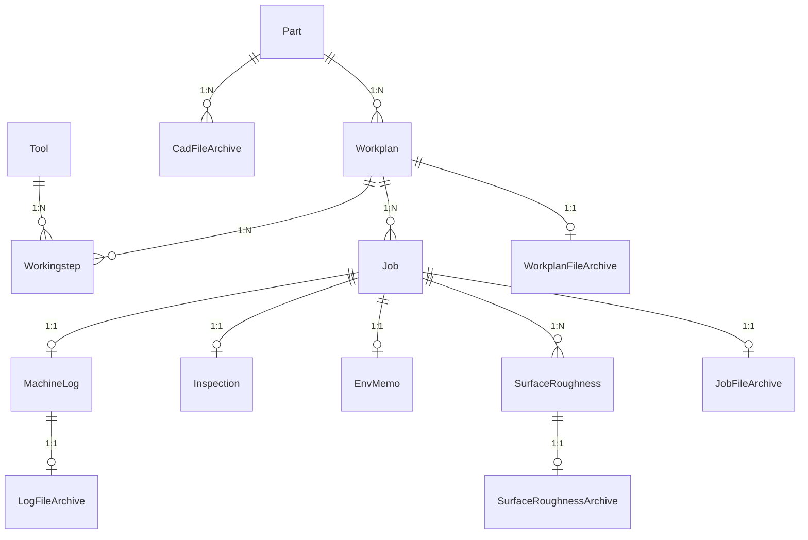

# 공작기계지능화실험실 제조 DB — 시스템 명세서

> **이 문서의 목적**
> 소스 코드가 없는 상태에서도 이 시스템을 다시 만들 수 있도록, 무엇을 왜 그렇게 만들었는지까지
> 기록한 단일 사양서입니다. 코드를 그대로 옮겨 적는 대신 **동작 규칙·자료 구조·판단 근거**를
> 서술합니다. 실제 코드와 어긋나는 부분이 보이면 코드가 정답이며, 이 문서를 고쳐 주세요.
>
> **기준 버전** V2.3.5 · **대상 독자** 이 시스템을 인수인계받거나 재구축하는 개발자

---

## 목차

1. [시스템 개요](#1-시스템-개요)
2. [환경 및 설치](#2-환경-및-설치)
3. [파일 레이아웃 규칙](#3-파일-레이아웃-규칙)
4. [데이터베이스 명세](#4-데이터베이스-명세)
5. [수집 파이프라인](#5-수집-파이프라인)
6. [파서 상세](#6-파서-상세)
7. [TDMS 정렬 엔진](#7-tdms-정렬-엔진)
8. [보관소와 무결성](#8-보관소와-무결성)
9. [복구 엔진](#9-복구-엔진)
10. [제조 DB Controller (C++)](#10-제조-db-controller-c)
11. [웹 대시보드](#11-웹-대시보드)
12. [엔드투엔드 흐름](#12-엔드투엔드-흐름)
13. [운영 가이드](#13-운영-가이드)
14. [설계 판단과 알려진 제약](#14-설계-판단과-알려진-제약)

---

## 1. 시스템 개요

### 1.1 무엇을 하는 시스템인가

CNC 공작기계 한 번의 가공에서 쏟아지는 **서로 다른 여섯 종류의 데이터**를 사람이 손대지 않고
한 데이터베이스로 모으고, 웹에서 함께 들여다볼 수 있게 하는 시스템입니다.

| 자료 | 형식 | 규모 | 나오는 곳 |
| :--- | :--- | :--- | :--- |
| 가공 메타데이터 | XML | ~8KB | 장비 제어 PC |
| NC 프로그램 | G코드 텍스트 | ~1KB | CAM / 작업자 |
| 고주파 센서 | NI TDMS | 수백 MB | DAQ (12.8kHz) |
| CNC 상태 로그 | 탭 구분 텍스트 | ~200KB | 컨트롤러 (1Hz) |
| 표면 조도 | CSV | ~30KB × N | 조도 측정기 |
| 3D 도면 | STEP / STL | ~30KB~15MB | CAD |

### 1.2 세 개의 축

이 시스템을 이해하는 가장 빠른 길은 아래 세 축이 **왜 분리되어 있는지**를 보는 것입니다.

**① 정적 계획과 동적 실행의 분리 (ISO 14649 / STEP-NC)**

같은 NC 프로그램으로 부품을 열 번 깎으면, *계획*은 하나이고 *실행 이력*이 열 개입니다.
계획을 열 번 복사해 저장하면 "이 프로그램으로 만든 결과들을 비교"하는 질문에 답할 수 없습니다.

```
Part (부품)
 └─ Workplan (NC 프로그램 단위의 가공 계획)       ← 정적, 1개
     ├─ Workingstep (공구 호출 순서 · 절삭조건)    ← 정적
     └─ Job (1회 가공 실행 이력)                   ← 동적, N개
         ├─ MachineLog / Inspection / EnvMemo      (각 1:1)
         └─ SurfaceRoughness                        (1:N)
```

**② 저장 계층의 분리**

한 저장소에 다 넣으면 어느 한쪽이 반드시 불행해집니다.

| 계층 | 담는 것 | 이유 |
| :--- | :--- | :--- |
| MySQL | 스칼라 값, 관계, 요약 통계 | 인덱스 기반 조건 검색·조인·정렬 |
| Parquet | 시계열·주파수·조도 곡선 | 수백만 행을 컬럼 압축으로 즉시 그림 |
| File Vault | 원본 파일 사본 | 원본을 절대 손실하지 않기 위한 불변 보관 |
| LONGBLOB | 15MB 이하 원본 바이너리 | **DB 덤프 하나만으로** 파일 트리까지 복원 |

**③ 실행 주체의 분리**

```
[제조 DB Controller (system_controller.exe)]   ← 사람이 켜고 끄는 유일한 창
        │  프로세스 감독 + 실시간 로그 + 파서 토글
        ├─ Watchdog 수집기 (data_insert_recognization.py)
        ├─ TDMS 변환 데몬 (tdms_visualizer.py)
        └─ Streamlit 대시보드 (frontend/dashboard.py, :8501)
```

컨트롤러는 파이썬 코드를 품지 않고 **디스크의 `.py` 를 그대로 실행**합니다.
따라서 파이썬을 고쳐도 컨트롤러를 다시 빌드할 필요가 없습니다.

### 1.3 전체 흐름

```text
[장비 / 계측 PC]
      │ 폴더째 복사
      ▼
data/machining_raw_data/{프로젝트}/{부품}/{가공차수}/
      │ Watchdog 감지 → 확장자로 하위 폴더 자동 정리 → 큐 적재
      ▼
[파서 6종] xml · nc · tdms · log · roughness · cad
      │
      ├─▶ MySQL (정규화 적재)
      ├─▶ {보관소 루트}/archive_vault (원본 사본 · 프로젝트 밖 가능)
      └─▶ LONGBLOB (15MB 이하 원본)
      │
      ▼
[TDMS 변환 데몬] NC 대조로 실가공 구간만 잘라 Parquet 생성
      │
      ▼
[Streamlit 대시보드 :8501]  검색 · 분석 · 편집 · 다운로드 · 복구
```

---

## 2. 환경 및 설치

### 2.1 요구사항

| 항목 | 버전 | 비고 |
| :--- | :--- | :--- |
| Python | 3.10+ | 3.13/3.14에서 동작 확인 |
| MySQL | 8.0+ | 기본 DB 이름 `orcus` |
| OS | Windows 10/11 | 컨트롤러가 Win32 API 사용 |
| g++ | MinGW-w64 / w64devkit | 컨트롤러를 **고칠 때만** 필요 |

### 2.2 `.env`

프로젝트 루트에 둡니다. `backend/DB/database.py` 가 `python-dotenv` 로 읽습니다.

```env
DB_HOST=localhost
DB_PORT=3306
DB_USER=root
DB_PASSWORD=your_password
DB_NAME=orcus
PYTHONPATH=backend
```

### 2.3 패키지 (`requirements.txt`)

```
pandas>=2.2.0          numpy>=1.26.0        openpyxl==3.1.5
SQLAlchemy==2.0.51     PyMySQL==1.2.0       python-dotenv==1.2.2
watchdog==6.0.0        streamlit==1.61.1    streamlit-option-menu>=0.4.0
plotly>=5.20.0         pyarrow>=14.0.1      scipy>=1.12.0
nptdms>=1.9.0          psutil>=6.0.0
```

### 2.4 DB 연결 (`backend/DB/database.py`)

```python
SQLALCHEMY_DATABASE_URL = f"mysql+pymysql://{USER}:{PW}@{HOST}:{PORT}/{NAME}"
engine = create_engine(URL, echo=False, pool_recycle=3600)
SessionLocal = sessionmaker(autocommit=False, autoflush=False, bind=engine)
```

> **`autoflush=False` 는 중요한 함정입니다.** 같은 세션에서 `db.add()` 한 객체는
> `db.flush()` 를 부르기 전까지 `db.query()` 에 **잡히지 않습니다**. 이 때문에 실제로
> Workingstep 이 두 배로 생성되는 버그가 있었습니다([6.2](#62-nc-파서-parsersnc_parserpy) 참고).
> 같은 트랜잭션 안에서 방금 추가한 행을 조회해야 한다면 **반드시 먼저 flush** 하세요.

### 2.5 스키마 생성과 보정

- **최초 생성** — `backend/reset_database_and_storage.py` 가 `Base.metadata.create_all()` 로 14개
  테이블을 만듭니다. 이 파일의 `from DB import models` 는 이름을 직접 쓰지 않지만 **지우면 안 됩니다.**
  이 import 가 있어야 모델이 `Base.metadata` 에 등록됩니다.
- **기동 시 보정** — `backend/DB/schema_patch.py` 의 `ensure_schema()` 가 `PENDING_COLUMNS` 목록을
  보고 **빠진 컬럼만** `ALTER TABLE ADD COLUMN` 합니다. 몇 번을 실행해도 안전하며,
  수집 파이프라인이 시작할 때 자동으로 호출됩니다.

---

## 3. 파일 레이아웃 규칙

### 3.1 감시 폴더 구조

`backend/job_layout.py` 가 **폴더 이름과 분류 규칙의 단일 출처**입니다.
수집·복원·업로드·다운로드가 모두 이 모듈을 참조하므로, 폴더 이름을 바꾸려면 여기만 고치면 됩니다.

```text
data/machining_raw_data/{프로젝트}/{부품}/
  ├─ CAD_Files/                  ← Part 레벨 (도면은 가공차수와 무관)
  └─ {가공차수}/                  ← Job 1건
       ├─ XML/                   장비 메타데이터
       ├─ Log/                   CNC 1Hz 상태 로그 (.log / .csv)
       ├─ TDMS/                  고주파 센서 원본
       ├─ NC/                    NC 프로그램
       ├─ Surface_Roughness/     조도 측정 결과
       ├─ etc/                   참고용 기타 파일
       └─ processed_parquet/     변환 산출물 (시스템이 생성)
```

`{가공차수}` 는 보통 DB의 `job_id` 와 같은 숫자입니다. 숫자가 아니어도 동작하지만,
같은 값으로 맞춰두면 폴더만 보고 Job 을 찾을 수 있습니다.

### 3.2 확장자 → 폴더 매핑

| 확장자 | 폴더 |
| :--- | :--- |
| `.xml` | `XML` |
| `.log`, `.csv` | `Log` |
| `.tdms`, `.tdms_index` | `TDMS` |
| `.nc` | `NC` |

> `.csv` 는 `Surface_Roughness/` **안에 있으면** 조도 데이터, Job 폴더 루트에 떨어지면 CNC 로그로
> 봅니다. 즉 자료 종류는 **어느 폴더에 있느냐**가 1차 기준이고 확장자는 2차 확인입니다.

### 3.3 자동 정리

장비가 예전 방식대로 Job 폴더에 파일을 한꺼번에 쏟아내도 됩니다.
수집기가 Job 폴더 **바로 아래**에서 파일을 발견하면 `job_layout.relocate_into_subdir()` 로
확장자에 맞는 하위 폴더를 만들어 옮긴 뒤 처리합니다.

```
[정리] DNM200__....xml  -> XML/ 로 이동
[정리] DNM200__....log  -> Log/ 로 이동
[정리] DNM200__....tdms -> TDMS/ 로 이동
[정리] O0911.nc         -> NC/ 로 이동
```

TDMS 를 옮길 때는 nptdms 가 만드는 `*.tdms_index` 사이드카도 함께 옮겨 짝을 맞춥니다.

### 3.4 읽을 때의 규칙

`job_layout.find_files(job_dir, kind, extensions)` 는 **하위 폴더를 먼저 보고, 없으면 Job 루트도**
봅니다. 예전 구조로 남아 있는 폴더도 그대로 읽히게 하기 위한 폴백입니다.

### 3.5 기존 데이터 이전

`backend/migrate_job_folder_layout.py` 가 Job 루트에 흩어진 파일을 하위 폴더로 옮기고,
DB에 저장된 경로 참조(`job.tdms_file_path`, `job.log_file_path`, `workplan.nc_file_path`,
`workplan_file_archive.nc_file_path`)까지 함께 고칩니다.

```bash
python backend/migrate_job_folder_layout.py          # 무엇을 옮길지 확인만
python backend/migrate_job_folder_layout.py --apply  # 실제 이동 + DB 갱신
```

> 수집 파이프라인을 **멈춘 상태에서** 실행하세요. 켜져 있으면 폴더 삭제를 유실로 보고
> 자동 복원을 걸 수 있습니다.

---

## 4. 데이터베이스 명세

### 4.1 관계도



### 4.2 키 설계 원칙

**사람이 읽는 이름을 기본키로 쓰지 않습니다.** V2.3.2 이전에는 `part.part_code` 가 부품 이름
문자열이었고 `workplan_id` 는 `"부품명_프로그램_해시"` 였습니다. 그 결과 이름을 바꾸면 자식
테이블 전체에 전파되고, 한글·공백이 그대로 키에 들어갔습니다.

지금은 모든 PK가 **의미 없는 숫자 대리키**이고, 사람이 읽는 값은 속성으로 분리되어 있습니다.
중복 차단은 유일 제약으로 옮겼습니다.

```
part.part_code      INT AUTO_INCREMENT   ← 이름은 part_name 속성
workplan.workplan_id INT AUTO_INCREMENT  ← UNIQUE(part_code, program_code, nc_hash)
```

### 4.3 테이블 상세

#### `part` — 가공 대상 부품

| 컬럼 | 타입 | 설명 |
| :--- | :--- | :--- |
| `part_code` **PK** | INT AI | 부품 고유 번호 |
| `part_name` | VARCHAR(100) NOT NULL UNIQUE | 부품 이름 (XML `PartCode` / 폴더명) |
| `project_code` | VARCHAR(50) | XML `ProjectCode` |
| `material_code` | VARCHAR(50) | XML `MaterialCode` |

#### `workplan` — NC 프로그램 단위 가공 계획

| 컬럼 | 타입 | 설명 |
| :--- | :--- | :--- |
| `workplan_id` **PK** | INT AI | |
| `part_code` **FK** | INT | → `part`, ON DELETE CASCADE |
| `program_code` | VARCHAR(50) | XML `ProgramCode` / `ProgramName` |
| `nc_hash` | VARCHAR(32) | NC 내용 MD5 앞 8자리 |
| `nc_file_path` | VARCHAR(255) | NC 파일 상대 경로 |

제약: `UNIQUE(part_code, program_code, nc_hash)`

> `nc_hash` 는 **같은 이름의 다른 NC** 를 구분하는 장치입니다. NC 파일이 XML 보다 늦게 도착하면
> 해시를 모르는 상태라 `'NOHASH'` 로 들어가고, 나중에 NC 를 읽을 때 `nc_parser` 가 채웁니다.
> 채우지 않으면 같은 부품에 Workplan 이 두 개 생기고 앞의 것이 고아가 됩니다.

#### `workingstep` — 공구 호출 단위 공정

| 컬럼 | 타입 | 설명 |
| :--- | :--- | :--- |
| `step_id` **PK** | INT AI | |
| `workplan_id` **FK** | INT | → `workplan`, CASCADE |
| `tool_id` **FK** | INT | → `tool`, ON DELETE SET NULL |
| `operation_type` | VARCHAR(50) | 가공 방식 |
| `step_order` | INT NOT NULL | 공구 호출 순서 |
| `tool_number` | INT NOT NULL | 호출된 공구 번호 |
| `xml_tool_code` | VARCHAR(50) | `T6` 형태의 공구 코드 |
| `feed_rate` | FLOAT | 이송속도 mm/min (NC 파싱) |
| `spindle_speed` | FLOAT | 주축 회전수 RPM (NC 파싱) |

#### `tool` — 공구 마스터

| 컬럼 | 타입 | 설명 |
| :--- | :--- | :--- |
| `tool_id` **PK** | INT AI | |
| `tool_code` | VARCHAR(50) NOT NULL | `T1`~`T99` |
| `company_name` / `tool_type` / `specification` | VARCHAR | 제조사 / 종류 / 규격 |
| `cutter_diameter` | DOUBLE | 직경 |
| `tool_teeth` / `stock_count` | INT | 날수 / 재고 |
| `memo` | VARCHAR(255) | 비고 |

> 이 테이블을 **만들고 고치고 지울 수 있는 경로는 공구 마스터 엑셀 업로드 하나뿐**입니다.
> `xml_parser` 는 `Tool` 모델을 import 조차 하지 않아, 실수로 공구 행을 만들 수 없습니다.

#### `job` — 1회 가공 실행 이력

| 컬럼 | 타입 | 설명 |
| :--- | :--- | :--- |
| `job_id` **PK** | INT AI | |
| `source_folder` | VARCHAR(255) UNIQUE | `{프로젝트}/{부품}/{차수}` |
| `workplan_id` **FK** | INT NOT NULL | → `workplan`, CASCADE |
| `work_id` | VARCHAR(50) NOT NULL | XML `WorkID` |
| `machine_code` / `machine_ip` | VARCHAR | 장비 식별 |
| `start_time` / `end_time` | DATETIME | 가공 시작·종료 |
| `cutting_seconds` | DOUBLE | 실절삭 시간 |
| `moving_distance` / `cutting_moving_distance` | DOUBLE | 총·절삭 이동거리 |
| `is_finish` / `is_error` | BOOLEAN | 완주 / 에러 |
| `research_project` / `machining_type` / `custom_part_name` | VARCHAR | 수기 입력 |
| `tdms_file_path` / `log_file_path` | VARCHAR(500) | 원본 상대 경로 |
| `tdms_parquet_path` / `tdms_fft_parquet_path` | VARCHAR(500) | 변환 산출물 경로 |
| `machining_window` | JSON | 실가공 구간 판별 결과 ([7장](#7-tdms-정렬-엔진)) |
| `tool_conditions` | JSON | 런타임 공구 상태 (사용횟수·오프셋) |

#### `machine_log` — CNC 로그 요약 (Job과 1:1)

`log_id` PK, `job_id` FK **UNIQUE**, `max_spindle_load`, `max_spindle_rpm`,
`max_feed_rate`, `avg_spindle_rpm`, `alarm_count`, `critical_alarm_msg`

#### `surface_roughness` — 조도 측정 (Job과 1:N)

`roughness_id` PK, `job_id` FK, `measure_name`, `ra`, `rq`, `rz`,
`profile_parquet_path`

#### `inspection` — 품질 점검 (Job과 1:1)

`inspection_id` PK, `job_id` FK UNIQUE, `dimension_tolerance`,
`surface_roughness_ra`, `surface_roughness_rz`, `shape_accuracy`, `pass_fail`

#### `env_memo` — 작업 환경 (Job과 1:1)

`env_id` PK, `job_id` FK UNIQUE, `worker_name`, `temperature`, `humidity`,
`day_of_week`, `chip_shape`, `abnormal_noise`, `free_memo`

#### 아카이브 4종

| 테이블 | 키 | 내용 |
| :--- | :--- | :--- |
| `workplan_file_archive` | `workplan_id` PK/FK | NC Vault 경로 + LONGBLOB + SHA-256 |
| `job_file_archive` | `job_id` PK/FK | XML Vault 경로 + LONGBLOB + SHA-256, Parquet 경로 |
| `cad_file_archive` | `cad_id` PK, `part_code` FK | CAD 파일명/확장자/경로 + LONGBLOB + SHA-256 |
| `surface_roughness_archive` | `roughness_id` PK/FK | 통계 CSV · 곡선 CSV · Parquet 경로 |
| `log_file_archive` | `log_id` PK/FK | 로그 Vault 경로 |

LONGBLOB 컬럼은 `LargeBinary(length=(2**32)-1)` 로 선언되어 최대 4GB까지 담을 수 있지만,
파서는 **15MB를 넘으면 저장을 생략**하고 Vault 경로만 남깁니다.

### 4.4 연쇄 삭제

```
Part 삭제   → Workplan → Workingstep, Job → (MachineLog, Inspection, EnvMemo,
                                              SurfaceRoughness, JobFileArchive)
Job 삭제    → 위 자식들만. Workplan 은 남는다 (다른 Job 이 공유할 수 있으므로)
```

> Job 을 지워도 Workplan 은 남습니다. 그 Workplan 을 쓰는 Job 이 하나도 없어지면
> `clean_dummy_data.py` 가 기동 시 정리합니다([13.3](#133-정리-스크립트)).

---

## 5. 수집 파이프라인

### 5.1 구조 (`backend/data_insert_recognization.py`)

```
watchdog Observer (recursive)
   │ on_created / on_modified  → file_queue.put()
   │ on_deleted                → 유실 검사 후 자동 복원
   ▼
단일 워커 스레드 (_process_queue)
   │
   ▼
handle_file()
```

**큐 + 단일 워커**를 쓰는 이유: 파서가 같은 Job 행을 동시에 건드리면 경합이 생깁니다.
순서대로 하나씩 처리해 그 문제를 없앴습니다. 대신 무거운 파일 하나가 뒤를 막을 수 있어,
TDMS 변환은 워커가 아니라 **별도 데몬**이 맡습니다([7.6](#76-변환-데몬-tdms_visualizerpy)).

### 5.2 `handle_file()` 처리 순서

1. **이미 처리한 경로인가** — `processed_files`(LRU 10000) 에 있으면 종료
2. **경로가 아직 존재하는가** — 없으면 즉시 종료
   > 하위 폴더로 옮긴 뒤 도착하는 **뒤늦은 이벤트**를 걸러냅니다. 이 검사가 없으면
   > `wait_for_file_ready` 가 10초를 기다린 뒤에야 포기해서, 단일 워커가 그동안 멈춥니다.
   > (실측: 7회 발생 시 NC 처리가 70초 지연)
3. **공구 마스터 엑셀인가** — 파일명에 `실험실 공구 정리` 가 있고 `.xlsx` 면 `tool_inserter` 로
4. **지원 확장자인가** — `.step .stp .stl .txt .csv .fpk .xml .tdms .log .nc` 외에는 무시
5. **전송이 끝났는가** — `wait_for_file_ready()` 가 파일을 열어 보고 **크기가 변하지 않을 때까지**
   0.5초 간격 최대 20회 대기. NAS/SMB 복사 지연 중 파싱하는 사고를 막습니다.
6. **Job 루트 파일이면 하위 폴더로 이동** ([3.3](#33-자동-정리))
7. **경로에서 자료 종류 판정** → 파서 호출
8. **실패 시 DLQ** — 예외가 나면 파일을 `failed_data/{타임스탬프}_{원본명}` 으로 격리

### 5.3 파서 토글 반영

`backend/pipeline_control.py` 가 `backend/pipeline_config.json` 을 통해 컨트롤러와 상태를 공유합니다.

```json
{
  "enable_xml": true, "enable_nc": true, "enable_tdms": true,
  "enable_log": true, "enable_roughness": true, "enable_cad": true,
  "paused": false
}
```

`handle_file()` 은 파서를 부르기 **직전에** 확인합니다.

```
paused=true            → 모든 처리를 건너뛴다
enable_{종류}=false    → 그 종류만 건너뛴다
```

토글은 파일에 즉시 기록되고 수집기가 매번 읽으므로, **재시작 없이** 반영됩니다.

### 5.4 자동 복원

`on_deleted` 는 지워진 경로의 깊이로 범위를 판단해 백그라운드 스레드에서 복원합니다.

| 지워진 깊이 | 복원 범위 |
| :--- | :--- |
| `machining_raw_data` 자체 | 전체 Job |
| `{프로젝트}` | 그 프로젝트의 Job |
| `{프로젝트}/{부품}` | 그 부품의 Job |
| `{...}/CAD_Files` | 그 부품의 Job (CAD 복원용) |
| `{프로젝트}/{부품}/{차수}` | 해당 Job |

1.5초 디바운스 후, **폴더가 없거나 비었을 때만** 복원합니다. 복원한 파일은
`_mark_processed()` 로 표시해 다시 파싱되지 않게 합니다.

---

## 6. 파서 상세

### 6.1 XML 파서 (`parsers/xml_parser.py`)

가공 메타데이터를 읽어 **Part → Workplan → Workingstep → Job** 계층 전체를 만듭니다.

**처리 순서**

1. 루트 태그가 `WorkModel` 이 아니면 건너뜀
2. 같은 Job 폴더의 NC 파일을 `job_layout.find_files(job_dir, NC, ('.nc',))` 로 탐색
   (`backup`, `old` 가 이름에 든 파일은 제외) → MD5 앞 8자리를 `nc_hash` 로
3. **Part upsert** — 이름으로 찾고 없으면 생성.
   프로젝트·부품 이름은 XML 내부 값보다 **폴더 구조를 우선**합니다. XML 내부 값이 부정확한
   경우가 많아서입니다.
4. **Workplan upsert** — `(part_code, program_code, nc_hash)` 로 조회.
   없고 해시를 아는 경우, 같은 부품·프로그램의 `NOHASH` 행이 있으면 **그 행의 해시를 채워
   재사용**합니다(고아 Workplan 방지).
5. **Workingstep 생성** — `ToolNumbers/int` 목록을 순회. 새 Workplan 일 때만 생성합니다
   (정적 계획이므로 한 번만).
6. **NC 절삭조건 동기화** — `sync_workplan_nc_cutting_conditions()` 호출
7. **Job upsert** — `job_id` PK 또는 `source_folder` 로 조회.
   `source_folder` 는 **반드시 실제 디스크 폴더와 일치**해야 합니다. 어긋나면 같은 폴더의 다른
   파일이 Job 을 못 찾아 중복 Job 을 만들고, 다운로드·복구가 폴더를 "유실됨"으로 오판합니다.
8. **XML 원본 보관** — Vault(`jobs/{source_folder}/metadata.xml`) + LONGBLOB + SHA-256

**추출 필드**: `WorkID`, `MachineCode`, `MachineIpAddress`, `StartTime`, `FinishTime`,
`CuttingSeconds`, `MovingDistance`, `CuttingMovingDistance`, `IsFinish`, `IsError`,
`ToolNumbers`, 공구별 `toolUsedCount` 및 `offset0~8` → `job.tool_conditions` (JSON)

### 6.2 NC 파서 (`parsers/nc_parser.py`)

**`parse_nc_cutting_conditions(nc_input)`** — G코드에서 공구 호출 단위로 `(T, S, F)` 를 뽑습니다.
경로·바이트열·문자열을 모두 받으며, 인코딩은 `utf-8 → cp949 → euc-kr → latin1` 순으로 시도합니다.

파싱 규칙:

| 대상 | 정규식 | 비고 |
| :--- | :--- | :--- |
| 공구 교체 | `(?<![#A-Z])M0?6(?![0-9])` + `T(\d+)` | M6 + T 가 같은 줄이면 새 스텝 시작 |
| 주축 회전수 | `(?<![#A-Z])S(\d+(?:\.\d*)?)` | 마지막 값 채택 |
| 이송속도 | `(?<![#A-Z])F(\d+(?:\.\d*)?)` | 절삭(G1/G2/G3 또는 축 이동) 값 중 **최빈값** |

`(?<![#A-Z])` 는 `G43H6` 의 `H6`, `#100` 같은 변수를 공구 번호로 오인하지 않기 위한 것입니다.
주석 `( ... )`, `< ... >`, `; ...` 과 `%` 줄은 먼저 제거합니다.

`compact` 포맷(`S3800M3`, `G1Z-2F710`, `M6T6`)과 공백 구분 포맷을 모두 지원합니다.

**`sync_workplan_nc_cutting_conditions(db, workplan_id, ...)`**

```python
db.flush()   # ← 반드시 먼저. 이유는 아래
existing_steps = db.query(Workingstep).filter(...).all()
if existing_steps:   # 기존 스텝에 조건만 채운다 (공구번호 매칭 → 실패 시 step_order)
else:                # 스텝이 없으면 NC 기준으로 새로 만든다
```

> **`db.flush()` 가 없으면 스텝이 두 배로 생깁니다.** `xml_parser` 는 Workingstep 을
> `db.add()` 로 세션에 담아두기만 한 채 이 함수를 부릅니다. 세션이 `autoflush=False` 라
> flush 없이 조회하면 그 행들이 보이지 않아 "스텝이 없다"고 판단하고 같은 스텝을 또 만듭니다.
> 실측 재현: 스텝 2개가 있어야 할 곳에 **4개** 생성, `step_order` 가 `[1,1,2,2]`.

**`parse_nc(file_path, job_id_str)`** — NC 단독 업로드 처리.
Workplan 의 `nc_file_path` 갱신, `nc_hash` 가 `NOHASH` 면 채우기, Vault + LONGBLOB 보관,
절삭조건 동기화를 수행합니다.

### 6.3 TDMS 파서 (`parsers/tdms_parser.py`)

수백 MB 파일을 **메타데이터만** 열어 빠르게 처리합니다.

1. `open_tdms(path, metadata_only=True)` 로 헤더만 읽기
2. 파일명에서 프로그램명·타임스탬프 추출 → `start_time` 보완
3. `job.tdms_file_path` 갱신, Vault(`tdms_files/Job_{id}/`) 백업

> **Parquet 변환을 여기서 하지 않습니다.** 예전에는 인라인으로 변환했는데, TDMS 변환 데몬도
> 같은 Job 을 5초마다 집어가서 **같은 464MB 파일을 두 프로세스가 동시에 변환**했습니다
> (76초 → 110초로 악화, 게다가 한쪽은 절대경로·다른 쪽은 상대경로를 저장). 변환 주체를
> 데몬 하나로 모아 중복과 경로 불일치를 함께 없앴습니다.

### 6.4 로그 파서 (`parsers/log_parser.py`)

탭 구분 CNC 1Hz 로그에서 **요약 통계만** 뽑습니다(시계열 전체를 DB에 넣지 않습니다).

**형식 검증이 먼저입니다.**

```python
CNC_LOG_REQUIRED_COLUMNS  = {'time'}
CNC_LOG_SIGNATURE_COLUMNS = {'cls', 'crpm', 'cfr', 'ctime', 'cut'}
```

헤더에 `time` 이 있고 위 계측 열 중 하나 이상이 있어야 CNC 로그로 인정합니다.

> 이 검사가 없으면 **엉뚱한 `.log` 가 통계를 0으로 덮어씁니다.** 실제로 NI TDMS 라이브러리가
> `TDMS: ERROR: TDS Exception in Initialize...` 라는 UTF-16 오류 로그를 TDMS 옆에 남기는데,
> 이걸 CNC 로그로 받아들여 `job.log_file_path` 가 그 파일을 가리키고 `machine_log` 가
> 전부 `0.0` 이 된 사고가 있었습니다(max_spindle_load 192.0 → 0.0).

**집계 항목**

| 항목 | 산출 |
| :--- | :--- |
| `max_spindle_load` | `cls` 최대 |
| `max_spindle_rpm` / `avg_spindle_rpm` | `crpm` 최대 / 평균 |
| `max_feed_rate` | `cfr` 최대 |
| `alarm_count` / `critical_alarm_msg` | `alarm_msg` 중복 제거 집합 |
| `cutting_seconds` | `ctime` 최대, 없으면 절삭 행 수 × 0.1 |
| `moving_distance` | `cpx/cpy/cpz` 3D 궤적 적분 |
| `cutting_moving_distance` | 절삭 상태(`cut=1` 또는 rpm>100 & feed>0)만 적분 |
| `start_time` / `end_time` | 파일명 `__YYMMDDHHMMSS` → `time` 열 순으로 폴백 |

### 6.5 조도 파서 (`parsers/roughness_parser.py`)

**파일 판별을 이름이 아니라 내용으로 합니다.** 헤더에 `DATANUM:` 이 있고
`DATAAXIS:` / `XPITCH:` / `PROFILENO:` 중 하나가 있으면 평가곡선 파일입니다.

> 예전에는 `*평가곡선*.CSV` 패턴으로 찾아서, 측정 담당자나 장비 설정에 따라 이름이 달라진 파일
> (예: `260911_1.CSV`)은 업로드해도 조도 값이 하나도 들어오지 않았습니다.

**처리**

1. `Surface_Roughness/` 에서 평가곡선 CSV 를 이름순으로 수집
2. `DATANUM:` 뒤부터 Z 값을 읽어 평균선을 뺀 뒤(`z_centered = z − mean(z)`) 계산

   | 값 | 산출 |
   | :--- | :--- |
   | `Ra` | 편차 절대값의 평균 — `mean(|z_centered|)` |
   | `Rq` | 편차 제곱 평균의 제곱근 — `sqrt(mean(z_centered²))` |
   | `Rz` | 프로파일을 **5구간으로 나눠** 각 구간의 `max − min` 을 구한 뒤 평균 (ISO 4287) |
3. `(X, Z)` 2열 Parquet 생성 → `data/processed_data/` 와 Job 폴더 `processed_parquet/` 양쪽에 저장
4. `measure_name` 은 파일명(확장자 제외)
5. 모든 측정의 `Ra`/`Rz` 평균을 `inspection` 에 자동 기록(소수 3자리)

### 6.6 CAD 파서 (`parsers/cad_parser.py`)

`CAD_Files/` 의 `.step` / `.stp` / `.stl` 을 Part 에 연결합니다.
Vault(`cad_models/Part_{부품명}/`) 보관 + 15MB 이하면 LONGBLOB + SHA-256.
같은 파일명이 이미 등록되어 있으면 건너뜁니다.

### 6.7 공구 마스터 (`tool_inserter.py`)

엑셀 업로드가 공구 마스터의 **유일한 입력 경로**이며, 업서트가 아니라 **전체 교체**입니다.

1. `tool_code` 를 `^T\d{1,2}$` 로 검증. `t4` / `T 4` 는 `T4` 로 정규화,
   `T19-TIP`·설명 문구·빈 값은 제외 건수로 보고
2. 한글 → 영문 변환 (`엔드밀`→`End Mill`, `날장`→`Flute Length` 등)
3. **유효 공구가 0건이면 교체를 취소**하고 기존 마스터를 유지
   (열 이름 불일치·파일 손상으로 마스터가 비워지는 사고 방지)
4. 기존 전체 삭제 → 엑셀 내용만 등록 → `tool_id` 를 1부터 연속 재부여
5. `relink_workingsteps()` 가 `xml_tool_code`(없으면 `T{tool_number}`) 기준으로
   가공 이력의 공구 연결을 다시 맺음. 이번 엑셀에 없는 공구는 `tool_id` 만 비우고 호출 번호는 보존
6. 원본을 `{보관소 루트}/tool_master/tool_info.xlsx` 로 보관(최신 1개만)

---

## 7. TDMS 정렬 엔진

`backend/tdms_alignment.py` (약 1,100줄) — 이 시스템에서 가장 복잡한 부분입니다.

### 7.1 풀려는 문제

TDMS 한 파일에는 **가공 한 건이 아니라 장비 모니터링이 켜져 있던 구간 전체**가 들어 있습니다.
예를 들어 12분짜리 파일에 실제 가공은 53초뿐일 수 있습니다. 게다가

- 파일명의 프로그램명이 실제 가공한 NC 와 **다를 수 있습니다** (`O2202.NC` 파일에 `O0911.nc` 가공)
- 한 파일에 **중단된 시도와 완주한 시도**가 같이 들어있을 수 있습니다
- CNC(약 27Hz, 수천 행)와 DAQ(12.8kHz, 수백만 행)는 **행 수가 600배** 차이납니다
- 두 그룹은 수집 경로가 달라 선언된 시작 시각이 같아도 실제로는 **몇 초씩 어긋나** 있습니다
- XML `StartTime` 은 로컬시간(+09:00), TDMS 파형 시각은 UTC 라 그대로 비교하면 **9시간** 차이

### 7.2 NC 블록 대조로 구간 찾기

업로드된 NC 원본을 정규화해 블록 목록을 만들고, CNC 의 `CNC-CurrentBlock` 열과 대조합니다.

```
NC 정규화: 주석 제거 → 공백 제거 → 대문자 → 헤더/끝 표식(%, <...>, O1234, :10) 제외
```

각 CNC 행을 "NC 프로그램의 몇 번째 블록인지"로 바꾸고(`map_block_positions`), 위치가
순서대로 증가하는 구간(run)을 찾습니다.

- **같은 블록이 여러 번 나오는 경우** (`G1Y-15` 가 2회 등) 진행 위치를 **단조 증가**로 매핑해
  한 번의 실행이 여러 조각으로 쪼개지지 않게 합니다.
- **후보가 여럿이면** 실행된 **블록 종류 수(커버리지)** 로 점수를 매겨 완주한 쪽을 고릅니다.
  XML 힌트와 겹치는 run 을 우선합니다.
- 커버리지가 `min_coverage`(기본 0.25) 미만이면 NC 대조를 포기하고 활동 기반으로 전환합니다.

### 7.3 앞뒤 대기 시간 잘라내기

고른 구간 앞뒤에는 공구 교체·대기 시간이 붙어 있습니다.
스핀들 RPM(`rpm_min` 기본 1.0)·이송(`feed_min` 기본 0.5)·블록 전환 간격(`idle_gap` 기본 15초)으로
활동 구간만 남기고, `merge_gap`(기본 5초) 이내 간격은 하나로 잇습니다.

### 7.4 판별 방법 4단계 폴백

| `method` | 조건 |
| :--- | :--- |
| `nc_block` | NC 대조 성공 (가장 신뢰) |
| `activity` | NC 가 없거나 커버리지 미달 → 스핀들/이송 활동으로 판별 |
| `hint` | 활동도 못 찾음 → XML 가공시간 사용 |
| `full` | 아무 근거도 없음 → 기록 전체 |

### 7.5 CNC ↔ DAQ 시간축 정렬

**공통 경과시간 축** — 가공 시작을 0초로 하는 `time_s`(CNC) / `daq_time_s`(DAQ) 열을 붙여
두 그룹을 같은 x축에 올립니다.

**DAQ 구간 잘라내기** — 비율 스케일이 아니라 파형 속성
(`wf_start_time` + `wf_start_offset` + `wf_increment`)으로 **절대 시각을 복원**해 자릅니다.
파형 속성이 없는 장비 데이터만 "두 그룹의 전체 기록 구간이 같다"는 가정으로 비율 환산합니다.

**시계 지연 실측** — 같은 물리량을 보는 두 채널의 **정규화 상호상관**으로 지연을 측정합니다.

```
기준 후보: CNC-Z-SpindleLoad → CNC-W-SpindleLoad → CNC-Z-Current → CNC-Z-SpindleSpeed
대조 후보: DAQ 스핀들 3상 전류 합 (DAQ-Spindle-C-R + -S + -T)
```

실측 예: 상관 0.963, 지연 0일 때 −0.141 → **DAQ 를 +3.05초 이동**.
상관이 충분하지 않으면 보정하지 않고 진단값만 남깁니다.

**시간대 정렬** — XML 힌트와 TDMS 기록 구간이 정수 시간 단위로 어긋나 있으면 맞춘 뒤
힌트로 사용하고, 보정해도 겹치지 않으면(다른 세션의 XML 등) 힌트를 버립니다.

### 7.6 변환 데몬 (`tdms_visualizer.py`)

5초 주기로 `tdms_file_path` 가 있고 변환이 필요한 Job 을 찾아 처리합니다.

**읽기 전략 — 채널별 지연 로딩이 아니라 단일 패스**

`TdmsFile.open()` 은 채널을 필요할 때 읽습니다. 그런데 채널 하나를 읽을 때마다 파일 전체의
세그먼트를 훑어야 해서, **채널 수만큼 파일을 다시 스캔**합니다. CNC 그룹은 채널이 34개라
464MB 파일을 34번 훑었고 이것만 45~51초가 걸렸습니다(전체 변환의 79%). 정작 데이터량이
100배인 DAQ 6채널(5,560만 샘플)은 0.75초였습니다. 병목은 데이터량이 아니라 **탐색 횟수**입니다.

`TdmsFile.read()` 는 순차로 한 번만 훑어 모든 채널을 채웁니다.

**두 번째 병목 — 잘게 쪼개진 읽기 호출.** 이 파일은 세그먼트가 약 56만 개여서 nptdms 가
아주 잘게 읽습니다. 그 호출이 전부 파이썬으로 짠 `_TruncatedFile` 로 들어오면 464MB 하나에
**400만 번** 넘게 호출됩니다(cProfile 실측). 두 가지로 줄였습니다.

1. 읽을 때마다 `tell()` 을 부르지 않고 위치를 직접 들고 있는다 (15.0s -> 11.1s)
2. `io.BufferedReader(buffer_size=1MB)` 로 한 번 더 감싸 파이썬 호출을 수백 번으로 줄인다 (-> 9.2s)

실측(464MB, 출력 동일 — CNC 1,423행 / DAQ 10,000행 / FFT 2,049행):

| 방식 | 소요 | 메모리 |
| :--- | ---: | ---: |
| 채널별 지연 로딩 (최초) | 54.9s | +445 MB |
| 단일 패스만 적용 | 16.4s | +560 MB |
| **단일 패스 + 버퍼링 (현재)** | **10.1s** | +561 MB |
| 지연 로딩 + 버퍼링 (메모리 부족 시 대체 경로) | 29.3s | +446 MB |

전부 메모리에 올리므로(파일 크기의 약 1.3배) `open_tdms(eager=None)` 이 여유 메모리를 보고
자동으로 고릅니다. 여유의 절반을 넘길 것 같으면 예전처럼 지연 로딩으로 돌아갑니다.

**남은 병목은 CPU 한 코어**입니다. 단일 패스로 바꾼 뒤에는 HDD 와 SSD 의 차이가 0.11초로
사라졌고(디스크 무관), 프로세스 CPU 점유율이 한 코어 기준 99.7% 로 붙습니다. 즉 nptdms 의
세그먼트 파싱이 한 코어를 포화시키는 구조입니다. 한 파일을 여러 코어로 쪼개는 것은
순차 파싱이라 어렵고, **여러 Job 을 동시에 돌리면** 처리량이 늘어납니다(4개 동시 = 2.6배,
다만 파일당 약 560MB 메모리가 필요).

**재처리 판단** (`_needs_processing`)
- Parquet 경로가 없거나 파일이 유실됨
- `machining_window` 가 없음
- NC 없이 만든 구간인데 이제 NC 가 생김 (단 1회만 재판별 — 무한 루프 방지)

**중복 변환 방지** — `job_conversion_lock()` 이 `data/processed_data/.job_{id}.converting` 을
`O_CREAT|O_EXCL` 로 만들어 선점합니다. `run_system.py` 를 실수로 여러 번 띄워도
같은 Job 을 두 번 변환하지 않습니다. 1시간이 지난 잠금은 죽은 프로세스가 남긴 것으로 보고 회수합니다.

**산출물**

| 파일 | 내용 |
| :--- | :--- |
| `job_{id}_viz.parquet` | 가공 구간만, 목표 10,000행. CNC 전 채널 + DAQ 포락선(max/min) + `time_s`/`daq_time_s` |
| `job_{id}_fft.parquet` | DAQ 채널별 주파수 스펙트럼 (`Frequency` + 채널별 PSD) |
| `job_{id}_window.json` | 구간·판별방법·NC 커버리지·DAQ 보정값·판단 메모 |

같은 내용이 `job.machining_window`(JSON) 에도 저장되고, Parquet 은 Job 폴더
`processed_parquet/` 로도 복사됩니다.

### 7.7 손상된 TDMS 내성

수집 프로그램이 비정상 종료하면 파일 끝과 `*.tdms_index` 에 0으로 채워진 조각이 남아
nptdms 가 `ValueError` 로 실패합니다(실측 파일에서 발생). `find_valid_data_end()` 가
세그먼트 lead-in(28바이트, 태그 `TDSm`/`TDSh`)을 따라가 유효 지점을 찾고,
`_TruncatedFile` 로 거기까지만 읽도록 우회합니다.

```
[알림] 파일 끝 277 바이트가 손상되어 있어 제외하고 읽었습니다.
```

### 7.8 단독 CLI

DB 없이 판별 결과를 확인할 수 있습니다.

```bash
python backend/tdms_alignment.py --tdms <파일> --nc <파일> [--xml <파일>] --out <폴더>
```

---

## 8. 보관소와 무결성

### 8.1 Vault (`backend/vault_manager.py`)

경로 기준의 **단일 출처**입니다. 다른 모듈은 여기서 `PROJECT_ROOT` 를 가져다 씁니다.

```python
PROJECT_ROOT   = <프로젝트 루트>
DATA_ROOT      = PROJECT_ROOT/data
RAW_DATA_ROOT  = DATA_ROOT/machining_raw_data
PROCESSED_ROOT = DATA_ROOT/processed_data
FAILED_ROOT    = DATA_ROOT/failed_data
VAULT_ROOT     = resolve_vault_root()   # 프로젝트 밖으로 뺄 수 있다
```

**보관소 위치는 환경변수로 정합니다.**

보관소가 프로젝트 안에 있으면 프로젝트 폴더를 지우는 순간 원본 백업까지 같이 사라집니다.
백업의 존재 이유가 "원본이 없어져도 복원할 수 있다"는 것이라, 보관소는 프로젝트와 수명이
다른 곳(예: DB 가 설치된 폴더)에 두어야 합니다. `.env` 에서 지정합니다.

| 우선순위 | 환경변수 | 의미 |
| :--- | :--- | :--- |
| 1 | `ORCUS_VAULT_ROOT` | 보관소 절대경로를 직접 지정 |
| 2 | `ORCUS_DB_DATA_DIR` | DB 설치 폴더. 그 아래 `archive_vault/` 를 만들어 사용 |
| 3 | (없음) | 예전 위치 `data/archive_vault` 를 그대로 사용 |

```ini
# .env
ORCUS_DB_DATA_DIR=C:\ProgramData\MySQL\MySQL Server 8.0\Data\orcus
```

OS 환경변수가 이미 있으면 `.env` 보다 그쪽이 우선합니다(`load_dotenv` 기본 동작).

DB 에 저장되는 Vault 경로는 **전부 `VAULT_ROOT` 기준 상대경로**라, 값을 바꾸고 폴더만
옮기면 기존 레코드는 손대지 않아도 그대로 살아납니다. 이전은
`backend/migrate_vault_location.py` 가 담당합니다(기본 미리보기, `--apply` 로 실행).

| 함수/상수 | 용도 |
| :--- | :--- |
| `resolve_vault_root()` | 위 우선순위대로 보관소 위치를 결정 |
| `VAULT_IS_EXTERNAL` | 보관소가 프로젝트 밖인지 (초기화 경고 문구를 가름) |
| `ensure_vault_root()` | 폴더 생성 + 쓰기 가능 여부 확인 → `(성공여부, 설명)` |

| 함수 | 용도 |
| :--- | :--- |
| `get_rel_raw_data_path(abs)` | 절대경로 → DB 저장용 상대경로(슬래시) |
| `get_abs_raw_data_path(rel)` | 상대경로 → 절대경로 (절대경로가 들어와도 그대로 통과) |
| `save_to_vault(src, *subpaths)` | Vault 에 복사하고 상대경로 반환 |
| `get_abs_vault_path(rel)` / `read_from_vault(rel)` | Vault 읽기 |

**Vault 구조**

```
{보관소 루트}/          # 기본: data/archive_vault, 설정 시 DB 설치 폴더 아래
  ├─ jobs/{프로젝트}/{부품}/{차수}/metadata.xml
  ├─ workplan_nc/WP{id}.nc
  ├─ tdms_files/Job_{id}/
  ├─ machine_logs/Job_{id}/
  ├─ surface_roughness/Job_{id}/
  ├─ cad_models/Part_{부품명}/
  ├─ etc_files/Job_{id}/
  ├─ processed_parquet/
  └─ tool_master/tool_info.xlsx
```

### 8.2 무결성 검증 (`integrity.py` / `integrity_monitor.py`)

DB의 LONGBLOB 이 삽입 당시와 바이트 단위로 같은지 SHA-256 으로 재계산합니다.

**판정은 반드시 3-상태입니다.**

| 값 | 뜻 |
| :--- | :--- |
| `True` | 일치 (복원 신뢰 가능) |
| `False` | 불일치 (변조/손상) |
| `None` | **검증 불가** (기준 해시 미기록) — "실패"가 아니라 "모름" |

> `if ok:` 로 분기하면 `None` 이 실패로, `if ok is not False:` 로 분기하면 성공으로 취급됩니다.
> 둘 다 오해를 부르므로 값 자체를 그대로 노출해야 합니다.

해시 재계산 로직은 `integrity.py` **한 곳만** 씁니다. 화면 쪽에서 다시 구현하면
"ETL과 동일한 계산"이라는 검증의 근거가 깨집니다.

`integrity_monitor` 가 파이프라인 기동 직후와 **30분 주기**로 XML·NC·CAD 전부를 검사해
로그에 남깁니다.

```
[원본 복원 검증] 일치 4건 / 불일치 0건 / 검증 불가 0건 / 원본 미보존 0건
```

---

## 9. 복구 엔진

`backend/recovery_engine.py` — Vault 와 DB BLOB 에서 원본 파일 트리를 되살립니다.

### 9.1 공용 복원 함수

```python
_restore_job_files(session, job, dest_dir, raw_root, folder_name) -> 복원한 파일 수
```

**단일 Job 복원과 전체 복구 ZIP 이 같은 함수를 씁니다.**

> 예전에는 두 경로가 각자 구현되어 있었고, 전체 복구 쪽은 XML·NC·로그·조도만 복원했습니다.
> 즉 재난 복구 ZIP 에 **TDMS·Parquet·etc·CAD 가 통째로 빠져** 있었습니다. 같은 일을 두 번
> 구현하면 반드시 갈라집니다.

**복원 항목과 순서**

1. XML → `XML/metadata.xml`
2. NC → `NC/{프로그램명}.nc`
3. TDMS → `TDMS/`
4. 로그 → `Log/`
5. 조도 → `Surface_Roughness/` (DB 아카이브 + Vault 폴더 양쪽)
6. etc → `etc/`
7. Part 레벨 CAD → `{raw_root}/{프로젝트}/{부품}/CAD_Files/`
8. Parquet → `processed_parquet/`

각 항목은 Vault 경로를 먼저 보고, 없으면 **DB BLOB 에서 복원**합니다.

### 9.2 멱등성

```python
_already_has(dest_dir, kind, extensions)   # 그 종류가 이미 있으면 복원 생략
```

> Vault 는 XML 을 항상 `metadata.xml` 이라는 표준 이름으로 보관합니다. 파일 이름으로만
> 판단하면, 원본이 멀쩡한 폴더에 복원을 한 번 더 돌렸을 때 원래 파일 옆에 `metadata.xml` 이
> 하나 더 생깁니다. **이름이 아니라 종류로** 판단해야 몇 번을 돌려도 같은 결과가 됩니다.

### 9.3 공개 API

| 함수 | 용도 |
| :--- | :--- |
| `get_job_archive_files(job_id)` | 종류별 아카이브 목록 (다운로드 센터용) |
| `restore_single_job_to_raw_data(job_id\|source_folder)` | 원본 폴더 원상 복구 |
| `recover_all_jobs(base_output_dir)` | 전체 Job + `metadata_export.json` |
| `create_recovery_zip()` | 전체 복구 ZIP |
| `create_single_job_zip(job_id, categories)` | Job 1건 ZIP |
| `backfill_missing_job_metadata()` | 파일명·Vault 로 빠진 메타데이터 보완 |

---

## 10. 제조 DB Controller (C++)

`controller/system_controller.cpp` + `theme.h` + `app_config.h` + `system_controller.rc`
→ `system_controller.exe` (약 2.7MB, 정적 링크)

### 10.1 성격

**파이썬 코드를 품지 않는 감독자(supervisor)** 입니다.
디스크의 `.py` 를 그대로 실행하므로 파이썬을 고쳐도 다시 빌드할 필요가 없습니다.

### 10.2 인터프리터 탐색 (`app_config.h`)

```
1) {프로젝트}/runtime/python.exe   ← 동봉 런타임 (파이썬 미설치 PC 대응)
2) py -3    → sys.executable 을 물어 실제 exe 경로를 얻음
3) python   → 같은 방식
```

> **왜 "실제 경로를 물어보는가"** — PATH 의 `python.exe` / `py.exe` 는 Microsoft Store 파이썬에서
> **0바이트 앱 실행 별칭**(reparse point)인 경우가 많습니다. 그런 별칭은 표준 출력을 파이프로
> 받고 핸들을 상속시키는 `CreateProcess` 에서 `ERROR_CANT_ACCESS_FILE(1920)` 로 실패합니다.
> 모듈 로그를 파이프로 받아야 하는 이 프로그램에서는 치명적이라, 별칭을 한 번 실행해
> `sys.executable` 을 받아낸 뒤 그 절대 경로만 씁니다.

### 10.3 프로세스 감독

| 모듈 | 실행 |
| :--- | :--- |
| Streamlit UI | `-m streamlit run frontend\dashboard.py --server.port 8501` |
| Watchdog | `-u backend\data_insert_recognization.py` |
| TDMS Visualizer | `-u backend\tdms_visualizer.py` |

- **stdout/stderr 를 익명 파이프로 받아** 로그 패널에 실시간 표시 (UTF-8 → UTF-16 변환)
- **Job Object** (`JOB_OBJECT_LIMIT_KILL_ON_JOB_CLOSE`) 에 묶어, 컨트롤러가 비정상 종료해도
  자식이 남지 않음 (검증: 강제 종료 후 고아 프로세스 0개)
- 중지는 `taskkill /F /T /PID` — 파이썬이 다시 자식(streamlit 등)을 띄우므로 트리째 정리

**핸들 수명은 전부 UI 스레드가 쥡니다.** 리더 스레드는 읽기 파이프만 소유하고, 끝나면
`WM_USER_PROC_EXITED` 를 보내 UI 스레드가 정리합니다.
(예전에는 리더 스레드가 `hProcess` 를 닫아서 `WM_TIMER` 의 상태 점검과 충돌했습니다.)

### 10.4 설정 파일 공유 (`app_config.h`)

`backend/pipeline_config.json` 을 파이썬과 공유합니다. 저장은 **있던 파일을 고쳐 쓰기**를
우선해, 파이썬이 나중에 키를 추가해도 토글 한 번에 그 키를 지우지 않습니다.

> 예전 구현은 `"paused"` 를 **항상 `false` 로 덮어써서** 일시정지 토글 자체가 동작하지
> 않았습니다. 지금은 파서를 끈 뒤 일시정지를 켜도 두 값이 모두 보존됩니다.

### 10.5 화면

Google Cloud 콘솔풍 밝은 화면을 Win32 오너드로우로 직접 그립니다(`theme.h`).

| 역할 | 값 |
| :--- | :--- |
| 바탕 · 카드 | `#FFFFFF` |
| 카드 테두리 / 구분선 | `#DADCE0` / `#E8EAED` |
| 본문 / 보조 | `#202124` / `#5F6368` |
| 강조 | `#1A73E8` (대시보드 사이드바와 동일) |
| 성공 / 위험 | `#1E8E3E` / `#D93025` |
| 로그 패널 | `#F8F9FA` |

- 헤더: `logo_card.png` (GDI+) + 제목 + 해석된 파이썬 경로
- 왼쪽: 모듈 3개(상태 점·PID·시작/중지) / 파서 토글 6개 + 일시정지 / 관리 유틸리티 2개
- 오른쪽: 실시간 로그 + 자동 스크롤·비우기·복사

**그리기 주의점 두 가지**

1. 오너드로우 버튼의 배경은 **GDI `FillRect`** 로 지웁니다. GDI+ 로 안티앨리어싱을 켠 채
   사각형을 채우면 가장자리 한 줄이 부분 커버라서, BUTTON 클래스가 먼저 칠한
   밝은 회색이 비쳐 선으로 남습니다(실측 `#878D96` = 흰색 47%).
2. 읽기 전용 `EDIT` 는 `WM_CTLCOLOREDIT` 가 아니라 **`WM_CTLCOLORSTATIC`** 을 받습니다.
   여기서 배경 모드를 `TRANSPARENT` 로 두면 새 줄을 그릴 때 이전 글자를 지우지 않아
   스크롤이 시작되는 순간부터 **글자가 겹쳐 그려집니다.** 로그 창만 `OPAQUE` 로 분기해야 합니다.

### 10.6 빌드

```bash
tools\compile_controller.bat     # windres(아이콘/버전) + g++
tools\run_controller.bat         # 없으면 자동 빌드 후 실행
```

```
g++ -std=c++17 -O2 -municode -mwindows src\system_controller.cpp build\resources.o
    -o system_controller.exe
    -lcomctl32 -lshlwapi -lgdiplus -lgdi32 -luser32 -lole32
    -static -static-libgcc -static-libstdc++
```

---

## 11. 웹 대시보드

`frontend/dashboard.py` 단일 엔트리포인트, 포트 8501.
로그인·역할 구분이 없고, 파괴적 작업에만 확인 절차가 남아 있습니다.

### 11.1 공통 기반 (`components/common.py`)

`PROJECT_ROOT` 계산 + `backend`/`frontend` 를 `sys.path` 에 추가 + 캐싱 쿼리 헬퍼.

```python
@st.cache_data(ttl=60)
def load_data(query, params=None): ...
```

> **TTL 60초는 UI 지연의 원인입니다.** DB 가 갱신되어도 화면은 최대 60초 뒤에 반영됩니다.
> 화면을 조작하면(필터 변경·재실행) 즉시 갱신됩니다. 편집 후에는 `st.cache_data.clear()` 를
> 명시적으로 부릅니다.

### 11.2 화면 구성

사이드바: 로고 + `DB 관계도(ERD) 보기` 버튼 + 메뉴(데이터 입출력 / 구분선 / 조회·관리)

| 메뉴 | 모듈 | 기능 |
| :--- | :--- | :--- |
| 홈 | `home_view.py` | 브랜드 헤더 + Quick Access 카드 8개 |
| 데이터 삽입 | `data_upload.py` | CAD/XML/NC/TDMS/Log/조도 수동 업로드 |
| 데이터 다운로드 | `download_center.py` | 프로젝트▸Part▸Job 드릴다운 ZIP |
| Job 워크스페이스 | `job_workspace.py` + `filters.py` | 검색·분석·편집·삭제 |
| 계층형 마스터 데이터 | `master_tree.py` | ISO 14649 트리 + CAD 뷰어 |
| 공구 마스터 | `tool_master.py` | 엑셀 전체 교체 + 목록 |
| DB 테이블 | `db_explorer.py` | 14개 테이블 조회·편집·CSV |
| 시스템 백업/복구 | `recovery.py` | 전체 복구 ZIP |

### 11.3 Job 워크스페이스

**5단계 캐스케이딩 필터** (`filters.py`) — 앞 단계 선택이 뒤 단계 선택지를 좁힙니다.

```
프로젝트 → 부품 → Job → 실험일자 범위 → 장비
추가: 가공시간(초) / 표면조도 Ra(μm) / 평균 RPM 범위
```

**분석 보기** — 정보 카드 3열 + 그래프

| 카드 | 내용 |
| :--- | :--- |
| Job 정보 | 프로젝트·부품·차수·장비·시작/종료 |
| 가공 결과 · 품질 | 가공시간·이동거리·PASS/FAIL 배지 |
| 표면조도 측정 통계 | Ra/Rq/Rz 측정점별 |
| CNC 로그 요약 (1Hz) | `cls`/`crpm`/`cfr` 최대·평균 |
| 작업 환경 및 메모 | 온습도·작업자·칩형태 |

그래프: **TDMS**(CNC / DAQ / FFT 탭) · **CNC 로그 추이** · **표면조도 단면 곡선**
TDMS 카드 상단에 가공 구간 판별 요약을 한 줄로 표시합니다.

```
가공 구간 53.6초 · 판별: NC 블록 대조 · NC 블록 22/22종 실행 (100%)
· CNC 1,423/15,229행 · DAQ 시계 보정 +3.05초
```

**편집 모드** — 켜면 메타데이터/환경/품질 탭과 영구 삭제 버튼이 나타납니다.
삭제는 확인 다이얼로그를 거치며 `CASCADE` 로 자식까지 정리됩니다.

### 11.4 데이터 다운로드

프로젝트 ▸ 부품 ▸ Job 3단계로 좁히고, 각 단계 라벨은 `:material/counter_N:` 아이콘을 씁니다.

- **부품까지 선택**하면 `CAD 파일` 버튼이 나타납니다. 도면은 가공차수가 아니라 부품에 딸린
  자료라 별도로 받습니다. 원본 폴더 → Vault → **DB BLOB**(임시 파일로 해제) 순으로 조달합니다.
- **Job 까지 선택**하면 그 Job 에 **실제로 존재하는 유형만** 버튼으로 나타나고(파일 개수 표시),
  유형별 또는 개별 파일로 받을 수 있습니다.
- 원본 폴더가 없는 Job 은 Vault/DB 에서 자동 조달하며, 로컬 디스크로 원본 복원도 가능합니다.

유형 분류는 확장자 기준이며 위에서부터 먼저 맞는 것으로 정해집니다:
메타데이터(XML) → NC → TDMS → 표면조도 → 장비로그 → Parquet → CAD → 기타

### 11.5 DB 테이블

인터랙티브 ERD 에서 테이블을 골라 조회하고, 행 수 제한(100/300/500/1000/전체)·정렬·
속성▸비교조건▸값 필터·CSV 내보내기를 지원합니다.

표를 직접 편집해 저장하면 **Root 계정 재인증** 다이얼로그를 거칩니다. 인증된 자격으로
임시 엔진을 만들어 `UPDATE`/`INSERT`/`DELETE` 를 실행하며, **값은 모두 바인딩 파라미터**이고
식별자(테이블·컬럼)만 보간합니다.

### 11.6 3D CAD 뷰어 (`cad_viewer_component.py`)

Three.js 를 `components.html` 로 임베드합니다. STEP/STL 을 base64 로 전달해 렌더링하고,
360° 회전·메시 모드·등각/상면/정면/측면 프리셋을 제공합니다.

좌표계는 **CAD 표준 Z-up** 입니다. 바닥 그리드를 XY 평면에 두고 카메라 up 벡터를 Z축으로
고정하며(OrbitControls 생성 **전에** 적용해야 함), 화면 좌측 하단에 X(적)/Y(녹)/Z(청)
축 gizmo 를 별도 뷰포트로 겹쳐 그립니다.

---

## 12. 엔드투엔드 흐름

폴더 하나를 떨어뜨렸을 때 무슨 일이 일어나는지, 실측 시간과 함께 정리합니다.
(464MB TDMS 포함 9개 파일 기준)

| 경과 | 일어나는 일 |
| ---: | :--- |
| 0.0s | `data/machining_raw_data/{프로젝트}/{부품}/{차수}/` 에 폴더 복사 |
| 0.9s | CAD 파서 → `cad_file_archive` |
| 1.7s | 파일들이 확장자에 맞는 하위 폴더로 이동 → XML 파싱 → **Part·Workplan·Workingstep·Job 생성**, NC 절삭조건 반영, XML·NC 원본 BLOB 보관 |
| 2.5s | 로그 파싱 → `machine_log` 통계 + Vault |
| 20s | TDMS 메타데이터 파싱 → `tdms_file_path` 매핑 + Vault 백업 |
| 22s | 조도 CSV 4점 → `surface_roughness` + `inspection` 평균 + 곡선 Parquet |
| 103s | TDMS 변환 데몬 완료 → 구간 판별(78.6초 소요) + viz/fft Parquet + `machining_window` |
| +최대 60s | 대시보드 캐시 TTL 만료 → 화면 반영 |

**총 약 2분 45초** (가만히 두고 볼 때 최악값). 화면을 조작하면 DB 반영 즉시 보입니다.

병목은 전적으로 TDMS 변환이며, 이는 **워커 스레드가 아닌 별도 데몬**에서 돌기 때문에
나머지 파일 처리를 막지 않습니다.

---

## 13. 운영 가이드

### 13.1 실행

**방법 1 — 제조 DB Controller (권장)**

```bash
system_controller.exe          # 또는 tools\run_controller.bat
```

모듈을 개별로 켜고 끄며 실시간 로그를 보고 파서를 토글할 수 있습니다.

**방법 2 — CLI 일괄 실행**

```bash
python tools/run_system.py
```

패키지 확인 → 더미 청소 → Watchdog → 대시보드 → TDMS 데몬을 순서대로 띄우고
`Ctrl+C` 로 프로세스 트리까지 정리합니다.

접속: <http://localhost:8501>

### 13.2 마이그레이션

| 스크립트 | 용도 |
| :--- | :--- |
| `migrate_keys_v3.py` | 이름 PK → 숫자 PK 전환 (`--check` / `--run`) |
| `migrate_job_folder_layout.py` | Job 루트 파일 → 하위 폴더 이전 (`--apply`) |
| `backfill_workingstep_conditions.py` | 기존 Workplan 에 NC 절삭조건 일괄 반영 |

전부 **이미 적용된 일회성 도구**이지만, 예전 DB 덤프를 복원할 때 필요하므로 남겨둡니다.

### 13.3 정리 스크립트

`backend/clean_dummy_data.py` — 파이프라인 기동 시 자동 실행

1. 자리 채우기 Workplan (`program_code='Unknown'`) 중 Job 이 없는 것 삭제
2. 해시를 뒤늦게 확보해 **밀려난 `NOHASH` Workplan** 삭제
   (같은 부품·프로그램에 실제 해시를 가진 형제 행이 있을 때만 — NC 만 올려두고 아직 돌리지
   않은 정상 계획을 지우지 않기 위한 조건)
3. 같은 `(workplan_id, step_order)` 로 **중복 생성된 Workingstep 병합**
   (살아남는 행의 빈칸을 나머지 행에서 채운 뒤 삭제)

`backend/reset_database_and_storage.py` — 컨트롤러의 `DB · 스토리지 초기화` 버튼이 부릅니다.
**되돌릴 수 없습니다.**

| 구분 | 대상 |
| :--- | :--- |
| **초기화** | DB 전체 DROP + `create_all` |
| **초기화** | `data/machining_raw_data` · `data/processed_data` · `data/failed_data` |
| **보존** | 원본 백업 보관소(`archive_vault`) — **어떤 경우에도 지우지 않음** |

보관소는 원본이 사라져도 복원할 수 있게 해 주는 마지막 방어선이고, 프로젝트와 함께
지워지지 않도록 일부러 밖으로 빼 둔 폴더입니다. 초기화가 그것까지 지우면 밖으로 뺀 의미가
없어지므로 **이중 안전장치**를 둡니다.

1. `reset_storage()` 의 삭제 대상 목록에서 보관소를 아예 제외
2. `clean_directory()` 가 실제 삭제 직전에 `vault_manager.is_inside_vault()` 로 확인하고,
   보관소 자신이거나 그 안쪽이면 `[보호]` 를 찍고 즉시 반환

경로 설정이 바뀌거나 호출이 잘못돼도 2번에서 막힙니다. 초기화가 끝나면 보관소에 남은
파일 수를 세어 보존됐음을 보고합니다. 이 상태에서 복원이 필요하면 `recovery_engine` 의
복구 기능으로 보관소에서 되살릴 수 있습니다.

### 13.4 테스트

| 파일 | 실행 방법 | 내용 |
| :--- | :--- | :--- |
| `test_nc_parser.py` | `pytest` | NC 절삭조건 파싱 4케이스 |
| `test_controller_integration.py` | `pytest` | 토글·파서 skip·프로세스 수명·exe 동작 |
| `test_tdms_alignment.py` | **단독 실행** | 합성 TDMS 로 31개 검사 |
| `verify_e2e_cutting_conditions.py` | **단독 실행** | 실제 DB 연동 E2E 검증 |

```bash
python -m pytest backend/tests/test_nc_parser.py backend/tests/test_controller_integration.py -q
python backend/tests/test_tdms_alignment.py
python backend/tests/verify_e2e_cutting_conditions.py
```

> `test_tdms_alignment.py` 는 인자 이름이 `tmp` 라 pytest 가 픽스처로 오인합니다.
> 자체 `main()` 을 가진 **단독 실행용 스크립트**이므로 그대로 실행하세요.

`test_controller_integration.py` 는 끝날 때 파일뿐 아니라 **자신이 만들었을 수 있는 DB 행도**
지웁니다(`_purge_test_rows`). 파서 skip 가드가 어떤 이유로든 동작하지 않으면
실제 DB 에 테스트용 Job 이 남기 때문입니다.

---

## 14. 설계 판단과 알려진 제약

### 14.1 왜 이렇게 했는가

| 판단 | 이유 |
| :--- | :--- |
| 폴더 이름을 `job_layout.py` 한 곳에만 | 수집·복원·업로드·다운로드가 각자 문자열을 들면 한 곳만 바뀌어도 어긋남 |
| 경로 기준을 `vault_manager.PROJECT_ROOT` 한 곳에만 | 6개 모듈이 `dirname` 을 몇 번 거슬러 올라가는지 세어가며 같은 값을 계산하고 있었음 |
| 복원을 `_restore_job_files` 하나로 | 같은 일을 두 번 구현하면 반드시 갈라짐 (실제로 갈라져 TDMS 가 빠졌음) |
| 해시 재계산을 `integrity.py` 한 곳에만 | 화면에서 다시 구현하면 "ETL과 같은 계산"이라는 검증 근거가 무너짐 |
| 공구 마스터 입력을 엑셀 하나로 | 여러 경로가 쓰면 어느 것이 정답인지 알 수 없음 |
| TDMS 변환을 데몬 하나로 | 인라인 + 데몬 병행 시 같은 파일을 동시에 변환 (76초 → 110초) |
| 단일 워커 스레드 | 파서가 같은 Job 행을 동시에 건드리는 경합 제거 |
| 파일 종류 판정을 폴더 우선으로 | 확장자만 보면 `.csv` 가 조도인지 로그인지 알 수 없음 |
| 로그 파서의 헤더 검증 | 아무 `.log` 나 받으면 통계가 0으로 덮어써짐 (실제 사고) |

### 14.2 알려진 제약

- **대시보드 캐시 60초** — DB 갱신이 화면에 최대 60초 늦게 반영됩니다.
- **`pipeline_config.json` 폴링** — 토글은 파일을 통해 전달되므로, 파일 시스템이
  느린 환경에서는 반영이 약간 지연될 수 있습니다.
- **컨트롤러는 Windows 전용** — Win32 API 와 Job Object 를 직접 씁니다.
  다른 OS 에서는 `run_system.py` 를 쓰세요.
- **`runtime/` 폴더는 비어 있습니다** — 탐색 로직은 준비되어 있으나, 파이썬 미설치 PC 배포가
  필요하면 python.org 의 embeddable 패키지를 `runtime/` 에 풀고 그쪽에
  `pip install -r requirements.txt` 를 해두어야 합니다.
- **`.igs` 등 미지원 확장자는 조용히 무시됩니다** — `etc/` 에 넣으면 Vault 에 보관은 됩니다.
- **Job 을 여러 번 돌리면 Workplan 의 `nc_file_path` 는 마지막 Job 을 가리킵니다** —
  그 Job 을 지우면 참조가 깨집니다. 데이터 차원에서 고칠 수 있지만 코드 차원의 방어는 없습니다.

### 14.3 기능을 추가할 때 확인할 것

1. **새 파일 종류를 다루나?** → `job_layout.EXTENSION_DIRS` 와 `KNOWN_SUBDIRS` 에 추가하고,
   `data_insert_recognization.handle_file()` 의 분기와 `recovery_engine._restore_job_files()`
   양쪽에 반영하세요. 한쪽만 고치면 수집은 되는데 복구가 안 됩니다.
2. **DB 컬럼을 추가하나?** → `models.py` 와 `schema_patch.PENDING_COLUMNS` 둘 다 고치세요.
   후자를 빠뜨리면 기존 DB 에서 기동할 때 컬럼이 없어 터집니다.
3. **같은 세션에서 방금 추가한 행을 조회하나?** → `db.flush()` 를 먼저 부르세요.
4. **컨트롤러에 토글을 추가하나?** → `pipeline_control.DEFAULT_CONFIG`,
   `app_config.h` 의 키 목록, 컨트롤러 UI 세 곳을 맞추세요.
5. **파괴적 동작인가?** → 확인 다이얼로그 또는 Root 재인증을 붙이세요.

---

*이 문서는 V2.3.5 기준입니다. 코드를 고치면 해당 절도 함께 갱신해 주세요.*
