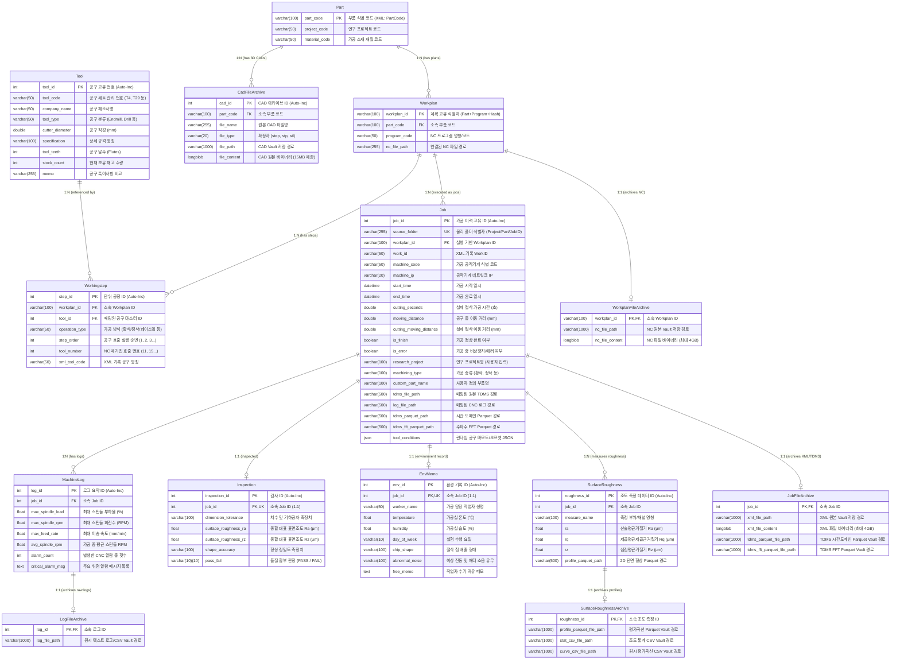

# 공작기계지능화실험실 통합 제조 DB 시스템 복원 및 명세서

본 문서는 소스 코드가 유실되었을 경우를 대비하여 작성된 **완벽한 단일 사양서**입니다. 본 문서의 내용만으로도 100% 동일한 프로젝트를 처음부터 재생성할 수 있도록 모든 아키텍처, 설정, 스키마, 파싱 알고리즘, UI 동작 방식을 상세하게 기술합니다.

---

## 1. 시스템 아키텍처 및 전체 폴더 구조

### 1.1 전체 프로젝트 아키텍처 및 데이터 파이프라인 흐름도

```text
[Raw Data / Network Drive]
       | (File Drop - XML, NC, TDMS, LOG, CAD, CSV)
       v
[Watchdog Observer (data_insert_recognization.py)]
       | (Queue & Stability Check: 파일 접근 권한 검사)
       v
[Parsing Engine (parsers/)]
  ├─ xml_parser.py       : 메타데이터 추출, Part/Workplan/Job 구조 매핑
  ├─ tdms_parser.py      : 초고속 메타데이터(nptdms) 추출 및 경로 매핑
  ├─ log_parser.py       : CNC 로그 통계(Max/Avg RPM, Load) 요약 및 Vault 저장
  ├─ roughness_parser.py : 조도 측정 결과(Ra, Rq, Rz) 자동 계산 및 Parquet 변환
  ├─ cad_parser.py       : 3D 모델(STEP, STL) 파트 매핑 및 원본 아카이빙
  └─ nc_parser.py        : NC 프로그램 코드 추출
       |
       v
[MySQL Database (SQLAlchemy ORM)]  <===> [Vault System (vault_manager.py)] (대용량 파일)
       |
       v
[Streamlit Frontend UI (Port 8501, 8502)]
  ├─ admin_dashboard.py  : 데이터 필터링, 삽입, 수정, 삭제(Cascade), 복구 파일(ZIP) 생성
  └─ user_dashboard.py   : 다차원 계층 조회, 센서 시계열(Plotly), 조도 프로파일 시각화, 선택 다운로드
```

### 1.2 디렉터리 및 파일 트리

```text
/Project_Root/
├── .env                        : 데이터베이스 및 시스템 환경변수
├── requirements.txt            : 런타임 종속 패키지 목록
├── run_system.py               : 전체 파이프라인(백그라운드 파서, UI) 실행 관리 스크립트
├── machining_raw_data/         : 외부 장비에서 원본 데이터가 업로드되는 모니터링 폴더
│   └── ProjectName/PartName/JobID/ (계층형 폴더 구조)
├── archive_vault/              : 파싱된 대용량 원본 파일(NC, XML, CAD, Log 등) 안전 보관용
├── processed_data/             : 처리 중 생성된 파생 데이터 폴더
├── failed_data/                : 파싱 실패 시 예외 처리된 파일 격리 폴더
├── backend/                    : 백엔드 파이프라인 모듈
│   ├── data_insert_recognization.py : Watchdog 기반 디렉터리 모니터링 큐 처리기
│   ├── job_manager.py               : Job(가공 이력) 생성 및 중복 확인 유틸리티
│   ├── recovery_engine.py           : Vault와 DB를 활용한 재난 복구 ZIP 생성기
│   ├── tool_inserter.py             : 공구(Excel) 데이터 파서
│   ├── tdms_visualizer.py           : 백그라운드 TDMS Parquet/FFT 변환 데몬
│   ├── vault_manager.py             : 파일 SHA/해시 기반 Vault 아카이빙 모듈
│   ├── DB/                          
│   │   ├── database.py              : SQLAlchemy DB 커넥션 풀링 생성
│   │   └── models.py                : 데이터베이스 테이블 DDL 및 ORM 정의
│   └── parsers/                     : 확장자별 자동 파싱 엔진
│       ├── xml_parser.py
│       ├── tdms_parser.py
│       ├── log_parser.py
│       ├── roughness_parser.py
│       ├── cad_parser.py
│       └── nc_parser.py
└── frontend/                   : Streamlit 기반 UI
    ├── admin_dashboard.py      : 관리자 전용 데이터 관리 페이지
    └── user_dashboard.py       : 일반 사용자용 시각화 및 다운로드 페이지
```

---

## 2. 환경 설정 및 종속성 (Environment & Dependencies)

### 2.1 런타임 버전 및 필수 패키지 (`requirements.txt`)
프로젝트는 Python 3.10 이상 환경을 권장합니다.
```text
# Project Dependencies
pandas>=2.2.0
numpy>=1.26.0
openpyxl==3.1.5
SQLAlchemy==2.0.51
PyMySQL==1.2.0
python-dotenv==1.2.2
watchdog==6.0.0
streamlit==1.61.1
streamlit-option-menu>=0.4.0
plotly>=5.20.0
pyarrow>=14.0.1
scipy>=1.12.0
nptdms>=1.9.0
psutil>=6.0.0
```

### 2.2 환경 변수 (`.env`)
루트 디렉터리에 생성되어야 하는 환경변수 구조는 다음과 같습니다.
```env
DB_HOST=localhost
DB_PORT=3306
DB_USER=root
DB_PASSWORD=610610610
DB_NAME=orcus
PYTHONPATH=backend
```

---

## 3. 데이터베이스 명세 (Database Architecture & Detailed Schema)

공작기계지능화실험실의 제조 DB 시스템은 **ISO 14649(STEP-NC) 국제 표준**의 철학을 계승하여 정적 공정 계획(Static Process Plan)과 동적 가공 이력(Dynamic Execution History)을 분리하고, 초고주파 센서 데이터와 3D CAD/NC 원본 파일까지 안전하게 영구 보존할 수 있도록 **하이브리드 스토리지(RDBMS + File Vault + Apache Parquet + LONGBLOB 미러링)** 구조로 설계되었습니다.

---

### 3.1 DB 설계 철학 및 표준 데이터 모델링 원칙 (Design Philosophy)

```text
[ISO 14649 표준 계층 모델]
Part (부품 마스터) 
  └─► Workplan (가공 계획: NC 코드 단위)
        ├─► Workingstep (공구 호출 순서 및 단위 공정) ◄── Tool (공구 마스터)
        └─► Job (실제 가공 1회 실행 이력)
              ├─► MachineLog (1Hz CNC 부하/RPM 요약 통계)
              ├─► SurfaceRoughness (다지점 표면조도 및 평가곡선 Parquet)
              ├─► Inspection (치수/형상 공차 및 PASS/FAIL 합부 판정)
              ├─► EnvMemo (온습도, 작업자, 이상소음, 칩 형태)
              └─► Archive Tables (XML, NC, CAD, Parquet 원본 바이너리 & Vault)
```

1. **정적 계획(Static Planning)과 동적 실행(Dynamic Execution)의 엄격한 분리**:
   - **정적 계획 그룹 (`Part`, `Workplan`, `Workingstep`, `Tool`)**: CAM 및 공정 설계 단계에서 생성되는 불변의 기준 정보입니다. 부품 도면, NC 프로그램 파일, 공구 세팅 번호, 공구 호출 순서 등이 이에 해당합니다.
   - **동적 실행 그룹 (`Job`, `MachineLog`, `SurfaceRoughness`, `Inspection`, `EnvMemo`)**: 동일한 Workplan(동일 NC 코드)을 사용하더라도 공작기계에서 실제로 가공할 때마다 달라지는 1회성 가공 일시, 센서 시계열, 가공 부하, 표면 조도, 작업자 환경, 합부 판정 등의 결과 정보입니다.
   - 이를 통해 *“하나의 부품(Part)에 여러 가공 계획(Workplan)이 존재할 수 있고, 하나의 계획을 바탕으로 수십 번의 반복 가공 실험(Job)을 수행”*하는 다대일(1:N) 관계를 정규화하여 중복 데이터를 원천 차단합니다.

2. **하이브리드 4계층 스토리지 아키텍처 (Hybrid Storage Architecture)**:
   - **메타데이터 & 인덱스 계층 (MySQL RDBMS)**: B-Tree 인덱스 기반의 초고속 조건 필터링, 정렬, 다차원 조인(Join) 및 통계 쿼리를 지원합니다.
   - **초고주파 시계열 & 형상 계층 (Apache Parquet on Disk)**: 100kHz+ 고주파 NI TDMS 진동 센서 데이터와 마이크로미터(μm) 단위의 표면조도 단면 평가곡선을 컬럼형 Snappy 압축 형식으로 변환하여 저장합니다. 이를 통해 수백 MB의 센서 데이터를 수 MB로 경량화하고 Streamlit 웹 UI에서 수십 밀리초(ms) 만에 Plotly 차트로 렌더링합니다.
   - **안전 아카이빙 계층 (File Vault on Disk)**: 장비에서 생성된 XML, NC, CAD(STEP/STL), 로그 원본 파일을 SHA-256 해시 기반의 불변(Immutable) 디렉터리에 안전 보관합니다.
   - **재난 복구 미러링 계층 (LONGBLOB in MySQL)**: 파일 시스템이 완전히 손상되거나 외장 디스크가 유실되더라도, MySQL 데이터베이스 덤프(`mysqldump`) 파일 하나만 있으면 `recovery_engine.py`를 통해 모든 원본 파일과 디렉터리 트리를 100% 원상 복구할 수 있도록 원본 바이너리를 이중 저장합니다.

3. **데이터 무결성 및 전대수적 삭제 전파 (Cascading Integrity Policy)**:
   - 부모 엔티티가 삭제되면 연관된 모든 하위 이력과 아카이브 데이터가 고아(Orphan)로 남지 않도록 외래키(Foreign Key)에 `ON DELETE CASCADE`를 엄격히 적용합니다.
   - 단, 공구 마스터(`Tool`) 테이블은 실물 공구의 재고 관리를 위해 `ON DELETE SET NULL`을 적용하여, 공구 마스터가 삭제되더라도 과거 가공 이력(`Workingstep`)의 공구 호출 번호 자체는 보존되도록 설계되었습니다.

---

### 3.2 통합 엔티티 관계도 (Comprehensive ERD)



---

### 3.3 도메인별 테이블 상세 명세 (Detailed Table Specifications)

#### 3.3.1 [도메인 1] 마스터 및 정적 공정 계획 그룹 (Master & Static Process Plan)

##### 1. `part` 테이블 (가공 대상 부품 마스터)
가공 대상 제품/소재의 상위 마스터 엔티티입니다. 모든 공정 계획(`Workplan`)과 도면(`CadFileArchive`)의 최상위 부모입니다.

| 컬럼명 | 데이터 타입 | 제약 조건 | 기본값 | 설명 및 데이터 소스 |
| :--- | :--- | :--- | :--- | :--- |
| **`part_code`** | `VARCHAR(100)` | **PK, Not Null** | - | 부품 고유 식별 코드 (XML: `<PartCode>` 또는 폴더명 파싱) |
| **`project_code`** | `VARCHAR(50)` | Nullable | NULL | 상위 프로젝트 식별 코드 (XML: `<ProjectCode>`) |
| **`material_code`** | `VARCHAR(50)` | Nullable | NULL | 가공 소재 재질명 (XML: `<MaterialCode>`, 예: AL6061, SM45C) |

* **관계 정의**:
  - `workplans`: `1:N` (`Workplan`과 연동, `cascade="all, delete-orphan"`)
  - `cad_files`: `1:N` (`CadFileArchive`와 연동, `cascade="all, delete-orphan"`)

---

##### 2. `workplan` 테이블 (ISO 14649 정적 가공 계획)
특정 부품을 가공하기 위해 작성된 단일 NC 프로그램(G코드) 단위의 계획 정보입니다.

| 컬럼명 | 데이터 타입 | 제약 조건 | 기본값 | 설명 및 데이터 소스 |
| :--- | :--- | :--- | :--- | :--- |
| **`workplan_id`** | `VARCHAR(100)` | **PK, Not Null** | - | 계획 고유 식별자 (`{part_code}_{program_code}_{NC_MD5_Hash}`) |
| **`part_code`** | `VARCHAR(100)` | **FK, Not Null** | - | 소속 부품 코드 (`part.part_code` 참조, `ON DELETE CASCADE`) |
| **`program_code`** | `VARCHAR(50)` | Nullable | NULL | NC 프로그램 이름/번호 (XML: `<ProgramCode>` 또는 TDMS 메타데이터) |
| **`nc_file_path`** | `VARCHAR(255)` | Nullable | NULL | 물리 저장소의 NC 코드 파일 상대/절대 경로 |

* **관계 정의**:
  - `part`: `N:1` (`Part` 역참조)
  - `workingsteps`: `1:N` (`Workingstep`과 연동, `cascade="all, delete-orphan"`)
  - `jobs`: `1:N` (`Job`과 연동, `cascade="all, delete-orphan"`)
  - `archive`: `1:1` (`WorkplanFileArchive`와 연동, `cascade="all, delete-orphan"`)

---

##### 3. `tool` 테이블 (공구 마스터 라이브러리)
실험실에서 보유 및 관리하는 절삭 공구의 물리적/기하학적 제원 마스터 테이블입니다. (Excel 업로드 연동)

| 컬럼명 | 데이터 타입 | 제약 조건 | 기본값 | 설명 및 데이터 소스 |
| :--- | :--- | :--- | :--- | :--- |
| **`tool_id`** | `INT` | **PK, Auto-Inc** | - | 공구 내부 일련번호 |
| **`tool_code`** | `VARCHAR(50)` | Nullable | NULL | 공구 세트/포켓 관리 번호 (예: `T04`, `T29`, `EM_D10`) |
| **`company_name`** | `VARCHAR(50)` | Nullable | NULL | 공구 제조사명 (예: 와이지원, 샌드빅, 코오로이) |
| **`tool_type`** | `VARCHAR(50)` | Nullable | NULL | 공구 종류 (예: Flat Endmill, Ball Endmill, Drill, Face Mill) |
| **`cutter_diameter`**| `DOUBLE` | Nullable | NULL | 공구 유효 절삭 직경 (단위: mm) |
| **`specification`** | `VARCHAR(100)` | Nullable | NULL | 공구 정규 규격 명칭 (예: `4F-10.0D-25L-75L`) |
| **`tool_teeth`** | `INT` | Nullable | NULL | 공구 날수 (Flute 수, 예: 2날, 4날) |
| **`stock_count`** | `INT` | Nullable | 0 | 현재 보유 재고 수량 |
| **`memo`** | `VARCHAR(255)` | Nullable | NULL | 공구 비고 및 코팅/특이사항 메모 |

* **관계 정의**:
  - `workingsteps`: `1:N` (`Workingstep` 역참조, `ON DELETE SET NULL`)

---

##### 4. `workingstep` 테이블 (단위 공정 및 공구 호출 순서)
하나의 Workplan 내에서 NC 코드가 실행될 때 호출되는 단위 공정(Operation)과 공구 교환 순서(Tool Change Sequence)를 정의합니다.

| 컬럼명 | 데이터 타입 | 제약 조건 | 기본값 | 설명 및 데이터 소스 |
| :--- | :--- | :--- | :--- | :--- |
| **`step_id`** | `INT` | **PK, Auto-Inc** | - | 단위 공정 고유 번호 |
| **`workplan_id`** | `VARCHAR(100)` | **FK, Not Null** | - | 소속 계획 ID (`workplan.workplan_id` 참조, `ON DELETE CASCADE`) |
| **`tool_id`** | `INT` | **FK, Nullable** | NULL | 연결된 공구 마스터 ID (`tool.tool_id` 참조, `ON DELETE SET NULL`) |
| **`operation_type`**| `VARCHAR(50)` | Nullable | NULL | 가공 방식 (황삭-Roughing, 정삭-Finishing, 면가공-Facing 등) |
| **`step_order`** | `INT` | **Not Null** | - | 공구 호출 실행 순번 (1, 2, 3... 실행 인덱스) |
| **`tool_number`** | `INT` | **Not Null** | - | NC 매거진 호출 공구 번호 (예: `T11` -> 11) |
| **`xml_tool_code`** | `VARCHAR(50)` | Nullable | NULL | XML 내 기록된 공구 명칭/코드 (`<toolCode>` / `<toolName>`) |

* **관계 정의**:
  - `workplan`: `N:1` (`Workplan` 역참조)
  - `tool`: `N:1` (`Tool` 역참조)

---

##### 5. `cad_file_archive` 테이블 (부품 도면 3D 모델 아카이브)
부품(`Part`)에 종속된 3D CAD 파일(STEP, STP, STL)의 메타데이터 및 바이너리 아카이브입니다.

| 컬럼명 | 데이터 타입 | 제약 조건 | 기본값 | 설명 및 데이터 소스 |
| :--- | :--- | :--- | :--- | :--- |
| **`cad_id`** | `INT` | **PK, Auto-Inc** | - | CAD 아카이브 식별 번호 |
| **`part_code`** | `VARCHAR(100)` | **FK, Not Null** | - | 소속 부품 코드 (`part.part_code` 참조, `ON DELETE CASCADE`) |
| **`file_name`** | `VARCHAR(255)` | Nullable | NULL | 원본 도면 파일명 (예: `bracket_v2.step`) |
| **`file_type`** | `VARCHAR(20)` | Nullable | NULL | 파일 확장자 (`step`, `stp`, `stl`) |
| **`file_path`** | `VARCHAR(1000)` | Nullable | NULL | Vault 안전 저장소 절대/상대 경로 |
| **`file_content`** | `LONGBLOB` | Nullable | NULL | CAD 원본 바이너리 (최대 15MB 제한) |

---

#### 3.3.2 [도메인 2] 동적 가공 실행 및 이력 그룹 (Dynamic Machining Execution & History)

##### 6. `job` 테이블 (실제 1회성 가공 이력 - 시스템 핵심 엔티티)
공작기계에서 실제로 실행된 1회의 가공 세션(실험)에 대한 마스터 이력 테이블입니다.

| 컬럼명 | 데이터 타입 | 제약 조건 | 기본값 | 설명 및 데이터 소스 |
| :--- | :--- | :--- | :--- | :--- |
| **`job_id`** | `INT` | **PK, Auto-Inc** | - | 가공 이력 고유 일련번호 |
| **`source_folder`** | `VARCHAR(255)` | **Unique, Not Null**| - | 물리 감시 폴더 경로 (`Project/Part/JobID`, 중복 방어 식별자) |
| **`workplan_id`** | `VARCHAR(100)` | **FK, Not Null** | - | 기반이 된 공정 계획 ID (`workplan.workplan_id` 참조, `CASCADE`) |
| **`work_id`** | `VARCHAR(50)` | **Not Null** | - | XML 내부 작업 식별자 (XML: `<WorkID>`) |
| **`machine_code`** | `VARCHAR(50)` | Nullable | NULL | 가공을 수행한 공작기계 명칭 (XML: `<MachineCode>`, 예: `Hi-V50`) |
| **`machine_ip`** | `VARCHAR(20)` | Nullable | NULL | 공작기계 CNC 컨트롤러 IP 주소 (XML: `<MachineIpAddress>`) |
| **`start_time`** | `DATETIME` | Nullable | NULL | 가공 시작 일시 (XML: `<StartTime>` 또는 TDMS `wf_start_time`) |
| **`end_time`** | `DATETIME` | Nullable | NULL | 가공 종료 일시 (XML: `<FinishTime>`) |
| **`cutting_seconds`**| `DOUBLE` | Nullable | NULL | 실제 절삭 이송 시간 (XML: `<CuttingSeconds>`, 단위: 초) |
| **`moving_distance`**| `DOUBLE` | Nullable | NULL | 공구 총 이동 거리 (XML: `<MovingDistance>`, 단위: mm) |
| **`cutting_moving_distance`** | `DOUBLE` | Nullable | NULL | 실제 절삭 중 이동 거리 (XML: `<CuttingMovingDistance>`, mm) |
| **`is_finish`** | `BOOLEAN` | Nullable | FALSE | 프로그램 정상 완료 여부 (XML: `<IsFinish>`) |
| **`is_error`** | `BOOLEAN` | Nullable | FALSE | 가공 중 에러/비상정지 발생 여부 (XML: `<IsError>`) |
| **`research_project`** | `VARCHAR(100)` | Nullable | NULL | 연구 과제/프로젝트명 (UI 수기 입력 및 분류 필터) |
| **`machining_type`**| `VARCHAR(100)` | Nullable | NULL | 가공 세부 목적 (황삭, 정삭, 절삭력실험, 조도평가 등 UI 수기) |
| **`custom_part_name`** | `VARCHAR(100)` | Nullable | NULL | 연구원 지정 별칭 Part 명 (UI 수기 입력) |
| **`tdms_file_path`** | `VARCHAR(500)` | Nullable | NULL | 매핑된 원본 고주파 TDMS 센서 파일 경로 |
| **`log_file_path`** | `VARCHAR(500)` | Nullable | NULL | 매핑된 1Hz CNC 상태 로그 파일 경로 |
| **`tdms_parquet_path`** | `VARCHAR(500)` | Nullable | NULL | 변환된 시간 도메인 고주파 센서 Parquet 파일 경로 |
| **`tdms_fft_parquet_path`**| `VARCHAR(500)` | Nullable | NULL | 변환된 주파수 스펙트럼(FFT) Parquet 파일 경로 |
| **`tool_conditions`** | `JSON` | Nullable | NULL | 런타임 공구 상태 (XML `<Tools>`: 사용횟수, 마모량, 오프셋 JSON) |

* **관계 정의**:
  - `workplan`: `N:1` (`Workplan` 역참조)
  - `machine_logs`: `1:N` (`MachineLog`와 연동, `cascade="all, delete-orphan"`)
  - `inspection`: `1:1` (`Inspection`과 연동, `cascade="all, delete-orphan"`, `uselist=False`)
  - `env_memo`: `1:1` (`EnvMemo`와 연동, `cascade="all, delete-orphan"`, `uselist=False`)
  - `surface_roughnesses`: `1:N` (`SurfaceRoughness`와 연동, `cascade="all, delete-orphan"`)
  - `archive`: `1:1` (`JobFileArchive`와 연동, `cascade="all, delete-orphan"`)

---

##### 7. `machine_log` 테이블 (CNC 장비 로그 및 통계 요약)
가공 중 1Hz 단위로 수집된 CNC 내부 컨트롤러 로그(CSV/TXT)를 파싱하여 주요 통계치와 알람 내역을 요약 저장합니다.

| 컬럼명 | 데이터 타입 | 제약 조건 | 기본값 | 설명 및 데이터 소스 |
| :--- | :--- | :--- | :--- | :--- |
| **`log_id`** | `INT` | **PK, Auto-Inc** | - | 로그 요약 식별 번호 |
| **`job_id`** | `INT` | **FK, Not Null** | - | 소속 가공 이력 ID (`job.job_id` 참조, `ON DELETE CASCADE`) |
| **`max_spindle_load`** | `FLOAT` | Nullable | NULL | 가공 중 기록된 최대 스핀들 부하율 (`cls` 최대값, %) |
| **`max_spindle_rpm`** | `FLOAT` | Nullable | NULL | 가공 중 기록된 최대 스핀들 회전수 (`crpm` 최대값, RPM) |
| **`max_feed_rate`** | `FLOAT` | Nullable | NULL | 가공 중 기록된 최대 이송 속도 (`cfr` 최대값, mm/min) |
| **`avg_spindle_rpm`** | `FLOAT` | Nullable | NULL | 가공 중 전체 평균 스핀들 회전수 (`crpm` 평균값, RPM) |
| **`alarm_count`** | `INT` | Nullable | 0 | 가공 중 발생한 CNC 경고/알람 총 횟수 |
| **`critical_alarm_msg`**| `TEXT` | Nullable | NULL | 발생한 주요 알람 메시지 고유 목록 (중복 제거 문자열) |

---

##### 8. `surface_roughness` 테이블 (다지점 표면 조도 측정)
가공 완료 후 표면조도 측정기(Roughness Tester)에서 추출된 부위별 2D 조도 파라미터 및 단면 형상 Parquet 파일 경로를 관리합니다. (1개 Job당 다수 부위 측정 가능: 1:N)

| 컬럼명 | 데이터 타입 | 제약 조건 | 기본값 | 설명 및 데이터 소스 |
| :--- | :--- | :--- | :--- | :--- |
| **`roughness_id`** | `INT` | **PK, Auto-Inc** | - | 조도 측정 데이터 고유 번호 |
| **`job_id`** | `INT` | **FK, Not Null** | - | 소속 가공 이력 ID (`job.job_id` 참조, `ON DELETE CASCADE`) |
| **`measure_name`** | `VARCHAR(100)` | Nullable | NULL | 측정 부위 또는 채널 이름 (예: `Top_Surface`, `Side_Wall_1`) |
| **`ra`** | `FLOAT` | Nullable | NULL | 산술평균 거칠기 ($R_a$, 단위: $\mu m$) |
| **`rq`** | `FLOAT` | Nullable | NULL | 제곱평균제곱근 거칠기 ($R_q$, 단위: $\mu m$) |
| **`rz`** | `FLOAT` | Nullable | NULL | 십점평균 거칠기 ($R_z$, 5구간 Peak-to-Valley 평균, 단위: $\mu m$) |
| **`profile_parquet_path`** | `VARCHAR(500)` | Nullable | NULL | X-Z 마이크로미터 단면 평가곡선 Parquet 파일 경로 |

---

##### 9. `inspection` 테이블 (치수/형상 정밀도 및 최종 품질 합부 판정)
가공품의 3차원 측정기(CMM), 버니어캘리퍼스 측정값 및 종합 품질 합부(PASS/FAIL) 판정 결과입니다.

| 컬럼명 | 데이터 타입 | 제약 조건 | 기본값 | 설명 및 데이터 소스 |
| :--- | :--- | :--- | :--- | :--- |
| **`inspection_id`** | `INT` | **PK, Auto-Inc** | - | 품질 검사 일련번호 |
| **`job_id`** | `INT` | **FK, Unique, Not Null**| - | 소속 가공 이력 ID (`job.job_id` 참조, `CASCADE`, 1:1 관계) |
| **`dimension_tolerance`** | `VARCHAR(100)`| Nullable | NULL | 주요 치수 및 가공 공차 측정 결과 (수기 입력) |
| **`surface_roughness_ra`**| `FLOAT` | Nullable | NULL | 부품 전체 대표 산술평균조도 ($R_a$, 자동 계산 또는 수기 입력) |
| **`surface_roughness_rz`**| `FLOAT` | Nullable | NULL | 부품 전체 대표 십점평균조도 ($R_z$, 자동 계산 또는 수기 입력) |
| **`shape_accuracy`** | `VARCHAR(100)`| Nullable | NULL | 진원도, 평면도, 직각도 등 형상 정밀도 측정치 |
| **`pass_fail`** | `VARCHAR(10)` | Nullable | 'PASS' | 최종 품질 합부 판정 (`PASS` 또는 `FAIL`) |

---

##### 10. `env_memo` 테이블 (작업 환경 및 작업자 메모)
가공 당일의 실험실 온/습도, 작업자 정보 및 정량화하기 어려운 현장 관측값(소음, 칩 형상 등)을 기록합니다.

| 컬럼명 | 데이터 타입 | 제약 조건 | 기본값 | 설명 및 데이터 소스 |
| :--- | :--- | :--- | :--- | :--- |
| **`env_id`** | `INT` | **PK, Auto-Inc** | - | 환경 기록 일련번호 |
| **`job_id`** | `INT` | **FK, Unique, Not Null**| - | 소속 가공 이력 ID (`job.job_id` 참조, `CASCADE`, 1:1 관계) |
| **`worker_name`** | `VARCHAR(50)` | Nullable | NULL | 실험/가공을 수행한 작업자(연구원) 성명 |
| **`temperature`** | `FLOAT` | Nullable | NULL | 가공 시점 실험실 실내 온도 (단위: ℃) |
| **`humidity`** | `FLOAT` | Nullable | NULL | 가공 시점 실험실 실내 습도 (단위: %) |
| **`day_of_week`** | `VARCHAR(10)` | Nullable | NULL | 실험 수행 요일 (월, 화, 수, 목, 금, 토, 일) |
| **`chip_shape`** | `VARCHAR(100)`| Nullable | NULL | 절삭 칩 배출 형태 (연속형, 전단형, 균열형, 분절형 등) |
| **`abnormal_noise`** | `VARCHAR(100)`| Nullable | NULL | 가공 중 이상 채터 소음 및 특이 진동 관측 여부 |
| **`free_memo`** | `TEXT` | Nullable | NULL | 작업자의 자유로운 실험 관찰 일지 및 세부 특이사항 |

---

#### 3.3.3 [도메인 3] 파일 아카이빙 및 Vault 연동 그룹 (Storage & Vault Archive)

##### 11. `workplan_file_archive` 테이블
`Workplan`에 연결된 원본 NC 프로그램 코드의 Vault 경로 및 바이너리(LONGBLOB) 백업입니다.

| 컬럼명 | 데이터 타입 | 제약 조건 | 기본값 | 설명 |
| :--- | :--- | :--- | :--- | :--- |
| **`workplan_id`** | `VARCHAR(100)` | **PK, FK, Not Null** | - | 소속 Workplan ID (`workplan.workplan_id` 참조, `CASCADE`) |
| **`nc_file_path`** | `VARCHAR(1000)`| Nullable | NULL | NC 파일 Vault 저장소 절대/상대 경로 |
| **`nc_file_content`**| `LONGBLOB` | Nullable | NULL | NC 원본 텍스트 바이너리 스트림 (최대 4GB 지원) |

---

##### 12. `job_file_archive` 테이블
`Job` 단위의 원본 XML 파일 및 전처리 완료된 Parquet 파일들의 Vault 경로와 바이너리 백업입니다.

| 컬럼명 | 데이터 타입 | 제약 조건 | 기본값 | 설명 |
| :--- | :--- | :--- | :--- | :--- |
| **`job_id`** | `INT` | **PK, FK, Not Null** | - | 소속 Job ID (`job.job_id` 참조, `CASCADE`) |
| **`xml_file_path`** | `VARCHAR(1000)`| Nullable | NULL | XML 메타데이터 원본 파일 Vault 경로 |
| **`xml_file_content`**| `LONGBLOB` | Nullable | NULL | XML 원본 바이너리 스트림 (최대 4GB 지원) |
| **`tdms_parquet_file_path`** | `VARCHAR(1000)`| Nullable | NULL | 변환된 시간 도메인 TDMS Parquet Vault 경로 |
| **`tdms_fft_parquet_file_path`**| `VARCHAR(1000)`| Nullable | NULL | 변환된 FFT 주파수 스펙트럼 Parquet Vault 경로 |

---

##### 13. `surface_roughness_archive` 테이블
`SurfaceRoughness` 측정 레코드에 대응되는 원시 CSV 파일들과 파생 Parquet 파일의 Vault 경로입니다.

| 컬럼명 | 데이터 타입 | 제약 조건 | 기본값 | 설명 |
| :--- | :--- | :--- | :--- | :--- |
| **`roughness_id`** | `INT` | **PK, FK, Not Null** | - | 소속 조도 ID (`surface_roughness.roughness_id` 참조, `CASCADE`) |
| **`profile_parquet_file_path`** | `VARCHAR(1000)`| Nullable | NULL | 평가곡선 Parquet Vault 경로 |
| **`stat_csv_file_path`** | `VARCHAR(1000)`| Nullable | NULL | 조도 통계 CSV 원본 Vault 경로 |
| **`curve_csv_file_path`** | `VARCHAR(1000)`| Nullable | NULL | 평가곡선 원시 CSV 파일 Vault 경로 |

---

##### 14. `log_file_archive` 테이블
`MachineLog` 레코드에 대응되는 CNC 컨트롤러의 원시 텍스트 로그/CSV 파일의 Vault 경로입니다.

| 컬럼명 | 데이터 타입 | 제약 조건 | 기본값 | 설명 |
| :--- | :--- | :--- | :--- | :--- |
| **`log_id`** | `INT` | **PK, FK, Not Null** | - | 소속 MachineLog ID (`machine_log.log_id` 참조, `CASCADE`) |
| **`log_file_path`** | `VARCHAR(1000)`| Nullable | NULL | 원시 로그 파일 Vault 절대/상대 경로 |

---

### 3.4 데이터 무결성 및 연쇄 삭제(CASCADE) 전파 정책

본 시스템은 제조 데이터의 정합성을 엄격하게 유지하기 위해 RDBMS 레벨의 Foreign Key 제약조건과 SQLAlchemy ORM 레벨의 `cascade="all, delete-orphan"` 옵션을 이중으로 적용하였습니다.

```text
[CASCADE 연쇄 삭제 전파 트리]

(1) Part 삭제 시
    Part ──► (CASCADE) ──► Workplan ──► (CASCADE) ──► Job ──► (CASCADE) ──► MachineLog, Inspection, EnvMemo, SurfaceRoughness
         └──► (CASCADE) ──► CadFileArchive

(2) Job 단독 삭제 시 (관리자 UI 삭제 기능)
    Job ──► (CASCADE) ──► MachineLog ──► (CASCADE) ──► LogFileArchive
        ──► (CASCADE) ──► Inspection
        ──► (CASCADE) ──► EnvMemo
        ──► (CASCADE) ──► SurfaceRoughness ──► (CASCADE) ──► SurfaceRoughnessArchive
        ──► (CASCADE) ──► JobFileArchive

(3) Tool 마스터 삭제 시
    Tool ──► (SET NULL) ──► Workingstep (공구 마스터만 제거되고 가공 단계 이력은 보존됨)
```

* **`ON DELETE CASCADE`의 이점**:
  - 관리자가 Admin Dashboard에서 불필요한 시험 가공 데이터(`Job`)를 삭제하면, 외래키 제약에 의해 연결된 로그, 조도, 품질 점검, 환경 메모, 아카이브 테이블의 모든 하위 행이 원자적(Atomic)으로 일괄 정리됩니다.
* **고유 식별자(`source_folder`) 기반 중복 방어**:
  - `Job.source_folder` 컬럼에 `UNIQUE` 인덱스를 부여하여, 파일 파서가 동일한 폴더를 중복 감지하더라도 중복 Row 생성을 방지하고 기존 Row에 `UPDATE`를 수행하도록 보장합니다.

---

### 3.5 DBMS 연결 및 풀링 설정 (`backend/DB/database.py`)

* **드라이버 및 연결 프로토콜**: `mysql+pymysql` (순수 Python 기반 MySQL 클라이언트 드라이버 사용)
* **커넥션 풀링 최적화**:
  - `pool_recycle=3600`: MySQL 서버의 기본 `wait_timeout`(8시간)에 도달하기 전 1시간 주기로 커넥션을 재생성하여 장시간 대기 후 발생하는 `MySQL server has gone away (Error 2006)` 오류를 완벽 차단.
  - `SessionLocal = sessionmaker(autocommit=False, autoflush=False, bind=engine)`: 명시적 트랜잭션 커밋(`db.commit()`)과 롤백(`db.rollback()`)을 강제하여 데이터 무결성 유지.
* **세션 라이프사이클 관리 (`get_db`)**:
  ```python
  def get_db():
      db = SessionLocal()
      try:
          yield db
      finally:
          db.close()
  ```
  - 파이프라인 및 UI에서 제너레이터를 활용하여 DB 작업 완료 후 세션이 반드시 `close()`되도록 하여 커넥션 누수(Leak)를 방지.

---

### 3.6 전체 SQLAlchemy ORM 모델 소스 코드 (`backend/DB/models.py`)

시스템 복원 시 즉시 사용할 수 있는 데이터베이스 ORM 모델의 100% 완전한 소스 코드입니다.

```python
# backend/DB/models.py
from sqlalchemy import Column, Integer, String, Float, Double, Boolean, DateTime, JSON, ForeignKey, LargeBinary, Text
from sqlalchemy.orm import relationship
from .database import Base

class Part(Base):
    __tablename__ = "part"
    __table_args__ = {'comment': '가공 대상 부품 마스터 정보'}

    part_code = Column(String(100), primary_key=True, comment='부품 코드 (XML: PartCode)')
    project_code = Column(String(50), comment='XML: ProjectCode')
    material_code = Column(String(50), comment='XML: MaterialCode')

    workplans = relationship("Workplan", back_populates="part", cascade="all, delete-orphan")


class Workplan(Base):
    __tablename__ = "workplan"
    __table_args__ = {'comment': 'ISO14649 Workplan: 단일 NC 프로그램(코드) 단위의 정적 계획'}

    workplan_id = Column(String(100), primary_key=True, comment='고유 식별자 (ProgramCode 등 조합)')
    part_code = Column(String(100), ForeignKey("part.part_code", ondelete="CASCADE"), nullable=False)
    program_code = Column(String(50), comment='XML: ProgramCode / ProgramName')
    nc_file_path = Column(String(255), comment='NC 코드 파일 경로')

    part = relationship("Part", back_populates="workplans")
    workingsteps = relationship("Workingstep", back_populates="workplan", cascade="all, delete-orphan")
    jobs = relationship("Job", back_populates="workplan", cascade="all, delete-orphan")


class Tool(Base):
    __tablename__ = "tool"
    __table_args__ = {'comment': '공구 마스터 정보 테이블 (Excel에서 불러오기)'}

    tool_id = Column(Integer, primary_key=True, autoincrement=True)
    tool_code = Column(String(50), comment='공구 세트 번호 (예: T4, T29)')
    company_name = Column(String(50), comment='제조사명')
    tool_type = Column(String(50), comment='공구 종류')
    cutter_diameter = Column(Double, comment='직경 (숫자값)')
    specification = Column(String(100), comment='규격')
    tool_teeth = Column(Integer, comment='날수')
    stock_count = Column(Integer, comment='재고 개수')
    memo = Column(String(255), comment='비고')

    workingsteps = relationship("Workingstep", back_populates="tool")


class Workingstep(Base):
    __tablename__ = "workingstep"
    __table_args__ = {'comment': 'ISO14649 Workingstep: Workplan 내의 개별 가공 단위(공구 호출 순서)'}

    step_id = Column(Integer, primary_key=True, autoincrement=True)
    workplan_id = Column(String(100), ForeignKey("workplan.workplan_id", ondelete="CASCADE"), nullable=False)
    tool_id = Column(Integer, ForeignKey("tool.tool_id", ondelete="SET NULL"), comment='연결된 공구 ID')
    operation_type = Column(String(50), comment='가공방식 (MachiningOperation 병합)')
    
    step_order = Column(Integer, nullable=False, comment='공구 호출 순서 (Index)')
    tool_number = Column(Integer, nullable=False, comment='호출된 공구 번호 (예: 11, 15, 16, 17)')
    xml_tool_code = Column(String(50), comment='XML: toolCode / toolName')

    workplan = relationship("Workplan", back_populates="workingsteps")
    tool = relationship("Tool", back_populates="workingsteps")


class Job(Base):
    __tablename__ = "job"
    __table_args__ = {'comment': 'Workplan을 바탕으로 수행된 실제 1회성 가공 이력'}

    job_id = Column(Integer, primary_key=True, autoincrement=True, comment='가공 이력 고유 ID')
    source_folder = Column(String(255), unique=True, comment='기존 폴더명 기반의 원본 식별자')
    workplan_id = Column(String(100), ForeignKey("workplan.workplan_id", ondelete="CASCADE"), nullable=False)
    work_id = Column(String(50), nullable=False, comment='XML: WorkID')
    
    machine_code = Column(String(50), comment='XML: MachineCode')
    machine_ip = Column(String(20), comment='XML: MachineIpAddress')
    
    start_time = Column(DateTime, comment='XML: StartTime')
    end_time = Column(DateTime, comment='XML: FinishTime')
    
    cutting_seconds = Column(Double, comment='XML: CuttingSeconds')
    moving_distance = Column(Double, comment='XML: MovingDistance')
    cutting_moving_distance = Column(Double, comment='XML: CuttingMovingDistance')
    
    is_finish = Column(Boolean, comment='XML: IsFinish')
    is_error = Column(Boolean, comment='XML: IsError')
    
    research_project = Column(String(100), nullable=True) # 연구 프로젝트 명 (수기 입력)
    machining_type = Column(String(100), nullable=True)   # 가공 종류 (수기 입력)
    custom_part_name = Column(String(100), nullable=True) # 사용자 지정 Part 명 (수기 입력)
    
    tdms_file_path = Column(String(500), nullable=True) # 매핑된 TDMS 파일 절대 경로
    log_file_path = Column(String(500), nullable=True)  # 매핑된 Log 파일 절대 경로
    tdms_parquet_path = Column(String(500), nullable=True) # TDMS Time-domain Parquet 절대 경로
    tdms_fft_parquet_path = Column(String(500), nullable=True) # TDMS Frequency-domain(FFT) Parquet 절대 경로
    
    tool_conditions = Column(JSON, comment='런타임 공구 상태 (사용횟수, 오프셋, 마모도 등)')

    workplan = relationship("Workplan", back_populates="jobs")
    machine_logs = relationship("MachineLog", back_populates="job", cascade="all, delete-orphan")
    inspection = relationship("Inspection", back_populates="job", cascade="all, delete-orphan", uselist=False)
    env_memo = relationship("EnvMemo", back_populates="job", cascade="all, delete-orphan", uselist=False)
    surface_roughnesses = relationship("SurfaceRoughness", back_populates="job", cascade="all, delete-orphan")


class MachineLog(Base):
    __tablename__ = "machine_log"
    __table_args__ = {'comment': '가공 단위 장비 알람 및 로그 요약 테이블'}

    log_id = Column(Integer, primary_key=True, autoincrement=True)
    job_id = Column(Integer, ForeignKey("job.job_id", ondelete="CASCADE"), nullable=False)
    max_spindle_load = Column(Float, comment='최대 스핀들 부하')
    max_spindle_rpm = Column(Float, comment='최대 스핀들 RPM')
    max_feed_rate = Column(Float, comment='최대 이송 속도(Feed Rate)')
    avg_spindle_rpm = Column(Float, comment='평균 스핀들 RPM')
    alarm_count = Column(Integer, comment='알람 발생 횟수')
    critical_alarm_msg = Column(Text, comment='주요 알람 메시지 (존재 시)')

    job = relationship("Job", back_populates="machine_logs")


class SurfaceRoughness(Base):
    __tablename__ = "surface_roughness"
    __table_args__ = {'comment': '표면조도 측정 결과 (1:N 측정 가능)'}
    
    roughness_id = Column(Integer, primary_key=True, autoincrement=True)
    job_id = Column(Integer, ForeignKey("job.job_id", ondelete="CASCADE"), nullable=False)
    measure_name = Column(String(100), comment='측정 항목 또는 부위 이름 (예: Roughness_1)')
    
    ra = Column(Float, comment='산술평균거칠기 (Ra, μm)')
    rq = Column(Float, comment='제곱평균제곱근거칠기 (Rq, μm)')
    rz = Column(Float, comment='십점평균거칠기 (Rz, μm)')
    
    profile_parquet_path = Column(String(500), nullable=True, comment='평가곡선 Parquet 파일 경로')
    
    job = relationship("Job", back_populates="surface_roughnesses")


class Inspection(Base):
    __tablename__ = "inspection"
    __table_args__ = {'comment': '가공 완료 후 품질 측정 테이블'}

    inspection_id = Column(Integer, primary_key=True, autoincrement=True)
    job_id = Column(Integer, ForeignKey("job.job_id", ondelete="CASCADE"), nullable=False, unique=True)
    dimension_tolerance = Column(String(100), comment='치수 및 공차')
    surface_roughness_ra = Column(Float, comment='표면조도 Ra')
    surface_roughness_rz = Column(Float, comment='표면조도 Rz')
    shape_accuracy = Column(String(100), comment='형상정밀도')
    pass_fail = Column(String(10), comment='합불 판정 (PASS/FAIL)')

    job = relationship("Job", back_populates="inspection")


class EnvMemo(Base):
    __tablename__ = "env_memo"
    __table_args__ = {'comment': '작업자, 환경, 수기 메모 테이블'}

    env_id = Column(Integer, primary_key=True, autoincrement=True)
    job_id = Column(Integer, ForeignKey("job.job_id", ondelete="CASCADE"), nullable=False, unique=True)
    worker_name = Column(String(50), comment='작업자')
    temperature = Column(Float, comment='온도')
    humidity = Column(Float, comment='습도')
    day_of_week = Column(String(10), comment='요일')
    chip_shape = Column(String(100), comment='칩 형태')
    abnormal_noise = Column(String(100), comment='이상 소음')
    free_memo = Column(Text, comment='자유 메모')

    job = relationship("Job", back_populates="env_memo")


class WorkplanFileArchive(Base):
    __tablename__ = "workplan_file_archive"
    __table_args__ = {'comment': 'Workplan 관련 대용량 파일 경로 및 원본 아카이브'}
    
    workplan_id = Column(String(100), ForeignKey("workplan.workplan_id", ondelete="CASCADE"), primary_key=True)
    nc_file_path = Column(String(1000), comment='NC 원본 파일 Vault 경로')
    nc_file_content = Column(LargeBinary(length=(2**32)-1), nullable=True, comment='NC 원본 바이너리 (최대 4GB LONGBLOB)')
    

class JobFileArchive(Base):
    __tablename__ = "job_file_archive"
    __table_args__ = {'comment': 'Job 관련 대용량 파일 경로 및 원본 아카이브 (XML, TDMS Parquet 등)'}
    
    job_id = Column(Integer, ForeignKey("job.job_id", ondelete="CASCADE"), primary_key=True)
    xml_file_path = Column(String(1000), comment='XML 원본 파일 Vault 경로')
    xml_file_content = Column(LargeBinary(length=(2**32)-1), nullable=True, comment='XML 원본 바이너리 (최대 4GB LONGBLOB)')
    tdms_parquet_file_path = Column(String(1000), comment='TDMS Time-domain Parquet 원본 파일 Vault 경로')
    tdms_fft_parquet_file_path = Column(String(1000), comment='TDMS Frequency-domain(FFT) Parquet 원본 파일 Vault 경로')
    
class CadFileArchive(Base):
    __tablename__ = "cad_file_archive"
    __table_args__ = {'comment': '가공 대상 도면 원본 파일 아카이브 (STEP, STP, STL)'}
    
    cad_id = Column(Integer, primary_key=True, autoincrement=True)
    part_code = Column(String(100), ForeignKey("part.part_code", ondelete="CASCADE"), nullable=False)
    file_name = Column(String(255), comment='파일 원본명')
    file_type = Column(String(20), comment='파일 확장자 (step, stp, stl)')
    file_path = Column(String(1000), comment='Vault 경로')
    file_content = Column(LargeBinary(length=(2**32)-1), nullable=True, comment='CAD 원본 바이너리 (15MB 제한)')
    
    part = relationship("Part")


class SurfaceRoughnessArchive(Base):
    __tablename__ = "surface_roughness_archive"
    __table_args__ = {'comment': '표면조도 측정 결과 파일 경로 아카이브'}
    
    roughness_id = Column(Integer, ForeignKey("surface_roughness.roughness_id", ondelete="CASCADE"), primary_key=True)
    profile_parquet_file_path = Column(String(1000), nullable=True, comment='평가곡선 원본 파일 Vault 경로')
    stat_csv_file_path = Column(String(1000), nullable=True, comment='통계 CSV 파일 Vault 경로')
    curve_csv_file_path = Column(String(1000), nullable=True, comment='평가곡선 CSV 파일 Vault 경로')


class LogFileArchive(Base):
    __tablename__ = "log_file_archive"
    __table_args__ = {'comment': 'MachineLog 관련 파일 경로 아카이브 (로그/CSV)'}
    
    log_id = Column(Integer, ForeignKey("machine_log.log_id", ondelete="CASCADE"), primary_key=True)
    log_file_path = Column(String(1000), comment='원시 로그/CSV 파일 Vault 경로')
```

---

## 4. 데이터 자동 파싱 엔진 명세 (Parsing Engine)

### 4.1 디렉터리 모니터링 (`data_insert_recognization.py`)
- `watchdog.observers.Observer`를 사용하여 `machining_raw_data/`를 모니터링.
- 파일 큐에 이벤트를 적재하고, 네트워크(NAS/SMB) 전송 지연 방지를 위해 **파일 사이즈 무변동 대기(Lock 검사)** 적용.
- 파일 경로 분해 로직: `ProjectName / PartName / JobID(또는 CAD_Files) / [Surface_Roughness]`
- 지원 확장자에 따른 분기 (`.xml`, `.tdms`, `.nc`, `.log`/`.csv`, `.txt`, `.step`/`.stl`).
- 파싱 실패 시 `failed_data/` 폴더로 타임스탬프와 함께 격리(DLQ 처리).

### 4.2 XML 파서 (`xml_parser.py`)
- 루트 태그 `<WorkModel>` 확인.
- NC 파일 동시 파싱: 해시(`md5`)를 추출하여 동일 파일명이라도 내용이 다르면 다른 `Workplan` 식별(`PartCode_ProgramCode_MD5Hash`).
- `<Tools>` 태그에서 JSON 형태로 공구 상태 추출 (`toolUsedCount`, `offset0`~`offset8`) 후 Job의 `tool_conditions` JSON 컬럼에 저장.
- `<StartTime>`, `<FinishTime>`, `<CuttingSeconds>`, `<IsError>` 등 메타데이터 추출.
- 기존에 큐 처리된 Job이 있으면 `UPDATE`, 없으면 `INSERT` (`source_folder` 식별 기준).

### 4.3 TDMS 고속 파서 (`tdms_parser.py`)
- 무거운 시계열 전체 로딩을 피하기 위해 `nptdms.TdmsFile.read_metadata()`를 사용.
- `CNC-ProgramName` 채널에서 `wf_start_time`, `ProgramName`, `MaterialCode` 속성만 0.1초 내외로 추출하여 빈 DB 정보 보완.
- DB에 TDMS 참조 경로만 저장하고, 시계열 Parquet/FFT 변환은 별도의 데몬(`tdms_visualizer.py`)이 처리.

### 4.4 로그 파서 (`log_parser.py`)
- `csv.Sniffer()`를 이용해 구분자(Tab 또는 Comma) 자동 감지. `utf-8` 및 `cp949` 에러 방어.
- `cls` (Spindle Load), `crpm` (Spindle RPM), `cfr` (Feed Rate) 컬럼 탐색.
- 전체 스캔하며 최대값(`max_load`, `max_rpm`)과 평균 RPM 계산.
- `alarm_msg`가 비어있지 않은 경우 Set에 수집하여 발생 횟수 저장. 시계열 원본은 Vault에 보관.

### 4.5 표면 조도 파서 (`roughness_parser.py`)
- `*평가곡선*.CSV` 파일 탐색. (파일명 규칙에 따라 측정 부위 이름 분리 추출).
- `DATANUM:` 문자열 발견 이후 라인부터 데이터(X, Z 좌표) 추출.
- **조도 계산 정규 알고리즘 (Numpy)**: 
  - 평균 교정: `Z_centered = Z - mean(Z)`
  - `Ra` = `mean(abs(Z_centered))`
  - `Rq` = `sqrt(mean(Z_centered^2))`
  - `Rz` = 전체 구간을 5등분하여 각 구간 `max - min` 값의 평균.
- X, Z 2D 좌표를 DataFrame 생성 후 `pyarrow` 엔진을 사용해 `.parquet`으로 변환.
- Job의 전체 `Ra`, `Rz` 평균을 다시 계산하여 `Inspection` 테이블 `surface_roughness`에 자동 기입.

### 4.6 CAD 및 NC 파서 (`cad_parser.py`, `nc_parser.py`)
- CAD: 15MB 제한을 걸어 파일 크기 확인 후 Part 테이블에 종속하여 Vault 및 BLOB 저장.
- NC: 단독 업로드 시 확장자를 이용해 `program_code` 보완 및 BLOB 저장.

---

## 5. UI 컴포넌트 및 인터페이스 명세 (UI Layer)

모든 UI는 Streamlit 프레임워크로 동작하며, `backend/DB/database.py`의 `SessionLocal`을 호출하여 쿼리를 수행합니다. `st.session_state` 객체를 통해 사용자가 선택한 필터 상태(`selected_projs`, `selected_parts`, `selected_dates` 등)가 탭 간 이동 시에도 유지됩니다.

### 5.1 관리자 대시보드 (`frontend/admin_dashboard.py`) - 포트 8501
관리자 대시보드는 좌측 사이드바에 'DB 스키마 구조' 요약(Expander)과 3개의 `streamlit_option_menu` 내비게이션("가공 검색", "데이터 수정", "데이터 삽입")을 제공합니다.

#### [메뉴 1] 데이터 수정 (Job 수정 / 삭제 / 재난 복구)
관리자 권한의 핵심 페이지입니다. 해당 메뉴 진입 시 좌측 **사이드바(Sidebar)** 영역에 동적 연동되는 5가지 필터가 나타납니다.
1. **조건별 실험 검색 (사이드바)**:
   - **1. 연구 프로젝트 명**: DB `research_project`를 조회하여 Multiselect 제공.
   - **2. Part 명**: 앞선 프로젝트 선택에 종속되어 `custom_part_name` 또는 `part_code` 목록 조회.
   - **3. 가공 순서 (N차 가공)**: 선택된 Part에 종속되어 시작시간(start_time) 오름차순 기준으로 pandas `cumcount()`를 수행, "O차 가공 (Job ID)" 형식으로 동적 라벨 생성.
   - **4. 실험 일자 범위**: DB 내 전체 최소/최대 날짜를 기본값으로 갖는 Date_Input.
   - **5. 가공 종류**: `machining_type` Multiselect.
   - **Job 직접 검색 (빠른 편집)**: 위 필터를 무시하고 Job ID를 숫자로 직접 입력할 수 있는 Number Input.
2. **단일 Job 통합 수정 (메인 화면)**:
   - 필터링 결과 Job들의 SelectBox (`Job ID - Part명 (시작시간)`)를 제공하여 최종 1건을 선택합니다.
   - 선택 시 `st.form` 기반의 **3개 세부 Tab**이 렌더링됩니다.
     - **Tab 1 (📝 Job 메타데이터)**: 사용자 지정 Part 명(`custom_part_name`), 연구 프로젝트 명(`research_project`), 가공 종류(`machining_type`) 수정.
     - **Tab 2 (🌡️ 환경 및 메모)**: EnvMemo 테이블 갱신 폼. 작업자(`worker_name`), 온도, 습도, 요일, 칩 형태, 이상 소음, 수기 메모(`free_memo`)를 입력받아 INSERT/UPDATE 수행.
     - **Tab 3 (🔍 품질 점검)**: Inspection 테이블 갱신 폼. 치수 공차(`dimension_tolerance`), 수기 조도 Ra/Rz 오버라이드, 형상정밀도, 합불 판정(`pass_fail` - "PASS", "FAIL" 콤보박스) 수정.
3. **가공 이력 영구 삭제 (CASCADE)**:
   - 현재 선택된 Job을 영구 삭제하는 버튼. 누를 시 `st.dialog` 모달 경고창("정말로 삭제하시겠습니까?") 발생.
   - `DELETE FROM job` 쿼리 실행. DB 외래키 조건(`ondelete="CASCADE"`)에 의해 하위 로그, 조도, 환경 테이블 레코드 자동 파기.
4. **시스템 데이터 복구 및 내보내기 (Disaster Recovery)**:
   - '복구 파일(ZIP) 생성 시작' 버튼 클릭 시 `recovery_engine.py`가 트리거됨.
   - Vault에 안전 보관된 XML, NC, TDMS 원본 파일들을 읽어 `Project/Part/Job` 물리 폴더 구조로 재조립 후 다운로드 가능한 `recovered_data.zip` 반환.

#### [메뉴 2] 가공 검색 (조회 전용)
관리자가 DB 데이터를 엑셀처럼 한눈에 모니터링하는 화면입니다.
- **메인 화면 상단 3개 + 2개 컬럼 필터**: 사이드바가 아닌 메인 화면 중앙에 가로로 배치된 5개의 기본 필터 제공 (로직은 [메뉴 1]과 동일).
- **⚙️ 고급 검색 필터 (Expander)**: 최소/최대 가공 시간(초), 표면 조도 Ra 범위(μm), 최소/최대 평균 RPM Number_Input 제공. 0 입력 시 조건 무시.
- **결과 데이터프레임**: 필터 조합을 바탕으로 동적 SQL WHERE절 생성. `st.dataframe`과 `st.column_config`를 적용하여 17개 종합 컬럼(Job ID, 시작시간, 프로젝트, Part 명, 가공 종류, 시간, 완료여부, 조도 Ra/Rz, 합불 판정, 작업자, 온도, 습도, 메모, 최대부하, 평균RPM, 알람수)을 소수점 포맷팅에 맞춰 표시.

#### [메뉴 3] 데이터 삽입 (수동 웹 업로드 기능)
로컬에 있는 장비 파일(XML, NC, TDMS 등)을 파이프라인(Watchdog 큐)으로 직접 전달합니다.
- **Step 1. 대상 Project 및 Part 설정**: Radio 버튼을 통해 "기존 항목 선택" 시 셀렉트박스로 선택하고, "신규 생성" 시 직접 텍스트를 입력.
- **Step 2. 데이터 업로드 타겟 선택**:
   1. `Part 레벨 (CAD 파일 단독 업로드)`: Job 단위가 아닌 마스터 Part에 CAD 귀속.
   2. `신규 Job 생성 및 데이터 업로드`: Part 폴더 내에 순차적(001, 002...) 번호 폴더를 동적 생성.
   3. `기존 Job에 데이터 추가`: DB를 조회하여 기존 Job_ID 폴더 경로(`source_folder`) 매핑.
- **Step 3. 파일 업로더 그룹 (`st.file_uploader`)**:
   - `CAD` (STL/STEP), `XML`, `NC` (15MB 제한), `TDMS`, `로그(log/txt)`, `표면 조도(csv/fpk)`, `기타 참고 파일`. 
   - 전송 버튼 클릭 시, 선택한 모드에 맞춰 로컬 `machining_raw_data/` 물리 폴더에 버퍼를 바이너리 복사합니다. 파일이 쓰여지면 백그라운드 Watchdog 모니터가 즉시 인지하여 파싱을 시작합니다.

### 5.2 사용자 및 분석 대시보드 (`frontend/user_dashboard.py`) - 포트 8502
CUD(삽입/수정/삭제) 폼을 완벽히 배제하고 심층 분석 시각화와 파일 다운로드 권한만 부여한 5개 탭 대시보드입니다.

#### [메뉴 1] 계층형 마스터 데이터 (ISO 14649)
- **부품명 필터**: 사용자가 조회할 Part 명칭 다중 선택(기본 상위 5개).
- **연관 CAD 모델 표출**: `CadFileArchive` 조회하여 Part에 종속된 CAD 파일 정보 표출.
- **Workplan 반복 조회**: 선택된 Part에 귀속된 하위 `Workplan`(계획)들을 Expander로 나열.
- **Workingstep 및 Tool 표출**: 각 Workplan 하위에 어떤 공구(`tool`)들이 무슨 순서(`step_order`)로 호출되었는지 직경/규격/날수/제조사 정보와 함께 Pandas 트리뷰 렌더링.

#### [메뉴 2] 가공 검색
- 기능 및 UI 배치가 5.1 관리자 대시보드의 `[메뉴 2] 가공 검색`과 정확히 100% 동일하게 제공됩니다.

#### [메뉴 3] 가공 이력 & 센서 분석 (핵심 시각화 대시보드)
가장 중요한 센서 및 품질 지표를 분석하는 2-Column 대시보드 레이아웃. `분석할 Job ID` 셀렉트박스로 대상을 특정합니다.
- **좌측 Column (지표/메타 카드 `st.container`)**:
  1. **📄 Job 요약 정보**: 프로젝트 명, 가공일시, 순번, NC 코드, 가공 시간, 이동 거리 명시.
  2. **⚙️ CNC 로그 요약 (1Hz)**: `st.metric` 컴포넌트로 Spindle Load(cls), Spindle RPM(crpm), Feed Rate(cfr)의 Max/Avg 통계 시각화.
  3. **📏 표면조도 통계**: Job 내 모든 측정 부위별 산술(Ra)/RMS(Rq)/10점(Rz) 거칠기 Dataframe.
  4. **🌡️ 환경 및 메모 (EnvMemo)**: 작업자 이름, 온습도, 수기 메모 텍스트 표시.
  5. **🔍 품질 점검 (Inspection)**: 형상 정밀도, 치수 공차를 출력하고 `pass_fail` 상태에 따라 HTML `<span>` 태그를 주입(PASS=녹색, FAIL=적색)하여 직관적 합불 렌더링.
- **우측 Column (Plotly `px.line` 차트 렌더링 카드)**:
  1. **📈 TDMS 고주파 센서 및 주파수 분석 (`st.tabs` 3개)**: `tdms_parquet_path`와 `tdms_fft_parquet_path` 기반 렌더링.
     - **Tab 1 (CNC 센서)**: 'CNC-'로 시작하는 컬럼명 필터링 다중 선택, 실시간 Line 차트.
     - **Tab 2 (DAQ 진동/소음 Envelope)**: 고주파에서 다운샘플링된 `_max`, `_min` 짝 컬럼들을 동시 출력하는 밴드형 라인 차트.
     - **Tab 3 (FFT 스펙트럼)**: 주파수 스펙트럼. X축 주파수(Hz), Y축 스펙트럼 밀도(PSD)를 로그 스케일(`log_y=True`) 라인 차트로 렌더링.
  2. **🔬 표면조도 프로파일 곡선**: 측정 부위(Selectbox) 선택 시, `profile_parquet_path`를 Pandas로 로드해 가로축 X(이동 길이, mm) - 세로축 Z(요철 높이, μm) 형태의 마이크로미터 단면 곡선을 시각화.

#### [메뉴 4] 데이터 다운로드
특정 Job ID 선택 시 원본 물리 폴더를 스캔하여 맞춤형 압축(ZIP) 파일 제공 기능.
- **📦 전체 데이터 다운로드**: 하위 구조 그대로 폴더 통째로 임시 ZIP 파일 생성 (`get_download_data_from_folder` 카테고리 '전체').
- **🎯 선택적 데이터 다운로드**: 
   - 백엔드 스크립트가 해당 폴더를 `os.walk`로 스캔하여, 실제로 존재하는 파일 확장자에 대해서만 다중선택 콤보박스 선택지(표면조도, 고주파 tdms, NC프로그램, xml, parquet, log 등)를 오픈함.
   - 체크된 카테고리 확장자 파일들만 분류하여 여러 개의 개별 파일 버튼이나 임시 압축 묶음(ZIP) 버튼을 동적으로 생성 및 다운로드 스트림 연동.

#### [메뉴 5] DB 테이블 조회
모든 데이터베이스 데이터를 날것(Raw)으로 검증하기 위한 통합 표출 기능.
- `sqlalchemy.inspect`로 현재 연결된 DB 엔진 안의 모든 테이블 명 리스트 추출.
- 테이블 선택 Selectbox 제공 후, `SELECT * FROM 테이블명` 단순 쿼리 실행.
- `st.dataframe`으로 전체 행/열 데이터 및 총 Record 개수(행 수) 표출.

---

## 6. 엔드투엔드 데이터 흐름 (End-to-End Workflow)

1. **데이터 유입**: 관리자가 네트워크 공유 드라이브인 `machining_raw_data/Project/Part/JobID` 폴더에 장비에서 생성된 XML, TDMS, LOG 파일을 통째로 붙여넣습니다. (단일 혹은 복수 폴더 투입 가능).
2. **이벤트 감지**: 파이프라인 백그라운드 서버(`data_insert_recognization.py`)의 Watchdog이 이벤트를 감지합니다. 즉시 읽지 않고 파일 접근 Lock이 풀릴 때까지 대기합니다.
3. **병렬 파싱 & 저장**:
   - `xml_parser`가 XML을 읽어 DB `Job` 테이블에 기본 뼈대를 만듭니다.
   - `log_parser`가 Spindle Load 등을 요약하여 `MachineLog` 테이블에 `INSERT`합니다.
   - `tdms_parser`가 고속으로 메타데이터를 추출해 시작 시간을 보완합니다.
4. **후속 데몬 처리**: 메인 스크립트 실행 시 띄워진 `tdms_visualizer.py` 데몬이 주기적으로 DB를 스캔하여 파싱되지 않은 TDMS를 발견하면, 이를 시계열 `.parquet`과 FFT `.parquet`으로 무거운 변환 작업을 수행합니다. 조도 데이터도 2D `.parquet`으로 변환됩니다.
5. **UI 모니터링 및 결론 도출**: 연구원은 `localhost:8502`(User Dashboard)에 접속하여 가공 이력을 검색하고 표면 조도 합불(Pass/Fail) 결과를 보며, TDMS CNC/DAQ 센서의 고주파 신호 스펙트럼 차트를 직관적으로 조회합니다. 

---

## 7. 복원 실행 가이드 (Reconstruction Blueprint)

프로젝트 코드나 서버가 완전히 초기화되어 빈 폴더만 남았을 경우, 아래 순서대로 수행하여 100% 원복합니다.

1. **파이썬 환경 준비**: Python 3.10+ 설치, `pip install -r requirements.txt` 실행.
2. **DB 설정**: `.env` 파일에 맞추어 MySQL 인스턴스에 빈 Database(예: `orcus`)를 생성합니다. (테이블은 자동 생성됨)
3. **디렉터리 구성**: 루트 폴더에 `machining_raw_data/`, `archive_vault/` 빈 폴더 생성.
4. **자동 실행**: `python run_system.py` 를 실행합니다.
   - 스크립트 실행 시 SQLAlchemy `Base.metadata.create_all()`이 호출되어 모든 테이블과 ERD(Foreign Key)가 즉시 복구 생성됩니다.
   - 4개의 프로세스 (Watchdog 파서, TDMS 백그라운드 시각화 데몬, Admin Streamlit UI, User Streamlit UI)가 서브프로세스로 동시 기동됩니다.
5. **데이터 유입**: 복구된 원본 장비 데이터 폴더들을 통째로 `machining_raw_data/` 하위로 붙여넣기하면 파이프라인이 즉시 재가동되며 DB와 파생 Parquet 파일을 새로 자동 렌더링합니다.

---
**[문서 끝] 본 문서는 의도적으로 생략 없이 모든 로직과 핵심 규칙을 포함하고 있습니다.**
