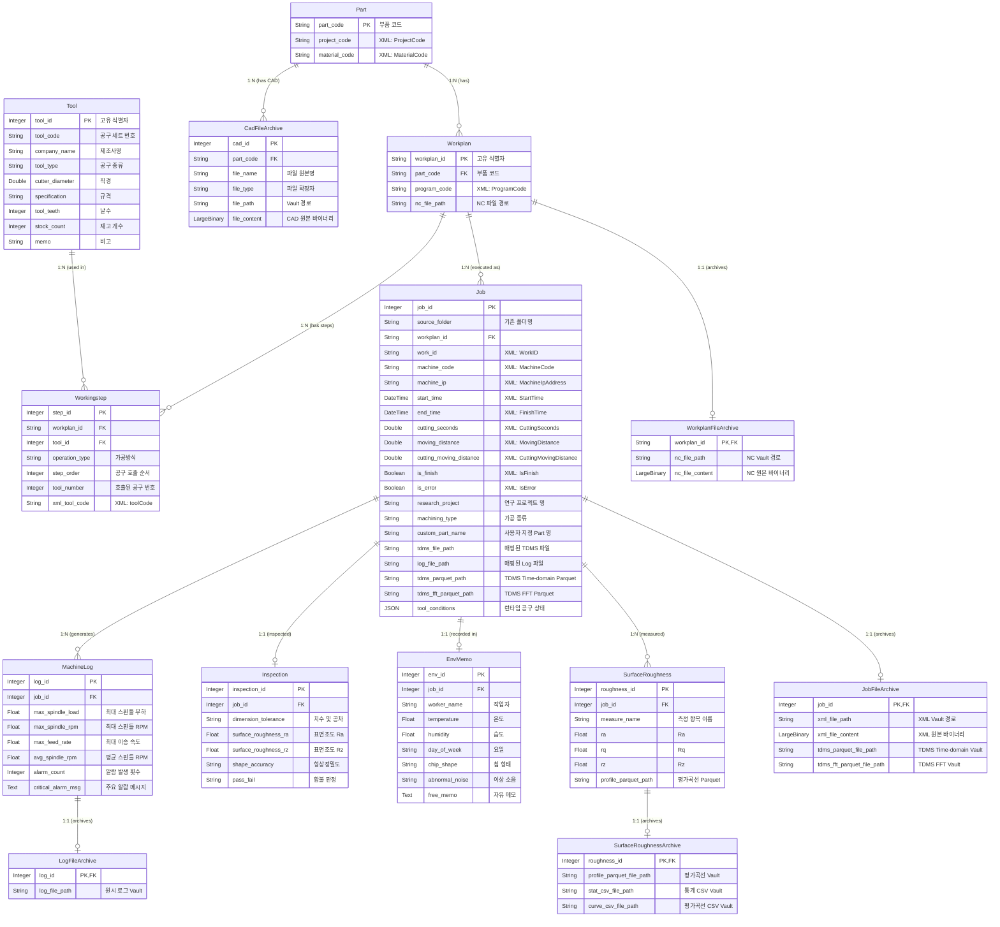

# 공작기계지능화실험실 통합 제조 DB 시스템 복원 및 명세서

본 문서는 소스 코드가 유실되었을 경우를 대비하여 작성된 **완벽한 단일 사양서**입니다. 본 문서의 내용만으로도 100% 동일한 프로젝트를 처음부터 재생성할 수 있도록 모든 아키텍처, 설정, 스키마, 파싱 알고리즘, UI 동작 방식을 상세하게 기술합니다.

---

## 1. 시스템 아키텍처 및 전체 폴더 구조

### 1.1 전체 프로젝트 아키텍처 및 데이터 파이프라인 흐름도

```text
[Raw Data / Network Drive]
       | (File Drop - XML, NC, TDMS, LOG, CAD, CSV)
       v
[Watchdog Observer (data_insert_recognization.py)]
       | (Queue & Stability Check: 파일 접근 권한 검사)
       v
[Parsing Engine (parsers/)]
  ├─ xml_parser.py       : 메타데이터 추출, Part/Workplan/Job 구조 매핑
  ├─ tdms_parser.py      : 초고속 메타데이터(nptdms) 추출 및 경로 매핑
  ├─ log_parser.py       : CNC 로그 통계(Max/Avg RPM, Load) 요약 및 Vault 저장
  ├─ roughness_parser.py : 조도 측정 결과(Ra, Rq, Rz) 자동 계산 및 Parquet 변환
  ├─ cad_parser.py       : 3D 모델(STEP, STL) 파트 매핑 및 원본 아카이빙
  └─ nc_parser.py        : NC 프로그램 코드 추출
       |
       v
[MySQL Database (SQLAlchemy ORM)]  <===> [Vault System (vault_manager.py)] (대용량 파일)
       |
       v
[Streamlit Frontend UI (Port 8501, 8502)]
  ├─ admin_dashboard.py  : 데이터 필터링, 삽입, 수정, 삭제(Cascade), 복구 파일(ZIP) 생성
  └─ user_dashboard.py   : 다차원 계층 조회, 센서 시계열(Plotly), 조도 프로파일 시각화, 선택 다운로드
```

### 1.2 디렉터리 및 파일 트리

```text
/Project_Root/
├── .env                        : 데이터베이스 및 시스템 환경변수
├── requirements.txt            : 런타임 종속 패키지 목록
├── run_system.py               : 전체 파이프라인(백그라운드 파서, UI) 실행 관리 스크립트
├── machining_raw_data/         : 외부 장비에서 원본 데이터가 업로드되는 모니터링 폴더
│   └── ProjectName/PartName/JobID/ (계층형 폴더 구조)
├── archive_vault/              : 파싱된 대용량 원본 파일(NC, XML, CAD, Log 등) 안전 보관용
├── processed_data/             : 처리 중 생성된 파생 데이터 폴더
├── failed_data/                : 파싱 실패 시 예외 처리된 파일 격리 폴더
├── backend/                    : 백엔드 파이프라인 모듈
│   ├── data_insert_recognization.py : Watchdog 기반 디렉터리 모니터링 큐 처리기
│   ├── job_manager.py               : Job(가공 이력) 생성 및 중복 확인 유틸리티
│   ├── recovery_engine.py           : Vault와 DB를 활용한 재난 복구 ZIP 생성기
│   ├── tool_inserter.py             : 공구(Excel) 데이터 파서
│   ├── tdms_visualizer.py           : 백그라운드 TDMS Parquet/FFT 변환 데몬
│   ├── vault_manager.py             : 파일 SHA/해시 기반 Vault 아카이빙 모듈
│   ├── DB/                          
│   │   ├── database.py              : SQLAlchemy DB 커넥션 풀링 생성
│   │   └── models.py                : 데이터베이스 테이블 DDL 및 ORM 정의
│   └── parsers/                     : 확장자별 자동 파싱 엔진
│       ├── xml_parser.py
│       ├── tdms_parser.py
│       ├── log_parser.py
│       ├── roughness_parser.py
│       ├── cad_parser.py
│       └── nc_parser.py
└── frontend/                   : Streamlit 기반 UI
    ├── admin_dashboard.py      : 관리자 전용 데이터 관리 페이지
    └── user_dashboard.py       : 일반 사용자용 시각화 및 다운로드 페이지
```

---

## 2. 환경 설정 및 종속성 (Environment & Dependencies)

### 2.1 런타임 버전 및 필수 패키지 (`requirements.txt`)
프로젝트는 Python 3.10 이상 환경을 권장합니다.
```text
# Project Dependencies
pandas>=2.2.0
numpy>=1.26.0
openpyxl==3.1.5
SQLAlchemy==2.0.51
PyMySQL==1.2.0
python-dotenv==1.2.2
watchdog==6.0.0
streamlit==1.61.1
streamlit-option-menu>=0.4.0
plotly>=5.20.0
pyarrow>=14.0.1
scipy>=1.12.0
nptdms>=1.9.0
psutil>=6.0.0
```

### 2.2 환경 변수 (`.env`)
루트 디렉터리에 생성되어야 하는 환경변수 구조는 다음과 같습니다.
```env
DB_HOST=localhost
DB_PORT=3306
DB_USER=root
DB_PASSWORD=610610610
DB_NAME=orcus
PYTHONPATH=backend
```

---

## 3. 데이터베이스 명세 (Database Architecture)

### 3.1 DB 스키마 트리 구조 (ER Diagram)
아래는 `models.py` 기반 데이터베이스의 관계형 구조를 나타낸 ER 다이어그램(트리 구조)입니다.



### 3.2 DBMS 및 커넥션 풀링
- DBMS: MySQL (`PyMySQL` 드라이버 사용)
- ORM: `SQLAlchemy` declarative_base 활용
- 커넥션 풀링: `pool_recycle=3600` 적용 (MySQL wait_timeout 이슈 방지)

### 3.2 핵심 ORM 모델 명세 (`backend/DB/models.py`)

#### 1. Part 테이블 (가공 대상 부품 마스터)
```python
class Part(Base):
    __tablename__ = "part"
    part_code = Column(String(100), primary_key=True) # 부품 식별 코드
    project_code = Column(String(50))
    material_code = Column(String(50))
    workplans = relationship("Workplan", back_populates="part", cascade="all, delete-orphan")
```

#### 2. Workplan 테이블 (ISO14649 정적 계획)
```python
class Workplan(Base):
    __tablename__ = "workplan"
    workplan_id = Column(String(100), primary_key=True) # part_code + program_code + NC Hash 조합
    part_code = Column(String(100), ForeignKey("part.part_code", ondelete="CASCADE"), nullable=False)
    program_code = Column(String(50))
    nc_file_path = Column(String(255))
    jobs = relationship("Job", back_populates="workplan", cascade="all, delete-orphan")
    workingsteps = relationship("Workingstep", back_populates="workplan", cascade="all, delete-orphan")
```

#### 3. Workingstep 테이블 (개별 가공 단위 / 공구 호출 순서)
```python
class Workingstep(Base):
    __tablename__ = "workingstep"
    step_id = Column(Integer, primary_key=True, autoincrement=True)
    workplan_id = Column(String(100), ForeignKey("workplan.workplan_id", ondelete="CASCADE"), nullable=False)
    tool_id = Column(Integer, ForeignKey("tool.tool_id", ondelete="SET NULL"))
    operation_type = Column(String(50))
    step_order = Column(Integer, nullable=False) # 공구 호출 순서
    tool_number = Column(Integer, nullable=False)
    xml_tool_code = Column(String(50))
```

#### 4. Tool 테이블 (공구 마스터 정보)
```python
class Tool(Base):
    __tablename__ = "tool"
    tool_id = Column(Integer, primary_key=True, autoincrement=True)
    tool_code = Column(String(50))
    company_name = Column(String(50))
    tool_type = Column(String(50))
    cutter_diameter = Column(Double)
    specification = Column(String(100))
    tool_teeth = Column(Integer)
    stock_count = Column(Integer)
    memo = Column(String(255))
```

#### 5. Job 테이블 (실제 1회성 가공 이력)
```python
class Job(Base):
    __tablename__ = "job"
    job_id = Column(Integer, primary_key=True, autoincrement=True)
    source_folder = Column(String(255), unique=True) # 모니터링 폴더 기준 원본 경로 (Project/Part/JobID)
    workplan_id = Column(String(100), ForeignKey("workplan.workplan_id", ondelete="CASCADE"), nullable=False)
    work_id = Column(String(50), nullable=False)
    machine_code = Column(String(50))
    machine_ip = Column(String(20))
    start_time = Column(DateTime)
    end_time = Column(DateTime)
    cutting_seconds = Column(Double)
    moving_distance = Column(Double)
    cutting_moving_distance = Column(Double)
    is_finish = Column(Boolean)
    is_error = Column(Boolean)
    research_project = Column(String(100), nullable=True)
    machining_type = Column(String(100), nullable=True)
    custom_part_name = Column(String(100), nullable=True)
    tdms_file_path = Column(String(500), nullable=True)
    log_file_path = Column(String(500), nullable=True)
    tdms_parquet_path = Column(String(500), nullable=True)
    tdms_fft_parquet_path = Column(String(500), nullable=True)
    tool_conditions = Column(JSON) # 런타임 공구 상태 (오프셋, 마모도 등 JSON)
```

#### 6. 그 외 품질/환경 테이블 (1:1 연관)
- **MachineLog**: `max_spindle_load`, `max_spindle_rpm`, `avg_spindle_rpm`, `alarm_count`, `critical_alarm_msg` 기록.
- **Inspection**: 치수/공차(`dimension_tolerance`), 형상정밀도(`shape_accuracy`), 합불판정(`pass_fail`), 종합조도(`surface_roughness_ra`, `surface_roughness_rz`).
- **EnvMemo**: 온도(`temperature`), 습도(`humidity`), 작업자(`worker_name`), 이상소음, 칩 형태, 자유 메모.
- **SurfaceRoughness**: 부위별(1:N) 측정 조도 (`ra`, `rq`, `rz`), Parquet 변환된 곡선 경로.

#### 7. 아카이브 전용 테이블
- **WorkplanFileArchive**: NC 파일 Vault 경로 및 `nc_file_content` (LargeBinary).
- **JobFileArchive**: XML, TDMS 데이터 Vault 경로 및 `xml_file_content` (LargeBinary).
- **CadFileArchive**: STEP/STL CAD 파일 경로 및 `file_content` (LargeBinary, 15MB 제한).
- **LogFileArchive** / **SurfaceRoughnessArchive**: 텍스트 로그 및 조도 원시 데이터 경로 보관.

---

## 4. 데이터 자동 파싱 엔진 명세 (Parsing Engine)

### 4.1 디렉터리 모니터링 (`data_insert_recognization.py`)
- `watchdog.observers.Observer`를 사용하여 `machining_raw_data/`를 모니터링.
- 파일 큐에 이벤트를 적재하고, 네트워크(NAS/SMB) 전송 지연 방지를 위해 **파일 사이즈 무변동 대기(Lock 검사)** 적용.
- 파일 경로 분해 로직: `ProjectName / PartName / JobID(또는 CAD_Files) / [Surface_Roughness]`
- 지원 확장자에 따른 분기 (`.xml`, `.tdms`, `.nc`, `.log`/`.csv`, `.txt`, `.step`/`.stl`).
- 파싱 실패 시 `failed_data/` 폴더로 타임스탬프와 함께 격리(DLQ 처리).

### 4.2 XML 파서 (`xml_parser.py`)
- 루트 태그 `<WorkModel>` 확인.
- NC 파일 동시 파싱: 해시(`md5`)를 추출하여 동일 파일명이라도 내용이 다르면 다른 `Workplan` 식별(`PartCode_ProgramCode_MD5Hash`).
- `<Tools>` 태그에서 JSON 형태로 공구 상태 추출 (`toolUsedCount`, `offset0`~`offset8`) 후 Job의 `tool_conditions` JSON 컬럼에 저장.
- `<StartTime>`, `<FinishTime>`, `<CuttingSeconds>`, `<IsError>` 등 메타데이터 추출.
- 기존에 큐 처리된 Job이 있으면 `UPDATE`, 없으면 `INSERT` (`source_folder` 식별 기준).

### 4.3 TDMS 고속 파서 (`tdms_parser.py`)
- 무거운 시계열 전체 로딩을 피하기 위해 `nptdms.TdmsFile.read_metadata()`를 사용.
- `CNC-ProgramName` 채널에서 `wf_start_time`, `ProgramName`, `MaterialCode` 속성만 0.1초 내외로 추출하여 빈 DB 정보 보완.
- DB에 TDMS 참조 경로만 저장하고, 시계열 Parquet/FFT 변환은 별도의 데몬(`tdms_visualizer.py`)이 처리.

### 4.4 로그 파서 (`log_parser.py`)
- `csv.Sniffer()`를 이용해 구분자(Tab 또는 Comma) 자동 감지. `utf-8` 및 `cp949` 에러 방어.
- `cls` (Spindle Load), `crpm` (Spindle RPM), `cfr` (Feed Rate) 컬럼 탐색.
- 전체 스캔하며 최대값(`max_load`, `max_rpm`)과 평균 RPM 계산.
- `alarm_msg`가 비어있지 않은 경우 Set에 수집하여 발생 횟수 저장. 시계열 원본은 Vault에 보관.

### 4.5 표면 조도 파서 (`roughness_parser.py`)
- `*평가곡선*.CSV` 파일 탐색. (파일명 규칙에 따라 측정 부위 이름 분리 추출).
- `DATANUM:` 문자열 발견 이후 라인부터 데이터(X, Z 좌표) 추출.
- **조도 계산 정규 알고리즘 (Numpy)**: 
  - 평균 교정: `Z_centered = Z - mean(Z)`
  - `Ra` = `mean(abs(Z_centered))`
  - `Rq` = `sqrt(mean(Z_centered^2))`
  - `Rz` = 전체 구간을 5등분하여 각 구간 `max - min` 값의 평균.
- X, Z 2D 좌표를 DataFrame 생성 후 `pyarrow` 엔진을 사용해 `.parquet`으로 변환.
- Job의 전체 `Ra`, `Rz` 평균을 다시 계산하여 `Inspection` 테이블 `surface_roughness`에 자동 기입.

### 4.6 CAD 및 NC 파서 (`cad_parser.py`, `nc_parser.py`)
- CAD: 15MB 제한을 걸어 파일 크기 확인 후 Part 테이블에 종속하여 Vault 및 BLOB 저장.
- NC: 단독 업로드 시 확장자를 이용해 `program_code` 보완 및 BLOB 저장.

---

## 5. UI 컴포넌트 및 인터페이스 명세 (UI Layer)

모든 UI는 Streamlit 프레임워크로 동작하며, `backend/DB/database.py`의 `SessionLocal`을 호출하여 쿼리를 수행합니다. `st.session_state` 객체를 통해 사용자가 선택한 필터 상태(`selected_projs`, `selected_parts`, `selected_dates` 등)가 탭 간 이동 시에도 유지됩니다.

### 5.1 관리자 대시보드 (`frontend/admin_dashboard.py`) - 포트 8501
관리자 대시보드는 좌측 사이드바에 'DB 스키마 구조' 요약(Expander)과 3개의 `streamlit_option_menu` 내비게이션("가공 검색", "데이터 수정", "데이터 삽입")을 제공합니다.

#### [메뉴 1] 데이터 수정 (Job 수정 / 삭제 / 재난 복구)
관리자 권한의 핵심 페이지입니다. 해당 메뉴 진입 시 좌측 **사이드바(Sidebar)** 영역에 동적 연동되는 5가지 필터가 나타납니다.
1. **조건별 실험 검색 (사이드바)**:
   - **1. 연구 프로젝트 명**: DB `research_project`를 조회하여 Multiselect 제공.
   - **2. Part 명**: 앞선 프로젝트 선택에 종속되어 `custom_part_name` 또는 `part_code` 목록 조회.
   - **3. 가공 순서 (N차 가공)**: 선택된 Part에 종속되어 시작시간(start_time) 오름차순 기준으로 pandas `cumcount()`를 수행, "O차 가공 (Job ID)" 형식으로 동적 라벨 생성.
   - **4. 실험 일자 범위**: DB 내 전체 최소/최대 날짜를 기본값으로 갖는 Date_Input.
   - **5. 가공 종류**: `machining_type` Multiselect.
   - **Job 직접 검색 (빠른 편집)**: 위 필터를 무시하고 Job ID를 숫자로 직접 입력할 수 있는 Number Input.
2. **단일 Job 통합 수정 (메인 화면)**:
   - 필터링 결과 Job들의 SelectBox (`Job ID - Part명 (시작시간)`)를 제공하여 최종 1건을 선택합니다.
   - 선택 시 `st.form` 기반의 **3개 세부 Tab**이 렌더링됩니다.
     - **Tab 1 (📝 Job 메타데이터)**: 사용자 지정 Part 명(`custom_part_name`), 연구 프로젝트 명(`research_project`), 가공 종류(`machining_type`) 수정.
     - **Tab 2 (🌡️ 환경 및 메모)**: EnvMemo 테이블 갱신 폼. 작업자(`worker_name`), 온도, 습도, 요일, 칩 형태, 이상 소음, 수기 메모(`free_memo`)를 입력받아 INSERT/UPDATE 수행.
     - **Tab 3 (🔍 품질 점검)**: Inspection 테이블 갱신 폼. 치수 공차(`dimension_tolerance`), 수기 조도 Ra/Rz 오버라이드, 형상정밀도, 합불 판정(`pass_fail` - "PASS", "FAIL" 콤보박스) 수정.
3. **가공 이력 영구 삭제 (CASCADE)**:
   - 현재 선택된 Job을 영구 삭제하는 버튼. 누를 시 `st.dialog` 모달 경고창("정말로 삭제하시겠습니까?") 발생.
   - `DELETE FROM job` 쿼리 실행. DB 외래키 조건(`ondelete="CASCADE"`)에 의해 하위 로그, 조도, 환경 테이블 레코드 자동 파기.
4. **시스템 데이터 복구 및 내보내기 (Disaster Recovery)**:
   - '복구 파일(ZIP) 생성 시작' 버튼 클릭 시 `recovery_engine.py`가 트리거됨.
   - Vault에 안전 보관된 XML, NC, TDMS 원본 파일들을 읽어 `Project/Part/Job` 물리 폴더 구조로 재조립 후 다운로드 가능한 `recovered_data.zip` 반환.

#### [메뉴 2] 가공 검색 (조회 전용)
관리자가 DB 데이터를 엑셀처럼 한눈에 모니터링하는 화면입니다.
- **메인 화면 상단 3개 + 2개 컬럼 필터**: 사이드바가 아닌 메인 화면 중앙에 가로로 배치된 5개의 기본 필터 제공 (로직은 [메뉴 1]과 동일).
- **⚙️ 고급 검색 필터 (Expander)**: 최소/최대 가공 시간(초), 표면 조도 Ra 범위(μm), 최소/최대 평균 RPM Number_Input 제공. 0 입력 시 조건 무시.
- **결과 데이터프레임**: 필터 조합을 바탕으로 동적 SQL WHERE절 생성. `st.dataframe`과 `st.column_config`를 적용하여 17개 종합 컬럼(Job ID, 시작시간, 프로젝트, Part 명, 가공 종류, 시간, 완료여부, 조도 Ra/Rz, 합불 판정, 작업자, 온도, 습도, 메모, 최대부하, 평균RPM, 알람수)을 소수점 포맷팅에 맞춰 표시.

#### [메뉴 3] 데이터 삽입 (수동 웹 업로드 기능)
로컬에 있는 장비 파일(XML, NC, TDMS 등)을 파이프라인(Watchdog 큐)으로 직접 전달합니다.
- **Step 1. 대상 Project 및 Part 설정**: Radio 버튼을 통해 "기존 항목 선택" 시 셀렉트박스로 선택하고, "신규 생성" 시 직접 텍스트를 입력.
- **Step 2. 데이터 업로드 타겟 선택**:
   1. `Part 레벨 (CAD 파일 단독 업로드)`: Job 단위가 아닌 마스터 Part에 CAD 귀속.
   2. `신규 Job 생성 및 데이터 업로드`: Part 폴더 내에 순차적(001, 002...) 번호 폴더를 동적 생성.
   3. `기존 Job에 데이터 추가`: DB를 조회하여 기존 Job_ID 폴더 경로(`source_folder`) 매핑.
- **Step 3. 파일 업로더 그룹 (`st.file_uploader`)**:
   - `CAD` (STL/STEP), `XML`, `NC` (15MB 제한), `TDMS`, `로그(log/txt)`, `표면 조도(csv/fpk)`, `기타 참고 파일`. 
   - 전송 버튼 클릭 시, 선택한 모드에 맞춰 로컬 `machining_raw_data/` 물리 폴더에 버퍼를 바이너리 복사합니다. 파일이 쓰여지면 백그라운드 Watchdog 모니터가 즉시 인지하여 파싱을 시작합니다.

### 5.2 사용자 및 분석 대시보드 (`frontend/user_dashboard.py`) - 포트 8502
CUD(삽입/수정/삭제) 폼을 완벽히 배제하고 심층 분석 시각화와 파일 다운로드 권한만 부여한 5개 탭 대시보드입니다.

#### [메뉴 1] 계층형 마스터 데이터 (ISO 14649)
- **부품명 필터**: 사용자가 조회할 Part 명칭 다중 선택(기본 상위 5개).
- **연관 CAD 모델 표출**: `CadFileArchive` 조회하여 Part에 종속된 CAD 파일 정보 표출.
- **Workplan 반복 조회**: 선택된 Part에 귀속된 하위 `Workplan`(계획)들을 Expander로 나열.
- **Workingstep 및 Tool 표출**: 각 Workplan 하위에 어떤 공구(`tool`)들이 무슨 순서(`step_order`)로 호출되었는지 직경/규격/날수/제조사 정보와 함께 Pandas 트리뷰 렌더링.

#### [메뉴 2] 가공 검색
- 기능 및 UI 배치가 5.1 관리자 대시보드의 `[메뉴 2] 가공 검색`과 정확히 100% 동일하게 제공됩니다.

#### [메뉴 3] 가공 이력 & 센서 분석 (핵심 시각화 대시보드)
가장 중요한 센서 및 품질 지표를 분석하는 2-Column 대시보드 레이아웃. `분석할 Job ID` 셀렉트박스로 대상을 특정합니다.
- **좌측 Column (지표/메타 카드 `st.container`)**:
  1. **📄 Job 요약 정보**: 프로젝트 명, 가공일시, 순번, NC 코드, 가공 시간, 이동 거리 명시.
  2. **⚙️ CNC 로그 요약 (1Hz)**: `st.metric` 컴포넌트로 Spindle Load(cls), Spindle RPM(crpm), Feed Rate(cfr)의 Max/Avg 통계 시각화.
  3. **📏 표면조도 통계**: Job 내 모든 측정 부위별 산술(Ra)/RMS(Rq)/10점(Rz) 거칠기 Dataframe.
  4. **🌡️ 환경 및 메모 (EnvMemo)**: 작업자 이름, 온습도, 수기 메모 텍스트 표시.
  5. **🔍 품질 점검 (Inspection)**: 형상 정밀도, 치수 공차를 출력하고 `pass_fail` 상태에 따라 HTML `<span>` 태그를 주입(PASS=녹색, FAIL=적색)하여 직관적 합불 렌더링.
- **우측 Column (Plotly `px.line` 차트 렌더링 카드)**:
  1. **📈 TDMS 고주파 센서 및 주파수 분석 (`st.tabs` 3개)**: `tdms_parquet_path`와 `tdms_fft_parquet_path` 기반 렌더링.
     - **Tab 1 (CNC 센서)**: 'CNC-'로 시작하는 컬럼명 필터링 다중 선택, 실시간 Line 차트.
     - **Tab 2 (DAQ 진동/소음 Envelope)**: 고주파에서 다운샘플링된 `_max`, `_min` 짝 컬럼들을 동시 출력하는 밴드형 라인 차트.
     - **Tab 3 (FFT 스펙트럼)**: 주파수 스펙트럼. X축 주파수(Hz), Y축 스펙트럼 밀도(PSD)를 로그 스케일(`log_y=True`) 라인 차트로 렌더링.
  2. **🔬 표면조도 프로파일 곡선**: 측정 부위(Selectbox) 선택 시, `profile_parquet_path`를 Pandas로 로드해 가로축 X(이동 길이, mm) - 세로축 Z(요철 높이, μm) 형태의 마이크로미터 단면 곡선을 시각화.

#### [메뉴 4] 데이터 다운로드
특정 Job ID 선택 시 원본 물리 폴더를 스캔하여 맞춤형 압축(ZIP) 파일 제공 기능.
- **📦 전체 데이터 다운로드**: 하위 구조 그대로 폴더 통째로 임시 ZIP 파일 생성 (`get_download_data_from_folder` 카테고리 '전체').
- **🎯 선택적 데이터 다운로드**: 
   - 백엔드 스크립트가 해당 폴더를 `os.walk`로 스캔하여, 실제로 존재하는 파일 확장자에 대해서만 다중선택 콤보박스 선택지(표면조도, 고주파 tdms, NC프로그램, xml, parquet, log 등)를 오픈함.
   - 체크된 카테고리 확장자 파일들만 분류하여 여러 개의 개별 파일 버튼이나 임시 압축 묶음(ZIP) 버튼을 동적으로 생성 및 다운로드 스트림 연동.

#### [메뉴 5] DB 테이블 조회
모든 데이터베이스 데이터를 날것(Raw)으로 검증하기 위한 통합 표출 기능.
- `sqlalchemy.inspect`로 현재 연결된 DB 엔진 안의 모든 테이블 명 리스트 추출.
- 테이블 선택 Selectbox 제공 후, `SELECT * FROM 테이블명` 단순 쿼리 실행.
- `st.dataframe`으로 전체 행/열 데이터 및 총 Record 개수(행 수) 표출.

---

## 6. 엔드투엔드 데이터 흐름 (End-to-End Workflow)

1. **데이터 유입**: 관리자가 네트워크 공유 드라이브인 `machining_raw_data/Project/Part/JobID` 폴더에 장비에서 생성된 XML, TDMS, LOG 파일을 통째로 붙여넣습니다. (단일 혹은 복수 폴더 투입 가능).
2. **이벤트 감지**: 파이프라인 백그라운드 서버(`data_insert_recognization.py`)의 Watchdog이 이벤트를 감지합니다. 즉시 읽지 않고 파일 접근 Lock이 풀릴 때까지 대기합니다.
3. **병렬 파싱 & 저장**:
   - `xml_parser`가 XML을 읽어 DB `Job` 테이블에 기본 뼈대를 만듭니다.
   - `log_parser`가 Spindle Load 등을 요약하여 `MachineLog` 테이블에 `INSERT`합니다.
   - `tdms_parser`가 고속으로 메타데이터를 추출해 시작 시간을 보완합니다.
4. **후속 데몬 처리**: 메인 스크립트 실행 시 띄워진 `tdms_visualizer.py` 데몬이 주기적으로 DB를 스캔하여 파싱되지 않은 TDMS를 발견하면, 이를 시계열 `.parquet`과 FFT `.parquet`으로 무거운 변환 작업을 수행합니다. 조도 데이터도 2D `.parquet`으로 변환됩니다.
5. **UI 모니터링 및 결론 도출**: 연구원은 `localhost:8502`(User Dashboard)에 접속하여 가공 이력을 검색하고 표면 조도 합불(Pass/Fail) 결과를 보며, TDMS CNC/DAQ 센서의 고주파 신호 스펙트럼 차트를 직관적으로 조회합니다. 

---

## 7. 복원 실행 가이드 (Reconstruction Blueprint)

프로젝트 코드나 서버가 완전히 초기화되어 빈 폴더만 남았을 경우, 아래 순서대로 수행하여 100% 원복합니다.

1. **파이썬 환경 준비**: Python 3.10+ 설치, `pip install -r requirements.txt` 실행.
2. **DB 설정**: `.env` 파일에 맞추어 MySQL 인스턴스에 빈 Database(예: `orcus`)를 생성합니다. (테이블은 자동 생성됨)
3. **디렉터리 구성**: 루트 폴더에 `machining_raw_data/`, `archive_vault/` 빈 폴더 생성.
4. **자동 실행**: `python run_system.py` 를 실행합니다.
   - 스크립트 실행 시 SQLAlchemy `Base.metadata.create_all()`이 호출되어 모든 테이블과 ERD(Foreign Key)가 즉시 복구 생성됩니다.
   - 4개의 프로세스 (Watchdog 파서, TDMS 백그라운드 시각화 데몬, Admin Streamlit UI, User Streamlit UI)가 서브프로세스로 동시 기동됩니다.
5. **데이터 유입**: 복구된 원본 장비 데이터 폴더들을 통째로 `machining_raw_data/` 하위로 붙여넣기하면 파이프라인이 즉시 재가동되며 DB와 파생 Parquet 파일을 새로 자동 렌더링합니다.

---
**[문서 끝] 본 문서는 의도적으로 생략 없이 모든 로직과 핵심 규칙을 포함하고 있습니다.**
